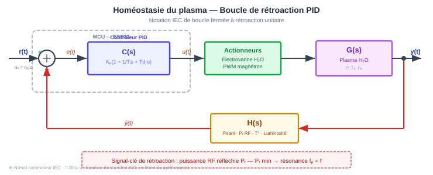
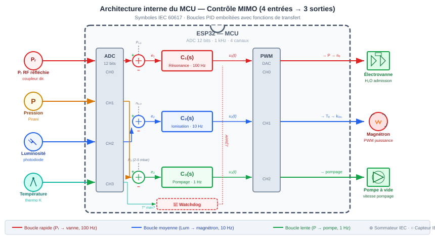

# 📐 Cadre Théorique

[← Retour au README](../README.md) · [← Objectifs](01_objectifs.md)

---

## Introduction vulgarisée

La physique quantique standard nous dit qu'une particule — un électron, un
photon — n'existe pas en un point précis avant d'être mesurée. Elle est décrite
par une « fonction d'onde » qui donne seulement la **probabilité** de la trouver
ici ou là. C'est la vision dite de **[Copenhague](https://fr.wikipedia.org/wiki/Interpr%C3%A9tation_de_Copenhague)**, adoptée par la plupart des
physiciens depuis les années 1920.

Mais il existe une autre lecture, proposée par **[Louis de Broglie](https://fr.wikipedia.org/wiki/Louis_de_Broglie)** en 1927 puis
redécouverte par **[David Bohm](https://fr.wikipedia.org/wiki/David_Bohm)** en 1952 : la particule a toujours une position
réelle et une trajectoire bien définie. Elle est simplement **guidée** par une
onde — « l'onde pilote » — un peu comme un surfeur porté par une vague. Cette
onde pilote est exactement la fonction d'onde $\psi$ de la mécanique quantique
standard, mais elle joue un rôle physique concret : elle dicte la vitesse et
la direction de la particule.

Ce qui rend cette théorie fascinante pour notre expérience, c'est qu'elle prédit
l'existence d'un **potentiel quantique** $Q$ — une sorte de « terrain invisible »
qui dépend de la forme de l'onde et qui peut exercer une force sur les particules.
Contrairement aux forces classiques, cette force ne diminue pas avec la distance
et peut être très sensible à la géométrie du milieu traversé.

Notre expérience cherche à exploiter cet effet : en façonnant la forme de l'onde
pilote (via un plasma inhomogène), on espère créer un gradient de potentiel
quantique qui produirait une force mécanique mesurable.

---

## 2.1 L'interprétation de de Broglie–Bohm

> 💡 **En termes simples** — En physique quantique classique, on renonce à
> dire où se trouve une particule : on ne donne que des probabilités.
> La théorie de de Broglie–Bohm dit le contraire : la particule **est**
> quelque part, elle a un chemin précis, mais ce chemin est dicté par
> une onde qui la guide — exactement comme un bouchon de liège suit
> le courant d'une rivière. L'onde est partout, le bouchon est à un
> seul endroit.

### Historique

- **1924** — [Louis de Broglie](https://fr.wikipedia.org/wiki/Louis_de_Broglie) propose dans sa [thèse de doctorat](https://fr.wikipedia.org/wiki/Th%C3%A8se_de_doctorat_de_Louis_de_Broglie) l'hypothèse
  de l'[onde de matière](https://fr.wikipedia.org/wiki/Dualit%C3%A9_onde-corpuscule) : toute particule est associée à une onde de longueur
  $\lambda = h/p$ ([relation de de Broglie](https://fr.wikipedia.org/wiki/Hypoth%C3%A8se_de_De_Broglie)).

- **1927** — Au [Congrès Solvay](https://fr.wikipedia.org/wiki/Congr%C3%A8s_Solvay), de Broglie présente sa **[théorie de l'onde
  pilote](https://fr.wikipedia.org/wiki/Th%C3%A9orie_de_l%27onde_pilote)** (*théorie de la double solution*) : la particule est un point
  singulier guidé par une onde réelle. La théorie est critiquée par [Pauli](https://fr.wikipedia.org/wiki/Wolfgang_Pauli)
  et éclipsée par l'[interprétation de Copenhague](https://fr.wikipedia.org/wiki/Interpr%C3%A9tation_de_Copenhague) ([Bohr](https://fr.wikipedia.org/wiki/Niels_Bohr), [Heisenberg](https://fr.wikipedia.org/wiki/Werner_Heisenberg), [Born](https://fr.wikipedia.org/wiki/Max_Born)).

- **1952** — [David Bohm](https://fr.wikipedia.org/wiki/David_Bohm), alors au Brésil, redécouvre et complète la théorie
  dans deux articles fondateurs publiés dans *[Physical Review](https://fr.wikipedia.org/wiki/Physical_Review)*. Il montre
  que la mécanique quantique peut être reformulée comme une théorie
  déterministe à [variables cachées](https://fr.wikipedia.org/wiki/Variable_cach%C3%A9e_(physique_quantique)), reproduisant toutes les prédictions
  expérimentales de la mécanique quantique standard.

- **1964–1987** — [John Stewart Bell](https://fr.wikipedia.org/wiki/John_Stewart_Bell), profondément influencé par Bohm,
  développe son célèbre [théorème](https://fr.wikipedia.org/wiki/Th%C3%A9or%C3%A8me_de_Bell) ([inégalités de Bell](https://fr.wikipedia.org/wiki/In%C3%A9galit%C3%A9s_de_Bell)) et plaide
  publiquement pour la théorie de Bohm comme « la meilleure formulation
  disponible de la mécanique quantique non-relativiste ».

### Postulats fondamentaux

La théorie repose sur deux éléments :

1. **La fonction d'onde** $\psi(\mathbf{r}, t)$ évolue selon l'[équation de
   Schrödinger](https://fr.wikipedia.org/wiki/%C3%89quation_de_Schr%C3%B6dinger) habituelle :

$$i\hbar \frac{\partial \psi}{\partial t} = -\frac{\hbar^2}{2m}\nabla^2\psi + V\psi$$

2. **L'équation de guidage** dicte la vitesse de la particule :

$$\frac{d\mathbf{Q}}{dt} = \frac{\hbar}{m} \text{Im}\left(\frac{\nabla\psi}{\psi}\right)$$

La particule a toujours une position définie $\mathbf{Q}(t)$. La fonction
d'onde n'est pas un simple outil de calcul : c'est un **champ physique réel**
qui pilote la particule.

> 📐 **Simulation** — Le script [004_trajectoires_bohm.py](../experiments/004_trajectoires_bohm.py)
> intègre numériquement cette loi de guidage en 2D (split-operator FFT +
> RK4) pour trois scénarios : double fente, puits asymétrique (analogue
> cavité plasma) et effet tunnel.

---

## 2.2 La Loi de Guidage — Dérivation complète

> 💡 **En termes simples** — Une onde, c'est deux informations : sa
> **hauteur** (l'amplitude $R$ : « à quel point elle est forte ») et son
> **rythme** (la phase $S$ : « où elle en est dans son cycle »). Pensez à
> une vague sur la mer : la hauteur dit si la vague est grosse, la phase
> dit si on est sur la crête ou dans le creux.
>
> La loi de guidage dit simplement : *la particule se déplace dans la
> direction où la phase change le plus vite*. Si la phase varie plus vite
> à droite qu'à gauche, la particule va à droite. C'est comme une bille
> qui roule dans la direction de la plus grande pente.
>
> L'équation de Hamilton-Jacobi, quant à elle, est l'équivalent classique
> (avant la physique quantique) de la description du mouvement par la phase.
> C'est la même équation qu'utilisait Newton, mais avec un terme en plus :
> le potentiel quantique $Q$.

### Décomposition polaire

On écrit la fonction d'onde sous forme polaire :

$$\psi(\mathbf{r}, t) = R(\mathbf{r}, t) \; e^{i S(\mathbf{r}, t) / \hbar}$$

où :
- $R(\mathbf{r}, t) \geq 0$ est l'**amplitude** de l'onde,
- $S(\mathbf{r}, t) \in \mathbb{R}$ est la **phase** de l'onde.

La densité de probabilité est $\rho = |\psi|^2 = R^2$.

### Obtention de la vitesse de guidage

En substituant la forme polaire dans l'équation de Schrödinger et en séparant
parties réelle et imaginaire, on obtient deux équations couplées :

**Partie imaginaire** — Équation de continuité :

$$\frac{\partial R^2}{\partial t} + \nabla \cdot \left(R^2 \frac{\nabla S}{m}\right) = 0$$

Cette équation exprime la conservation de la probabilité et identifie
naturellement le champ de vitesse :

$$\boxed{\vec{v} = \frac{\nabla S}{m}}$$

C'est la **loi de guidage** : la vitesse de la particule est proportionnelle
au gradient de la phase de la fonction d'onde.

> 📐 **Trajectoires** — Le script [004_trajectoires_bohm.py](../experiments/004_trajectoires_bohm.py)
> visualise le champ de vitesse $\vec{v} = \nabla S / m$ et les trajectoires
> qui en résultent. Le scénario « puits asymétrique » montre la déviation
> des particules par le potentiel quantique $Q$.

**Partie réelle** — Équation de [Hamilton-Jacobi](https://fr.wikipedia.org/wiki/%C3%89quation_de_Hamilton-Jacobi) modifiée :

$$\frac{\partial S}{\partial t} + \frac{(\nabla S)^2}{2m} + V + Q = 0$$

où apparaît le terme supplémentaire $Q$, le **potentiel quantique**.

### Équivalence avec la forme standard

Pour un système de $N$ particules, l'équation de guidage se généralise :

$$\frac{d\mathbf{Q}_k}{dt} = \frac{\hbar}{m_k} \text{Im}\left(\frac{\nabla_k \psi}{\psi}\right) \bigg|_{\mathbf{q} = \mathbf{Q}(t)}$$

Cette forme est directement calculable à partir de $\psi$ sans passer par
la décomposition polaire.

---

## 2.3 Le Potentiel Quantique

> 💡 **En termes simples** — Imaginez un terrain vallonné invisible.
> Une bille posée dessus roule vers les creux et évite les bosses —
> c'est ce que fait un « potentiel » en physique. Le potentiel quantique
> $Q$ est un terrain de ce type, mais avec des propriétés étranges :
>
> - **Il ne dépend pas de la force de l'onde**, seulement de sa forme.
>   Une toute petite ondulation bien courbée crée un terrain aussi pentu
>   qu'une grosse vague. C'est comme si la forme des collines comptait
>   plus que leur taille.
> - **Il « sait » ce qui se passe partout en même temps** (non-localité).
>   Modifier l'onde à gauche change instantanément le terrain à droite.
>   C'est l'origine de l'intrication quantique.
> - **Il disparaît dans le monde macroscopique** : quand les objets sont
>   gros, le terrain s'aplatit et on retrouve la physique de Newton.
>
> La force que notre expérience cherche à mesurer est simplement :
> « la bille dévale la pente du terrain quantique ».

### Définition

Le potentiel quantique est défini par :

$$\boxed{Q = -\frac{\hbar^2}{2m} \frac{\nabla^2 R}{R}}$$

### Propriétés remarquables

1. **Insensibilité à l'intensité** — $Q$ dépend de la *forme* de $R$
   (via $\nabla^2 R / R$), pas de son amplitude absolue. Multiplier $R$
   par une constante ne change pas $Q$. Cela signifie que le potentiel
   quantique peut être très grand même là où l'onde est très faible.

2. **Non-localité** — $Q$ dépend de la forme globale de $\psi$ dans
   tout l'espace. Il encode des corrélations à distance (intrication)
   sans signal supraluminique, conformément au [théorème de Bell](https://fr.wikipedia.org/wiki/Th%C3%A9or%C3%A8me_de_Bell).

3. **Pas d'analogue classique** — Dans la limite classique ($\hbar \to 0$),
   $Q \to 0$ et on retrouve l'[équation de Hamilton-Jacobi](https://fr.wikipedia.org/wiki/%C3%89quation_de_Hamilton-Jacobi) classique.
   Le potentiel quantique est donc la signature spécifiquement quantique
   de la dynamique.

4. **Force quantique** — La force exercée par le potentiel quantique est :

$$\mathbf{F}_Q = -\nabla Q$$

C'est cette force que l'expérience Bohemian Lab cherche à détecter.

> 📐 **Modèle 2D** — Le script [003_profil_plasma.py](../experiments/003_profil_plasma.py)
> modélise $n_e(r,\theta)$ avec asymétrie azimutale, calcule $Q$ et
> $-\nabla Q$ en 2D, et compare la force bohméenne intégrée à la
> pression de radiation $P/c \approx 3{,}3\;\mu$N.

> 📐 **Modèle 3D** — La simulation [009_plasma_3d.py](../experiments/009_plasma_3d.py)
> calcule $\mathbf{F}_Q$ en 3D sur 384 000 points de grille. Résultat
> clé : la force a une composante verticale dominante (angle
> d'élévation ≈ −55°) due à la position du magnétron au sommet de la
> cavité. Voir [data/009_force_3d.png](../data/simulations/009_force_3d.png).

### Interprétation géométrique

[Holland](https://en.wikipedia.org/wiki/Peter_R._Holland) (1993) propose une analogie : le potentiel quantique joue un rôle
similaire à la courbure de l'espace-temps en [relativité générale](https://fr.wikipedia.org/wiki/Relativit%C3%A9_g%C3%A9n%C3%A9rale). Il
modifie les trajectoires des particules non pas en exerçant une force
au sens newtonien, mais en « déformant » l'espace de configuration dans
lequel les particules se déplacent.

---

## 2.4 Application aux photons RF

> 💡 **En termes simples** — La théorie de Bohm a été écrite pour des
> particules qui ont une masse (électrons, atomes…). Les photons, eux,
> n'ont pas de masse — ils sont de la lumière pure. On ne peut donc pas
> appliquer la formule directement.
>
> Mais l'idée-clé se transpose : dans un milieu comme un plasma, la
> lumière ne voyage pas à la même vitesse partout. Là où le plasma est
> plus dense, la lumière ralentit et change de direction — exactement
> comme un rayon lumineux dévie en entrant dans l'eau (c'est la
> **réfraction**). L'**indice de réfraction** mesure cet effet.
>
> Si le plasma est plus dense d'un côté que de l'autre, la lumière est
> déviée préférentiellement dans une direction. C'est cet « aiguillage »
> asymétrique qui, dans notre expérience, pourrait créer la poussée.
>
> Un point crucial : la fréquence naturelle de vibration de notre plasma
> (~ 1-9 GHz) est très proche de la fréquence du magnétron (2,45 GHz).
> C'est comme accorder un instrument de musique : quand les deux
> fréquences coïncident, l'interaction est maximale.
>
> Comment « accorder » le plasma ? Avec deux boutons de réglage :
> - **La pression** de vapeur d'eau dans la chambre (~ 1–5 mbar). Plus de
>   gaz = plus de molécules à ioniser = plus d'électrons libres = fréquence
>   plasma plus haute. On vise le « point juste » où $f_p = 2{,}45$ GHz.
> - **La puissance** du magnétron (qui contrôle la température électronique).
>   Des électrons plus chauds ionisent davantage, ce qui augmente aussi la
>   densité. On cherche environ $7 \times 10^{16}$ électrons par cm³.
>
> Quand on atteint la résonance exacte, l'indice de réfraction tombe à
> zéro : le plasma devient « opaque » à l'onde, créant une barrière qui
> dévie fortement le flux d'énergie — exactement ce qu'il faut pour
> maximiser le gradient de phase et donc la force de guidage.

### Le problème de la masse

La formule standard $\vec{v} = \nabla S / m$ suppose une particule massive.
Pour les photons ($m = 0$), le guidage se reformule via la dynamique de
champ. L'analogie pertinente est la suivante :

- L'onde électromagnétique dans la cavité joue le rôle de $\psi$.
- Le [vecteur de Poynting](https://fr.wikipedia.org/wiki/Vecteur_de_Poynting) $\vec{\mathcal{S}} = \vec{E} \times \vec{H}$
  joue le rôle du courant de probabilité.
- Le flux d'énergie est « guidé » par le gradient de phase de l'onde.

Dans un milieu plasma avec un indice de réfraction $n(\mathbf{r})$ :

$$n(\mathbf{r}) = \sqrt{1 - \frac{\omega_p^2(\mathbf{r})}{\omega^2}}$$

la phase accumulée sur un trajet est :

$$S = \int n(\mathbf{r}) \, \frac{\omega}{c} \, d\ell$$

Un gradient de $n$ crée un gradient de $S$, et donc une déviation du flux
d'énergie (analogue au guidage bohmien).

### Fréquence plasma

La pulsation plasma est :

$$\omega_p = \sqrt{\frac{n_e \, e^2}{\varepsilon_0 \, m_e}}$$

Pour un plasma de vapeur d'eau typique ($n_e \sim 10^{16} - 10^{18} \; \text{m}^{-3}$) :

$$f_p = \frac{\omega_p}{2\pi} \approx 0{,}9 - 9 \; \text{GHz}$$

Ceci est du même ordre de grandeur que la fréquence du magnétron
($f = 2{,}45$ GHz), ce qui place le système dans un régime où le plasma
interagit fortement avec l'onde — condition idéale pour maximiser le
gradient de phase.

### Condition de résonance et densité critique

La résonance optimale se produit lorsque la fréquence plasma égale la
fréquence du magnétron : $\omega_p = \omega$, soit $f_p = 2{,}45$ GHz.
Cela correspond à la **densité électronique critique** $n_{e,c}$ :

$$n_{e,c} = \frac{\omega^2 \varepsilon_0 m_e}{e^2} = \frac{(2\pi \times 2{,}45 \times 10^9)^2 \times 8{,}85 \times 10^{-12} \times 9{,}11 \times 10^{-31}}{(1{,}60 \times 10^{-19})^2}$$

$$\boxed{n_{e,c} \approx 7{,}4 \times 10^{16} \; \text{m}^{-3}}$$

À cette densité, l'indice de réfraction s'annule ($n = 0$) : le plasma
devient **opaque** à l'onde. C'est la **coupure plasma** — le gradient
de $n$ diverge localement, maximisant le $\nabla S$ et donc la force
de guidage.

> 📐 **Simulation 3D** — Le [modèle 3D](../experiments/009_plasma_3d.py)
> atteint $n_{e,\text{max}} = 9{,}95 \times 10^{16}$ m$^{-3}$, soit
> $1{,}34 \times n_{e,c}$ — le plasma dépasse la coupure au cœur de
> la cavité, créant une zone opaque entourée d'une zone de transition
> abrupte. Voir [data/009_coupes_transversales.png](../data/simulations/009_coupes_transversales.png).

### Paramètres de tuning

La densité électronique dépend de deux paramètres contrôlables :

#### Pression de vapeur d'eau

La pression détermine la densité de neutres disponibles pour
l'ionisation. Pour un plasma micro-onde de vapeur d'eau à 2,45 GHz :

| Pression (mbar) | Régime | $n_e$ typique (m$^{-3}$) | $f_p$ (GHz) | Observations |
|:---|:---|:---|:---|:---|
| < 0,5 | Sous-critique | $< 10^{15}$ | < 0,3 | Claquage difficile, plasma instable |
| 0,5 – 2 | Transition | $10^{15} - 10^{16}$ | 0,3 – 0,9 | Plasma diffus, interaction modérée |
| **2 – 5** | **Optimal** | $\mathbf{\sim 7 \times 10^{16}}$ | **≈ 2,45** | **Résonance — coupure plasma** |
| 5 – 15 | Collisionnel | $10^{16} - 10^{17}$ | 1 – 3 | Fréquence de collision $\nu > \omega$ : plasma amortissant |
| > 15 | Sur-critique | $> 10^{17}$ | > 3 | Plasma d'arc, thermique, instable |

Le régime optimal se situe autour de **2–5 mbar** : assez de neutres
pour atteindre $n_{e,c}$ par ionisation, mais assez peu pour que le
libre parcours moyen des électrons reste suffisant ($\ell_{\text{mpm}} > \delta_s$,
l'épaisseur de peau).

#### Température électronique

Dans un plasma micro-onde basse pression, il y a **deux températures** :

- **Température électronique** $T_e \approx 1 - 3$ eV ($\approx 12\,000 - 35\,000$ K) :
  contrôle le taux d'ionisation.
- **Température du gaz** $T_g \approx 300 - 800$ K :
  reste proche de l'ambiante (plasma « froid » hors équilibre).

Le taux d'ionisation de la vapeur d'eau suit une loi d'[Arrhenius](https://fr.wikipedia.org/wiki/Loi_d%27Arrhenius) :

$$k_{\text{ion}} = k_0 \exp\left(-\frac{E_i}{k_B T_e}\right)$$

où $E_i \approx 12{,}6$ eV est l'énergie de première ionisation de H₂O.
Pour atteindre $n_{e,c}$ :

- À $T_e = 1$ eV : ionisation faible → $n_e < n_{e,c}$ → sous la coupure.
- À $T_e \approx 2$ eV : ionisation suffisante → $n_e \approx n_{e,c}$ → **résonance**.
- À $T_e > 3$ eV : ionisation excessive → $n_e > n_{e,c}$ → plasma opaque,
  l'onde est réfléchie avant de pénétrer.

$T_e$ est contrôlée principalement par le **champ réduit** $E/p$
(Raizer [13], MacDonald [14]) — le champ électrique RF local divisé
par la pression de gaz. Dans notre cavité cylindrique (Q $\approx$ 100),
le champ pic est $E_{\text{peak}} = \sqrt{4PQ/(\omega \varepsilon_0 V_{\text{eff}})}$ :

| $P_{\text{RF}}$ | $E_{\text{peak}}$ | $E/p$ (à 2 mbar) | $E/p$ (à 5 mbar) | $T_e$ estimée |
|:---|:---|:---|:---|:---|
| 100 W | 7,2 kV/m | 48 V/(cm·Torr) | 19 V/(cm·Torr) | ≈ 2 eV |
| **200 W** | **10,1 kV/m** | **68 V/(cm·Torr)** | **27 V/(cm·Torr)** | **≈ 2 eV** |
| 500 W | 16,0 kV/m | 107 V/(cm·Torr) | 43 V/(cm·Torr) | ≈ 2 eV |
| 1 000 W | 22,7 kV/m | 151 V/(cm·Torr) | 61 V/(cm·Torr) | ≈ 2 eV |

Le seuil de maintien du plasma H₂O est $E/p \gtrsim 10$ V/(cm·Torr)
(MacDonald [14]). **Même à 200 W, $E/p$ dépasse largement le seuil**
(×5–7) — la température électronique $T_e \approx 2$ eV est atteinte.
De plus, à 200 W le champ $E_{\text{peak}} \approx 10$ kV/m reste
**sous le seuil de claquage** du néon dans les tubes Nixie IN-13
(~20–50 kV/m), préservant leur fonction de capteur de gradient
(voir [§3.5](03_materiel.md#limite-de-puissance-rf--saturation-et-échauffement)).

> 💡 **Pourquoi 200 W suffit alors que 1 kW semble nécessaire ?**
> Parce que le critère de formation du plasma est le **champ local**,
> pas la puissance totale. Dans une cavité résonante, le facteur de
> qualité Q concentre l'énergie. À Q = 100, 200 W produisent un champ
> $3 \times$ supérieur au seuil de claquage de H₂O. Le magnétron n'a
> pas besoin de délivrer 1 kW — un four compact de 600–700 W piloté
> à 200–400 W effectifs (via duty cycle SSR) est optimal.

#### Résumé des conditions optimales

$$\boxed{P \approx 2-5 \; \text{mbar} \qquad P_{\text{RF}} \approx 200-400 \; \text{W} \qquad T_e \approx 2 \; \text{eV} \qquad n_e \approx 7{,}4 \times 10^{16} \; \text{m}^{-3} \qquad f_p = 2{,}45 \; \text{GHz}}$$

Ces conditions placent le plasma exactement à la **coupure** :
l'indice de réfraction passe par zéro, créant une zone de transition
abrupte entre propagation ($n_e < n_{e,c}$) et réflexion
($n_e > n_{e,c}$). Cette transition est la source du gradient de phase
maximal recherché par l'expérience.

#### Bilan de puissance et puissance RF minimale

Le plasma s'allume dès que $E/p$ dépasse le seuil de claquage (~20 W
dans notre cavité, cf. tableau ci-dessus). Mais **allumer** un plasma
ne suffit pas : il faut que $n_e$ approche $n_{e,c}$ pour que le
gradient d'indice soit physiquement pertinent.

En régime stationnaire, la puissance absorbée compense les pertes par
diffusion ambipolaire et recombinaison dissociative
(Lieberman & Lichtenberg [11], cap. 10 ; Capitelli *et al.*, 2016) :

$$P_{\text{abs}} = n_e \, V_{\text{pl}} \, E_T \left(
  \underbrace{\frac{1}{\tau_{\text{diff}}}}_{\text{pertes aux parois}}
  + \underbrace{\alpha_{\text{rec}} \, n_e}_{\text{recombinaison vol.}}
\right)$$

où :

| Symbole | Valeur | Signification |
|:---|:---|:---|
| $E_T$ | ≈ 170 eV | Coût énergétique total par paire ion-électron perdue (ionisation 12,6 eV + dissociation 9,5 eV + excitations + énergie cinétique aux parois + radiation) |
| $\alpha_{\text{rec}}$ | ≈ $10^{-13}$ m³/s | Coefficient de recombinaison dissociative H₃O⁺ + e⁻ (Florescu-Mitchell & Mitchell, 2006) |
| $\tau_{\text{diff}}$ | ≈ 1,9 s | Temps de confinement par diffusion ambipolaire ($\Lambda^2 / D_a$, $D_a \approx 10^{-3}$ m²/s à 3 mbar) |
| $V_{\text{pl}}$ | ≈ 6 100 cm³ | Volume plasma effectif (~50 % de la cavité) |

En résolvant cette équation quadratique en $n_e$, on obtient la densité
électronique en fonction de la puissance RF injectée ($\eta_{\text{abs}} \approx 50\;\%$) :

| $P_{\text{RF}}$ | $P_{\text{abs}}$ | $n_e$ | $n_e / n_{e,c}$ | Régime |
|:---|:---|:---|:---|:---|
| 20 W | 10 W | $2{,}5 \times 10^{16}$ m⁻³ | 0,33 | Sous-critique — gradient faible |
| 50 W | 25 W | $3{,}9 \times 10^{16}$ m⁻³ | 0,52 | Sous-critique — gradient modéré |
| 75 W | 38 W | $4{,}7 \times 10^{16}$ m⁻³ | 0,64 | Sous-critique — gradient insuffisant |
| **100 W** | **50 W** | $5{,}5 \times 10^{16}$ m⁻³ | **0,73** | **Approche la coupure — viable** |
| **150 W** | **75 W** | $6{,}7 \times 10^{16}$ m⁻³ | **0,90** | **★ Coupure — optimal** |
| **200 W** | **100 W** | $7{,}7 \times 10^{16}$ m⁻³ | **1,04** | **★ Coupure dépassée — optimal** |
| 300 W | 150 W | $9{,}5 \times 10^{16}$ m⁻³ | 1,27 | Légèrement sur-critique |
| 400 W | 200 W | $1{,}1 \times 10^{17}$ m⁻³ | 1,47 | Sur-critique — risque Nixie |

#### Pourquoi le gradient d'indice est le critère clé

L'indice de réfraction du plasma est :

$$n_{\text{refr}} = \sqrt{1 - \frac{n_e}{n_{e,c}}}$$

Son gradient diverge à la coupure :

$$\frac{\partial n_{\text{refr}}}{\partial n_e} = -\frac{1}{2\,n_{e,c}\,\sqrt{1 - n_e/n_{e,c}}}$$

| $n_e / n_{e,c}$ | $n_{\text{refr}}$ | Force relative du gradient | Épaisseur de transition |
|:---:|:---:|:---:|:---:|
| 0,3 | 0,84 | ×0,60 | ~100 mm (doux) |
| 0,5 | 0,71 | ×0,71 | ~85 mm |
| 0,7 | 0,55 | ×0,91 | ~66 mm |
| 0,8 | 0,45 | ×1,12 | ~54 mm |
| 0,9 | 0,32 | ×1,58 | ~38 mm |
| 0,95 | 0,22 | ×2,24 | ~27 mm |
| 1,0 | 0 | ∞ (singularité) | 0 (discontinuité) |

En dessous de $n_e/n_{e,c} \sim 0{,}7$, la transition
propagation/réflexion est trop progressive : le $\nabla S$ est dilué
sur ~100 mm — comparable aux dimensions de la cavité — et la force
bohmienne attendue (si elle existe) est proportionnellement réduite.

> ⚠️ **Puissance minimum absolue** — Pour que l'expérience conserve
> sa pertinence physique (gradient de phase marqué à la coupure),
> la puissance RF ne doit pas descendre en dessous de :
>
> $$\boxed{P_{\text{RF,min}} \approx 100 \; \text{W} \qquad (n_e/n_{e,c} \approx 0{,}7)}$$
>
> La zone **optimale** est $P_{\text{RF}} = 150\text{–}200$ W, où le
> plasma atteint ou dépasse la coupure ($n_e/n_{e,c} \gtrsim 0{,}9$)
> tout en restant sous le seuil de saturation des Nixie.

Notons que la **sensibilité du pendule** n'est jamais le facteur
limitant : même à 100 W, la force de radiation
$F = P_{\text{abs}}/c \approx 0{,}17\;\mu$N produit un déplacement de
~350 mm au PSD — plus de $10^5$ fois la résolution. Le goulot
d'étranglement est exclusivement la **physique du plasma**.

Le tableau suivant résume les trois contraintes qui encadrent la
fenêtre de puissance utilisable :

| Contrainte | Borne | $P_{\text{RF}}$ |
|:---|:---:|:---:|
| Gradient de phase insuffisant ($n_e/n_{e,c} < 0{,}7$) | min | ~100 W |
| **Zone optimale** ($n_e/n_{e,c} \approx 0{,}9\text{–}1{,}2$) | **cible** | **150–200 W** |
| Saturation Nixie ($E_{\text{peak}} > 20$ kV/m) | max | ~300 W |

### Homéostasie du plasma par rétroaction

Le point de fonctionnement optimal ($P \approx 3$ mbar, $T_e \approx 2$ eV)
est un équilibre **instable** : de petites perturbations (désorption des
parois, consommation de neutres par ionisation, variations de puissance
RF) déplacent le plasma hors de la résonance en quelques millisecondes.

Pour maintenir le plasma au voisinage de la coupure $n_e \approx n_{e,c}$,
on implémente une **boucle de rétroaction** (contrôle PID) pilotée par
un [micro-contrôleur](https://fr.wikipedia.org/wiki/Microcontr%C3%B4leur) :

<!-- Fallback ASCII
  Consigne : n_e = n_{e,c}
       │
       ▼
  ┌─────────────┐    ┌───────────────┐    ┌─────────────────┐
  │ Contrôleur  │────▶│  Actionneurs  │────▶│     Plasma      │
  │   (PID)    │    │  (vanne +     │    │  P, T_e, n_e   │
  │ MCU/ESP32  │    │   PWM RF)     │    │                 │
  └─────────────┘    └───────────────┘    └─────────────────┘
       ▲                                       │
       │         ┌───────────────┐          │
       └─────────┤   Capteurs    │◀──────────┘
                 │ (pression,   │
                 │  lumière RF, │
                 │  température)│
                 └───────────────┘
-->

En réalité, le contrôle est un problème **MIMO** (4 entrées, 3 sorties)
implémenté en trois boucles PID indépendantes à des cadences différentes
— de la plus rapide (résonance RF, 100 Hz) à la plus lente (pompage,
1 Hz) — avec un watchdog de sécurité sur la température :

**Variables mesurées** (entrées du contrôleur) :

| Grandeur | Capteur | Signal | Proxy de |
|:---|:---|:---|:---|
| Pression $P$ | Jauge Pirani / capacitive | 0–10 V analogique | Densité de neutres |
| Luminosité plasma | Photodiode + filtre | 0–3,3 V analogique | $n_e$ (intensité de recombinaison $\propto n_e^2$) |
| Puissance RF réfléchie | Coupleur directionnel | 0–3,3 V analogique | Désaccord $f_p \neq f$ |
| Température paroi | Thermocouple type K | 0–50 mV | $T_g$ (dérive thermique) |

**Variables de commande** (sorties du contrôleur) :

| Actionneur | Commande | Effet |
|:---|:---|:---|
| Électrovanne d'admission | PWM basse fréquence (0,1–10 Hz) | Ajuste la pression $P$ → $n_e$ |
| Puissance magnétron | PWM haute fréquence (duty cycle) | Ajuste $T_e$ → taux d'ionisation |
| Pompe à vide (vitesse) | Signal analogique / relais | Ajuste le pompage (puits de neutres) |

**Loi de commande** — Régulateur [PID](https://fr.wikipedia.org/wiki/R%C3%A9gulateur_PID) :

L'erreur est définie comme l'écart entre la puissance RF réfléchie
mesurée $P_r$ et la consigne $P_{r,0}$ (minimum de réflexion = résonance) :

$$e(t) = P_r(t) - P_{r,0}$$

La commande sur la vanne d'admission $u(t)$ est :

$$u(t) = K_p \, e(t) + K_i \int_0^t e(\tau) \, d\tau + K_d \, \frac{de}{dt}$$

En pratique, le signal le plus **rapide** et le plus **fiable** pour
asservir est la **puissance réfléchie** : à la résonance $f_p = f$, le
couplage est maximal et la réflexion est minimale. Toute dérive de $n_e$
hors de $n_{e,c}$ augmente $P_r$ → le contrôleur corrige en ajustant
la pression.

La fréquence de la boucle doit être supérieure à l'inverse du temps de
résidence du gaz dans la chambre ($\tau_{\text{rés}} \sim 10-100$ ms) :

$$f_{\text{boucle}} > \frac{1}{\tau_{\text{rés}}} \approx 10-100 \; \text{Hz}$$

Un microcontrôleur comme l'ESP32 (fréquence ADC ~ 1 kHz en 12 bits)
est largement suffisant. Voir la page dédiée
[6. Contrôle et Asservissement du Plasma](06_controle.md)
pour l'architecture MIMO, les 3 boucles PID, le firmware et la
télémétrie.

> 📐 **Simulation PID** — Le script [007_dynamique_pid.py](../experiments/007_dynamique_pid.py)
> simule le système d'ODE couplé ($dP/dt$, $dn_e/dt$, $dT_e/dt$) et
> les 3 boucles PID à cadences étagées (100/10/1 Hz), avec auto-tuning
> par Ziegler-Nichols et réponse aux perturbations.

---

## 2.5 Modes de résonance de la cavité cylindrique

> 💡 **En termes simples** — Imaginez un tambour : frappez-le, et il
> vibre selon des motifs précis (les « modes »). Ici, la chambre inox
> est le tambour et les micro-ondes sont le son. Parmi les dizaines
> de motifs possibles, un seul — le mode TM₃₁₀ — vibre pile à
> 2,45 GHz, la fréquence de notre magnétron. C'est une coïncidence
> heureuse des dimensions de la chambre. Les formules ci-dessous
> calculent tous ces motifs (Pozar [2], chap. 6).

### Fréquence de résonance

Les modes de résonance d'une cavité cylindrique sont les modes
$\text{TM}_{mnp}$ et $\text{TE}_{mnp}$. La fréquence de résonance est :

$$f_{mnp} = \frac{c}{2\pi} \sqrt{\left(\frac{x_{mn}}{a}\right)^2 + \left(\frac{p\pi}{d}\right)^2}$$

où $x_{mn}$ est le $n$-ième zéro de $J_m$ (mode TM) ou de $J'_m$
(mode TE) — voir Pozar [2], §6.3 pour la dérivation complète, et
Jackson [7], chap. 8 pour le traitement en électrodynamique classique.

### Application numérique ($a = 125$ mm, $d = 250$ mm)

Les dimensions de la chambre inox (voir [§3.2](03_materiel.md#32-enceinte-intégrée--chambre-à-vide-inox))
permettent de calculer les fréquences de tous les modes accessibles :

| Mode | $x_{mn}$ | $f$ (GHz) | Compatible 2,45 GHz ? |
|:---|:---|:---|:---|
| TM$_{010}$ | 2,405 | $\frac{c \times 2{,}405}{2\pi \times 0{,}125} = 0{,}918$ | Non (trop bas) |
| TM$_{110}$ | 3,832 | $\frac{c \times 3{,}832}{2\pi \times 0{,}125} = 1{,}46$ | Non |
| TE$_{111}$ | 1,841 | $\frac{c}{2\pi}\sqrt{(1{,}841/0{,}125)^2 + (\pi/0{,}25)^2} = 1{,}17$ | Non |
| TM$_{011}$ | 2,405 | $\frac{c}{2\pi}\sqrt{(2{,}405/0{,}125)^2 + (\pi/0{,}25)^2} = 1{,}14$ | Non |
| TM$_{210}$ | 5,136 | 1,96 | Non |
| TE$_{211}$ | 3,054 | 1,32 | Non |
| TM$_{310}$ | 6,380 | **2,44** | **✔ Excellent !** |
| TE$_{011}$ | 3,832 | 1,62 | Non |
| TM$_{020}$ | 5,520 | 2,11 | Non (proche) |
| TE$_{311}$ | 4,201 | 1,78 | Non |
| TM$_{410}$ | 7,588 | 2,90 | Non |
| TE$_{411}$ | 5,318 | 2,19 | Non (proche) |
| TM$_{120}$ | 7,016 | **2,68** | Proche |
| TE$_{112}$ | 1,841 | 1,46 | Non |
| TM$_{320}$ | 8,417 | 3,22 | Non |
| TE$_{012}$ | 3,832 | 2,17 | Non (proche) |
| TE$_{511}$ | 6,416 | **2,62** | Proche |

**Résultat clé** : le mode **TM$_{310}$** à **2,44 GHz** est quasi
parfaitement accordé à la fréquence du magnétron (2,45 GHz). C'est
une coïncidence favorable des dimensions de la chambre.

D'autres modes (TM$_{020}$ à 2,11 GHz, TM$_{120}$ à 2,68 GHz,
TE$_{511}$ à 2,62 GHz) sont proches et pourraient être excités
par la largeur spectrale du magnétron ($\Delta f \sim 50$ MHz),
créant un champ multimode complexe — favorable à l'inhomogénéité
de la distribution de champ, et donc au gradient de phase recherché.

> 📐 **Calcul des modes** — Le script [002_modes_cavite.py](../experiments/002_modes_cavite.py)
> calcule les fréquences de résonance de tous les modes TM/TE ≤ 4 GHz,
> trace le champ $E_z(r,\theta)$ du TM$_{310}$ et confirme numériquement
> la compatibilité à 2,44 GHz.

> 📐 **Modes 3D** — Le [modèle 3D](../experiments/009_plasma_3d.py)
> inclut la superposition de modes avec $p \neq 0$ (TM$_{311}$),
> introduisant une **structure axiale** du champ $E_z(r,\theta,z)$.
> C'est cette variation en $z$ qui crée le gradient vertical de $Q$.

---

## 2.6 Formation et rôle physique du plasma

### Ionisation par claquage RF

La vapeur d'eau est injectée à basse pression (~ 1–10 mbar) dans la
chambre. Le champ micro-onde à 2,45 GHz initie l'ionisation par
**claquage** :

1. Les électrons libres résiduels sont accélérés par le champ RF.
2. Ils acquièrent assez d'énergie pour ioniser les molécules d'eau
   par collision : $\text{H}_2\text{O} + e^- \to \text{H}_2\text{O}^+ + 2e^-$
3. Avalanche électronique → formation du plasma.

### Le plasma comme modulateur de phase

Le plasma agit comme un **modulateur de phase non-linéaire** :

- Sa densité électronique $n_e$ modifie l'indice de réfraction :
  $n = \sqrt{1 - \omega_p^2 / \omega^2}$
- Si la distribution de $n_e$ est **inhomogène** (plus dense d'un côté),
  l'onde accumule une phase différente selon sa trajectoire.
- Ce gradient de phase est l'analogue du $\nabla S$ de la mécanique
  bohmienne.

> 📐 **Profil 2D** — Le script [003_profil_plasma.py](../experiments/003_profil_plasma.py)
> modélise $n_e(r,\theta) = n_{e0}\exp(-r^2/\sigma_r^2)[1+\varepsilon\cos(\theta-\theta_{\text{mag}})]$
> et calcule l'indice de réfraction, la phase accumulée et $-\nabla Q$
> en 2D.

> 📐 **3D** — En réalité la distribution $n_e$ est tridimensionnelle :
> $n_e(r,\theta,z)$. Le magnétron étant au sommet de la cavité, le
> maximum de densité se situe à $z \approx 0{,}75d$ (75 % de la
> hauteur) selon le [modèle 3D](../experiments/009_plasma_3d.py).
> Voir [data/009_coupe_axiale_plasma.png](../data/simulations/009_coupe_axiale_plasma.png).
C'est le lien fondamental entre la physique des plasmas et
l'interprétation de de Broglie–Bohm : le plasma inhomogène crée le
gradient de phase $\nabla S$ nécessaire à la force de guidage
$F = -\nabla Q$. Les aspects matériels du plasma (composition
chimique, diagnostic spectral) sont détaillés dans
[§3.4 Médium — Plasma de vapeur d'eau](03_materiel.md#34-médium--plasma-de-vapeur-deau).

---

## 2.7 Force de Poussée Totale

> 💡 **En termes simples** — On sait depuis Maxwell (1873) que la lumière
> exerce une pression quand elle frappe un objet : c'est la **pression de
> radiation**. Pour 1 kW, elle vaut environ 3,3 µN — le poids d'un grain
> de poussière. Mais dans notre cas, la source (magnétron) est **à
> l'intérieur** de la chambre fermée : le recul du magnétron annule
> exactement la poussée sur la paroi opposée. La force nette classique
> attendue est donc **zéro** (théorème du centre de masse).
>
> Si le pendule de torsion détecte **quoi que ce soit** au-delà du bruit,
> c'est entièrement anomal. C'est ce qui rend l'expérience tranchante :
> pas de baseline classique à soustraire, pas d'ambiguïté.

### Expression théorique

Dans l'hypothèse où la force bohmienne existerait, la force mesurée serait :

$$\boxed{F_{\text{totale}} = \underbrace{\frac{P_{\text{abs}}}{c}}_{\text{pression de radiation}} + \underbrace{\int \rho \, (-\nabla Q) \, dV}_{\text{force bohmienne}}}$$

### Bilan de quantité de mouvement en système fermé

**Correction essentielle** : la pression de radiation $P_{\text{abs}}/c$
ne produit une force nette que si la source de photons est **extérieure**
au système. Ici, le magnétron est fixé à la chambre : son recul compense
exactement la poussée sur la paroi opposée. Par le théorème du centre de
masse, la force nette classique est :

$$F_{\text{classique}} = 0$$

Cela signifie que **toute force détectée** par le pendule est entièrement
anomale. La référence de 3,3 µN ($P/c$ pour 1 kW) reste utile comme
échelle de sensibilité instrumentale, mais elle ne constitue pas une
baseline à soustraire.

### Équivalence empirique et non-équilibre quantique

La mécanique bohmienne (dBB) est construite pour être **empiriquement
équivalente** à la mécanique quantique standard pour toutes les
prédictions observables (Bohm, 1952 ; Holland, 1993, chap. 3). Si la MQ
standard prédit $F = 0$ dans un système fermé, dBB devrait prédire la
même chose — **tant que** le système est en **équilibre quantique**
($\rho = |\psi|^2$).

Une faille théorique existe cependant : Valentini (1991, 2002) a montré
que si les particules sont en **non-équilibre quantique**
($\rho \neq |\psi|^2$), les prédictions de dBB divergent de celles de
la MQ standard. Le plasma — un système hautement hors-équilibre
thermodynamique — est un candidat spéculatif mais intéressant pour
explorer cette possibilité.

L'expérience ne présuppose aucun résultat : elle **contraint**
l'amplitude de la force anomale dans un régime (cavité RF + plasma)
rarement testé. Un résultat nul est une borne supérieure publiable.

### Signature expérimentale attendue

- **Corrélation temporelle** : la force doit apparaître et disparaître
  synchroniquement avec le plasma.
- **Directionnalité** : la force doit être orientée selon l'axe du
  gradient de densité plasma.

> 📐 **Prédiction 3D** — Le [modèle 3D](../experiments/009_plasma_3d.py)
> prédit un angle d'élévation de $\approx -55°$ pour la force
> résultante. La direction dans le plan horizontal est à $\approx 30°$
> (opposée au magnétron, à $\theta_{\text{mag}}+180°$).
> Le pendule de torsion ne détecte que la projection horizontale,
> soit $\cos(55°) \approx 57\%$ de la norme totale.
- **Non-réversibilité par rotation** : rotation de 180° du dispositif
  interne → inversion de la direction de la force (et non annulation).

### Direction de la force hypothétique

> 💡 **En termes simples** — Si une force anomale existe, dans quelle
> direction pointerait-elle ?
>
> - **Fusée** : les gaz brûlés s'échappent du système (système
>   ouvert). La fusée recule par conservation de la quantité de
>   mouvement. Force = $m \dot{v}_{\text{éjection}}$.
> - **Notre expérience** : **rien ne sort**. Le plasma reste confiné
>   dans la chambre hermétique sous vide. Classiquement, la force
>   nette est **nulle** (théorème du centre de masse).
>
> Si l'asymétrie action/réaction de dBB produit un effet, la force
> $-\nabla Q$ serait dirigée **à l'opposé du magnétron** (où $n_e$
> et $Q$ sont maximaux), vers la zone de plus faible $Q$.

Dans le cadre bohmien, le champ de vitesse dans le plasma est
$\vec{v} = \nabla S / m$ ; le flux d'énergie (vecteur de Poynting) est
dévié par le gradient de phase. La direction $-\nabla Q$ est la
prédiction de la théorie pour la force nette hypothétique.

> 📐 **Visualisation 3D** — La décomposition de la force en composantes
> horizontale / verticale est illustrée dans
> [data/009_decomposition_force.png](../data/simulations/009_decomposition_force.png)
> et les données chiffrées dans
> [data/009_forces_3d.csv](../data/simulations/009_forces_3d.csv).

L'asymétrie fondamentale de dBB est structurelle : l'onde pilote $\psi$
viole la 3ᵉ loi de Newton car elle agit **sur** les particules sans
subir de réaction. Si cette asymétrie se manifeste macroscopiquement,
elle violerait le théorème du centre de masse — c'est précisément ce
que l'expérience teste (Objectif 1).

> 📝 **Rappel : l'EmDrive** — Une cavité RF fermée (sans plasma)
> a fait l'objet de revendications similaires de « poussée en système
> fermé » pendant 15 ans. Tous les résultats positifs ont finalement
> été attribués à des artefacts. Voir l'[Objectif 1](01_objectifs.md)
> pour le détail et les leçons intégrées dans notre protocole.

---

## 2.8 Lien avec le formalisme quantique computationnel

> 💡 **En termes simples** — Avant de construire l'expérience physique, on
> la « joue » sur ordinateur. Pour cela, on utilise le langage des
> **circuits quantiques** — une façon de représenter des opérations
> quantiques comme des briques qu'on assemble, un peu comme un circuit
> électronique mais pour l'information quantique.
>
> La **sphère de Bloch** est simplement un globe 3D : chaque point sur
> la surface représente un état possible du qubit (le « bit » quantique).
> Le pôle Nord = état 0, le pôle Sud = état 1, et tous les points entre
> les deux = superpositions. Tourner autour de l'axe vertical, c'est
> changer la phase — exactement le $S$ de notre théorie. Monter ou
> descendre, c'est changer l'amplitude $R$. On retrouve les mêmes
> deux ingrédients que dans la loi de guidage.

Les simulations numériques du projet (dossier `experiments/`) utilisent
**[Qiskit](https://fr.wikipedia.org/wiki/Qiskit)** et **[PennyLane](https://en.wikipedia.org/wiki/PennyLane_(software))** pour modéliser des aspects du guidage bohmien
dans un cadre de [circuits quantiques](https://fr.wikipedia.org/wiki/Circuit_quantique) :
> 📐 **Inventaire complet** — Les 9 expériences sont listées dans
> le [README — Simulations numériques](../README.md#-simulations-numériques).
> Le [modèle 3D](../experiments/009_plasma_3d.py) dépasse le cadre
> des circuits quantiques : il simule directement $n_e(r,\theta,z)$,
> le champ EM multimode et la force bohméenne 3D.

- **Superposition** → modélise l'onde pilote (amplitude et phase).
  Voir [001_superposition.py](../experiments/001_superposition.py).
- **Portes de phase** ($R_z$, $P$) → simulent l'accumulation de phase
  dans le plasma. Voir [005_phase_circuit.py](../experiments/005_phase_circuit.py).
- **Intrication** (CNOT) → explore les corrélations non-locales du
  potentiel quantique. Voir [005_phase_circuit.py](../experiments/005_phase_circuit.py).
- **Mesure** → simule l'effondrement de la fonction d'onde et la
  sélection de trajectoire bohméenne. Voir [001_superposition.py](../experiments/001_superposition.py).

La visualisation sur la **[sphère de Bloch](https://fr.wikipedia.org/wiki/Sph%C3%A8re_de_Bloch)** permet de suivre l'évolution
de la phase et de l'amplitude du qubit, en analogie directe avec le
rapport $S/R$ de la décomposition polaire.

---

## Références

### Articles fondateurs

1. **[de Broglie, L.](https://fr.wikipedia.org/wiki/Louis_de_Broglie)** (1924). *Recherches sur la théorie des quanta*.
   Thèse de doctorat, Faculté des Sciences de Paris.
   [Texte intégral (Gallica)](https://gallica.bnf.fr/ark:/12148/bpt6k62461489)

2. **de Broglie, L.** (1928). « La nouvelle dynamique des quanta ».
   *Électrons et Photons : Rapports et Discussions du Cinquième Conseil
   de Physique*, Solvay, pp. 105–132.

3. **[Bohm, D.](https://fr.wikipedia.org/wiki/David_Bohm)** (1952a). « A Suggested Interpretation of the Quantum
   Theory in Terms of "Hidden" Variables, I ». *Physical Review*, 85(2),
   166–179.
   [doi:10.1103/PhysRev.85.166](https://doi.org/10.1103/PhysRev.85.166)

4. **Bohm, D.** (1952b). « A Suggested Interpretation of the Quantum
   Theory in Terms of "Hidden" Variables, II ». *Physical Review*, 85(2),
   180–193.
   [doi:10.1103/PhysRev.85.180](https://doi.org/10.1103/PhysRev.85.180)

### Ouvrages de référence

5. **[Holland, P. R.](https://en.wikipedia.org/wiki/Peter_R._Holland)** (1993). *The Quantum Theory of Motion: An Account
   of the de Broglie–Bohm Causal Interpretation of Quantum Mechanics*.
   Cambridge University Press. ISBN 978-0-521-48543-2.

6. **[Bell, J. S.](https://fr.wikipedia.org/wiki/John_Stewart_Bell)** (1987). *Speakable and Unspeakable in Quantum Mechanics*.
   Cambridge University Press. ISBN 978-0-521-36869-8.

7. **[Bohm, D.](https://fr.wikipedia.org/wiki/David_Bohm) & [Hiley, B. J.](https://en.wikipedia.org/wiki/Basil_Hiley)** (1993). *The Undivided Universe: An
   Ontological Interpretation of Quantum Theory*. Routledge.
   ISBN 978-0-415-06588-7.

### Articles contemporains

8. **[Dürr, D.](https://en.wikipedia.org/wiki/Detlef_D%C3%BCrr), [Goldstein, S.](https://en.wikipedia.org/wiki/Sheldon_Goldstein) & Zanghì, N.** (1992). « Quantum Equilibrium
   and the Origin of Absolute Uncertainty ». *Journal of Statistical
   Physics*, 67, 843–907.
   [doi:10.1007/BF01049004](https://doi.org/10.1007/BF01049004)

9. **[Dürr, D.](https://en.wikipedia.org/wiki/Detlef_D%C3%BCrr) & Teufel, S.** (2009). *Bohmian Mechanics: The Physics and
   Mathematics of Quantum Theory*. Springer. ISBN 978-3-540-89343-1.

10. **Goldstein, S.** (2021). « Bohmian Mechanics ». In *Stanford
    Encyclopedia of Philosophy*.
    [plato.stanford.edu/entries/qm-bohm](https://plato.stanford.edu/entries/qm-bohm/)

### Physique des plasmas

11. **Chen, F. F.** (2016). *Introduction to Plasma Physics and Controlled
    Fusion*. 3ᵉ édition, Springer. ISBN 978-3-319-22308-7.

12. **Lieberman, M. A. & Lichtenberg, A. J.** (2005). *Principles of
    Plasma Discharges and Materials Processing*. 2ᵉ édition, Wiley.
    ISBN 978-0-471-72001-0.

### Claquage et décharges micro-ondes

13. **[Raizer, Yu. P.](https://en.wikipedia.org/wiki/Yuri_Raizer)** (1991). *Gas Discharge Physics*. Springer.
    ISBN 978-3-642-64760-4.
    — Référence de base sur le champ réduit $E/p$ et les seuils de
    claquage dans les gaz, utilisée pour valider le fonctionnement
    à 200 W (§ 2.5).

14. **MacDonald, A. D.** (1966). *Microwave Breakdown in Gases*. Wiley.
    — Monographie sur le claquage micro-onde spécifiquement, données
    expérimentales $E_{\text{claq}}(p, f)$ pour H₂O, air, gaz rares.

---

[← Objectifs](01_objectifs.md) · [Section suivante : Configuration Matérielle →](03_materiel.md)
