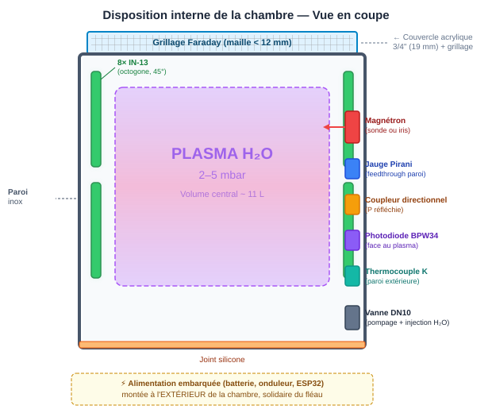
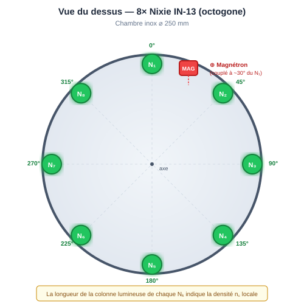
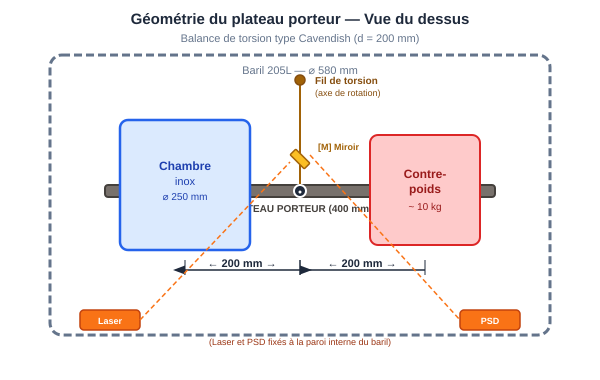
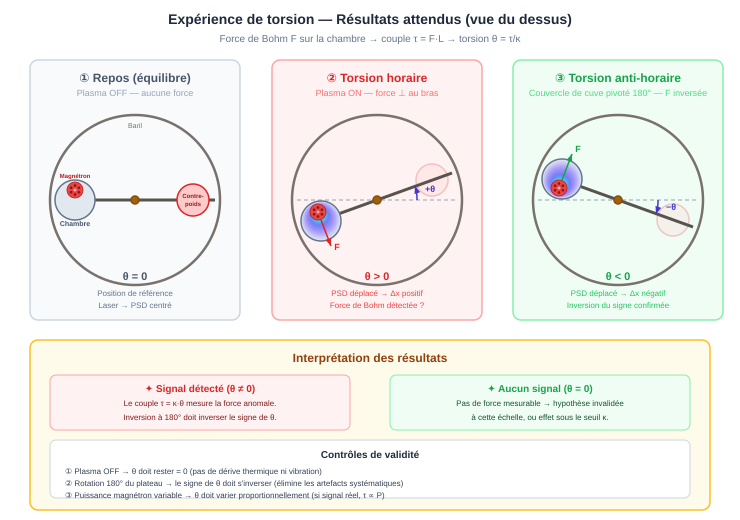
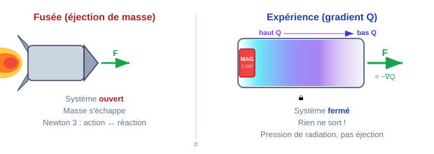
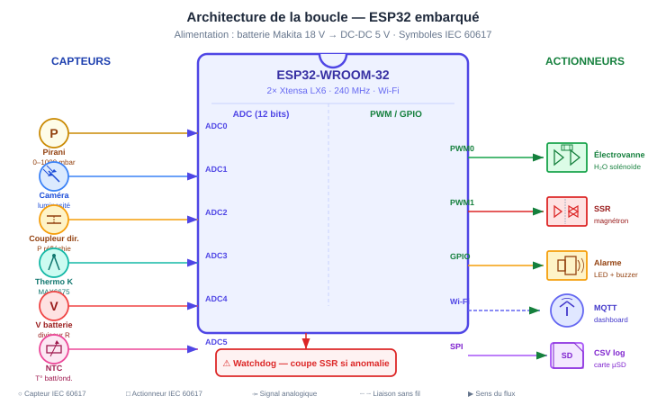
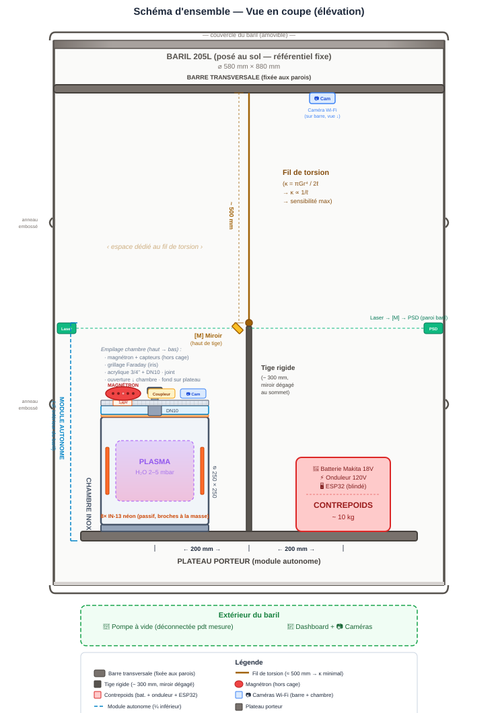
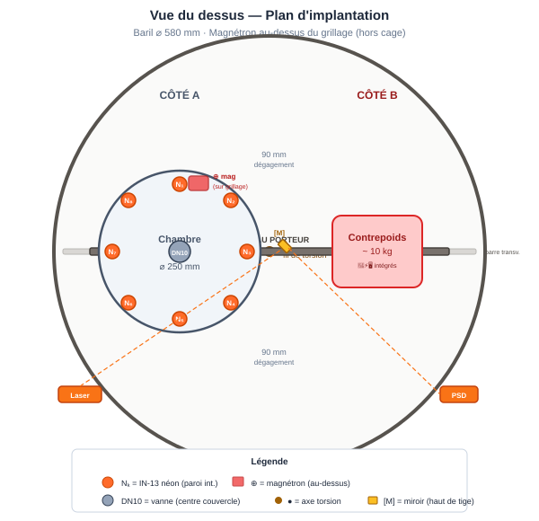

# ⚙️ Configuration Matérielle

[← Retour au README](../README.md) · [← Cadre Théorique](02_theorie.md)

---

## Inventaire du kit — Statut des composants

> 💡 **En termes simples** — Ce tableau liste toutes les pièces du
> montage, comme la liste de courses d'un kit IKEA. Les ✅ sont
> déjà dans l'atelier ; les 🔶 restent à se procurer. Rien ici n'est
> exotique : la plupart des composants viennent de la quincaillerie,
> d'un micro-ondes de récupération ou d'Amazon.

| # | Composant | Statut | Notes |
|:--|:---|:---|:---|
| 1 | Magnétron 2,45 GHz (500 W, récupéré d'un micro-ondes bon marché) | 🔶 À récupérer | Inclut transfo HT + condensateur + diode. Phase 1 : un seul magnétron. |
| 1b | *(Phase 2)* 2ᵉ magnétron 500 W + transfo HT (même modèle) | 🔶 À récupérer | Ajouté en Phase 2 pour commuter la direction du gradient (iris B à 90°). |
| 2 | Chambre à vide inox 3 gal (⌀250×250 mm, 0–29 inHg) | ✅ **En stock** | Avec couvercle acrylique 3/4" et joint silicone |
| 3 | 8× tubes Nixie IN-13 | ✅ **En stock** | Mode passif (broches à la masse, pas de câblage) |
| 4 | Batterie Makita 18V Li-ion (BL1850B, 5 Ah) + socles | ✅ **En stock** | Batteries et socles de charge disponibles |
| 5 | Onduleur 120V AC sinus pur (≥ 1200 W) | ✅ **En stock** | < 1,5 kg, entrée 18V DC |
| 6 | ESP32 (DevKitC ou similaire) | ✅ **En stock** | Boîtier alu blindé requis |
| 7 | Baril 205L (acier, récupéré) | 🔶 À trouver | Avec couvercle amovible |
| 8 | Fil de torsion (acier ou tungstène, ⌀ 0,1–0,2 mm) | 🔶 À acheter | Le + long possible (sensibilité ∝ 1/ℓ) |
| 9 | Plateau porteur + tige rigide (alu ou inox, ⌀ 10–15 mm) | 🔶 À fabriquer | Module autonome : support chambre + contrepoids |
| 10 | Barre transversale (acier ou alu, ⌀ 15–20 mm, ~ 500 mm) | 🔶 À fabriquer | Fixée aux parois du baril, supporte le fil de torsion |
| 11 | Contrepoids (~ 10 kg, ajustable) | 🔶 À fabriquer | Masse + vis de réglage fin |
| 12 | Pompe à vide (palettes ou membrane, ≥ 10 L/min) | ✅ **En stock** | Disponible |
| 13 | Vanne à boisseau sphérique DN10 (quart de tour) | ✅ **En stock** | Inox ou laiton, vide-compatible |
| 14 | Grillage métallique (maille < 12 mm) | ✅ **En stock** | Pour la cage de Faraday (couvercle) |
| 15 | Laser diode (< 5 mW, classe 3R) | ✅ **En stock** | Pour mesure angulaire PSD |
| 16 | PSD (Position Sensitive Detector) | ✅ **En stock** | Disponible |
| 17 | Capteurs : jauge Pirani, coupleur directionnel, caméra Wi-Fi (plasma), thermocouple K + MAX31855, ADS1115 | ✅ **En stock** | Kit capteurs disponible |
| 18 | SSR (relais statique) + MOSFET pour électrovanne | ✅ **En stock** | Commande magnétron |
| 19 | Caméras Wi-Fi (2–3) | ✅ **En stock** | Internes + externes |
| 20 | Miroir plan (~ 20×20 mm) | ✅ **En stock** | Collé en haut de la tige rigide |
| 21 | Résistances ballast, shunts, connectique, ruban cuivre | ✅ **En stock** | Consommables disponibles |

> **Stock confirmé** : **17 composants sur 22** sont en stock (✅).
> Les restants (🔶) sont le(s) magnétron(s) (à récupérer d'un micro-ondes),
> le baril 205L (à trouver) et le fil de torsion — tous facilement
> sourçables. Le plateau porteur (avec la tige rigide) et le contrepoids
> sont à fabriquer. Le 2ᵉ magnétron (1b) n'est nécessaire qu'en Phase 2.

---

## Introduction vulgarisée

Imaginez un petit cylindre en acier inoxydable — une chambre à vide
d'environ 25 cm de diamètre — suspendu à un fil **en plein air**, comme
une balançoire très sensible. À l'intérieur, un four micro-ondes démonté
(le magnétron) envoie ses ondes dans cette chambre contenant une fine
brume d'eau. Les micro-ondes transforment cette brume en **plasma** :
un gaz ionisé lumineux, comme un éclair miniature enfermé dans un bocal.

L'inox est conducteur : la chambre sert donc naturellement de **cage de
Faraday** — aucune radiation ne s'échappe. Le couvercle transparent en
acrylique est recouvert d'un grillage métallique pour compléter le
blindage. L'ensemble est suspendu par un fil de torsion **à l'intérieur
d'un baril métallique de 205 litres**, qui le protège du vent, du soleil
et de toute perturbation extérieure. Le baril est posé au sol et ne
bouge pas — c'est la référence fixe. Si le plasma « pousse » d'un côté,
la chambre tourne imperceptiblement dans le baril, et on le mesure par
réflexion laser à travers un petit hublot.

---

## 3.1 Source RF — Magnétron

> 💡 **En termes simples** — Un magnétron, c'est le composant qui
> chauffe vos plats dans un four micro-ondes. Il transforme
> l'électricité en ondes radio à 2,45 GHz. Ici, au lieu de cuire
> un bol de soupe, on l'utilise pour ioniser de la vapeur d'eau —
> exactement la même pièce, recyclée d'un four de cuisine.
> *(Inventé en 1940 par Boot & Randall [1] pour le radar militaire.)*

### Principe de fonctionnement

Un **magnétron à cavité** est un tube à vide qui convertit l'énergie
électrique en ondes micro-ondes. Son fonctionnement repose sur l'interaction
entre un faisceau d'électrons et un ensemble de cavités résonantes :

1. Un **cathode chauffée** (filament) émet des électrons par effet
   thermoïonique.
2. Une **haute tension** (≈ 4 000 V) entre la cathode et l'anode
   accélère les électrons radialement.
3. Un **champ magnétique permanent** (aimant) force les électrons à
   suivre des trajectoires courbes (cycloïdales).
4. Les électrons passent devant les ouvertures des **cavités résonantes**
   creusées dans l'anode, y induisant des oscillations électromagnétiques
   à la fréquence de résonance.
5. Un **couplage par antenne** extrait l'énergie micro-onde des cavités
   vers un guide d'onde.

### Spécifications techniques

| Paramètre | Valeur |
|:---|:---|
| Fréquence | 2,45 GHz (λ = 12,24 cm) |
| Magnétron (Phase 1) | **1× 500 W** (micro-ondes domestique bon marché) |
| Magnétron (Phase 2) | **2× 500 W** (un seul actif à la fois, commutation direction) |
| Puissance RF nominale (chaque) | ~ 500 W |
| Puissance RF de fonctionnement | **200–400 W** (duty cycle SSR ajustable) |
| Puissance électrique (entrée) | ~ 400–800 W (selon duty) |
| Rendement | ~ 65 % |
| Tension d'anode | ~ 3 500–4 000 V DC |
| Courant d'anode | ~ 150–250 mA |
| Commutation A/B *(Phase 2)* | Via MCU (SSR + volets iris) |

> ⚠️ **Pourquoi pas 1 kW ?** — Un magnétron de 1 kW produit un champ
> $E_{\text{peak}} \approx 23$ kV/m dans la cavité (Q ≈ 100), ce qui
> **sature les tubes Nixie IN-13** (seuil de claquage du néon ≈ 20–50
> kV/m) et compromet la cartographie du gradient de phase (Objectif 2).
> À 200 W ($E_{\text{peak}} \approx 10$ kV/m), le plasma H₂O se
> forme normalement ($E/p$ au-dessus du seuil de maintien) mais les
> Nixie restent en régime **linéaire**. Voir [§3.5](03_materiel.md#limite-de-puissance-rf--saturation-et-échauffement)
> et [§2.4](02_theorie.md#température-électronique).

> 💡 **Magnétrons bon marché — aucun enjeu de qualité** — Les « défauts »
> des magnétrons de micro-ondes domestiques (~5–10 $) sont sans impact :
> le décalage de fréquence entre lots (±20 MHz) est absorbé par la bande
> passante de la cavité ($\Delta f = f/Q \approx 24{,}5$ MHz) ; la largeur
> spectrale (~10–50 MHz) est filtrée par la cavité ; le *frequency pushing*
> et le *pulling* sont identiques sur tout magnétron à cavité et le plasma
> charge la cavité, ce qui verrouille le magnétron sur la résonance
> (*injection locking*). Durée de vie (~1 000 h) largement suffisante.

> ⚠️ **500 W vs 1 000 W — la puissance nominale compte** — Le champ
> pic évolue comme $E_{\text{peak}} = 22{,}7\sqrt{P/1000}$ kV/m. Le duty
> cycle SSR réduit la puissance *moyenne* mais **pas** $E_{\text{peak}}$ :
> chaque pulse ON est à pleine puissance nominale.
>
> | Magnétron | $E_{\text{peak}}$ | Nixie (seuil ~20 kV/m) | Variac requis ? |
> |:---|:---|:---|:---|
> | **500 W** | 16,1 kV/m | ✅ sous le seuil | **Non** — utilisable tel quel |
> | **1 000 W** | 22,7 kV/m | ❌ sature | **Oui** — variac ou SCR (+2 kg, ~20 $) |
>
> **Conclusion** : un magnétron 500 W est le meilleur choix — il fonctionne
> dans la fenêtre optimale sans aucun accessoire de réduction de tension.
> Un 1 000 W fonctionne *aussi*, mais nécessite un variac pour descendre
> $V_{\text{anode}}$ (poids et complexité supplémentaires).

> ⚠️ **Et en dessous de 100 W ?** — Le plasma s'allume dès ~20 W
> dans la cavité, mais la densité électronique reste très inférieure
> à la densité critique ($n_e/n_{e,c} < 0{,}7$). Le gradient de
> l'indice de réfraction est alors trop doux : la transition
> propagation/réflexion s'étale sur ~100 mm au lieu de ~30 mm à la
> coupure. L'expérience perd sa pertinence physique.
> **Minimum absolu : 100 W** ($n_e/n_{e,c} \approx 0{,}73$).
> **Zone optimale : 150–200 W** ($n_e/n_{e,c} \approx 0{,}9\text{–}1{,}0$).
> Voir le [bilan de puissance détaillé](02_theorie.md#bilan-de-puissance-et-puissance-rf-minimale).
| Champ magnétique | ~ 0,1 T (aimants permanents) |

### Fréquence de 2,45 GHz

Cette fréquence est choisie car :

- C'est une **bande ISM** (Industriel, Scientifique, Médical) — pas de
  licence requise.
- La longueur d'onde ($\lambda = c/f = 12{,}24$ cm) est compatible avec
  les dimensions de la chambre à plasma.
- La fréquence plasma de la vapeur d'eau ionisée ($f_p \sim 1-9$ GHz)
  chevauche cette fréquence, permettant une **interaction forte** onde-plasma.

### Mode de fonctionnement pulsé

Le magnétron est activé en mode **pulsé** à la fréquence de résonance
mécanique de la chambre $f = 1/T_0$. Ce mode permet :

- D'amplifier le mouvement du pendule par **résonance mécanique**.
- De distinguer l'effet de poussée de l'effet thermique (le chauffage est
  continu, la poussée est pulsée et corrélée).
- De réduire la puissance thermique moyenne déposée.

---

## 3.2 Enceinte intégrée — Chambre à vide inox

> 💡 **Simplification majeure** — L'architecture initiale prévoyait un
> baril de 205L comme cage de Faraday externe + une chambre à plasma
> séparée. La chambre à vide en inox décrite ci-dessous **cumule les
> trois fonctions** (cage de Faraday, chambre à vide, masse oscillante).
> Le baril de 205L sert d'**enceinte du pendule de torsion** : la
> chambre est suspendue par un fil à l'intérieur du baril, qui repose
> au sol comme référentiel fixe. Le baril cumule ainsi 5 fonctions :
> protection contre le vent, stabilité thermique, double cage de
> Faraday, rétention d'éclats et confinement des gaz (défense en
> profondeur). Voir la [section pendule](#36-mesure--pendule-de-torsion)
> et la [section sécurité](05_securite.md#enceinte-du-pendule-et-confinement-baril-de-205l).

### Fonction

La chambre inox remplit **trois fonctions simultanées** :

1. **Chambre à vide et cavité RF** — Confine le plasma et sert de
   cavité résonante pour les micro-ondes.
2. **Cage de Faraday** — L'inox est conducteur ($\sigma \approx 1{,}4 \times 10^6$ S/m) ;
   les parois métalliques + le couvercle acrylique recouvert de grillage
   confinent le rayonnement RF.
3. **Masse oscillante** — Suspendue au fil de torsion, c'est l'élément
   mobile dont on mesure le déplacement.

### Spécifications

| Paramètre | Valeur |
|:---|:---|
| Type | Chambre à vide de laboratoire |
| Volume | 3 gallons US (≈ 11,4 litres) |
| Matériau | Acier inoxydable |
| Diamètre intérieur | 250 mm |
| Hauteur intérieure | 250 mm |
| Couvercle | Acrylique (PMMA), épaisseur 3/4" (19 mm) |
| Joint d'étanchéité | Silicone |
| Certification vide | 0 à 29 inHg (≈ 0 à 982 mbar de dépression) |
| Pression résiduelle min. | ~ 18 mbar (vide limite à 29 inHg) |
| Masse estimée (vide) | ~ 5 kg |

> **Note :** 29 inHg correspond à une pression absolue d'environ
> $1\,013 - 982 = 31$ mbar. Pour atteindre le régime optimal de
> 2–5 mbar, une pompe à vide plus performante (pompe à palettes) sera
> nécessaire. La certification à 29 inHg garantit toutefois la tenue
> mécanique sous vide partiel.

### Efficacité de blindage RF

L'atténuation $A$ d'une cage de Faraday en inox à 2,45 GHz :

L'épaisseur de peau dans l'inox ($\sigma \approx 1{,}4 \times 10^6$ S/m) :

$$\delta = \sqrt{\frac{1}{\pi f \mu_0 \sigma}} = \sqrt{\frac{1}{\pi \times 2{,}45 \times 10^9 \times 4\pi \times 10^{-7} \times 1{,}4 \times 10^6}} \approx 8{,}6 \; \mu\text{m}$$

Pour une paroi d'inox typique (~ 2 mm) :

$$A \approx 20 \log_{10}\left(\frac{2\,000}{8{,}6}\right) \approx 47 \; \text{dB}$$

Soit un facteur $\sim 50\,000$ en puissance — blindage excellent.

### Complétion de la cage de Faraday (couvercle)

Le couvercle en acrylique est transparent aux micro-ondes. Pour fermer
la cage de Faraday, le montage est réalisé **en sandwich** de bas en
haut :

1. **Couvercle acrylique 3/4"** — posé sur la bride inox de la
   chambre (joint silicone). Percé en son **centre** pour la vanne
   DN10 (pompage + injection H₂O). L'acrylique assure la rigidité
   structurelle et la transparence visuelle.
2. **Grillage métallique** (cuivre ou inox) — posé **directement
   sur l'acrylique**. Maille < $\lambda/10 = 12$ mm. **Contact
   galvanique** avec la bride inox (ruban de cuivre, pinces ou
   vis). Le grillage comporte une **fenêtre (iris)** pour le
   passage de l'antenne du magnétron.
3. **Magnétron** — monté **au-dessus du grillage**, c'est-à-dire
   **à l'extérieur de la cage de Faraday**. L'antenne pointe vers
   le bas à travers l'iris du grillage et le couvercle acrylique
   pour injecter les micro-ondes dans la cavité.

Ce montage permet de :
- **Voir le plasma** à travers le grillage et le couvercle acrylique
  (observation visuelle directe).
- Garder le magnétron **hors du volume sous vide** et **hors de la
  cage de Faraday** — accessible sans démontage.
- Fermer la cage de Faraday entièrement (inox + grillage directement
  sur acrylique) avec une seule ouverture contrôlée (iris).

### Avantages par rapport au baril de 205L

| Critère | Baril 205L (ancien) | Chambre inox 3 gal (actuel) |
|:---|:---|:---|
| Masse | ~ 20 kg | ~ 5 kg |
| Volume | 205 L | 11,4 L |
| Sensibilité pendule | Faible (masse élevée → $\theta$ petit) | **4× meilleure** (masse réduite) |
| Certification vide | Aucune (bricolage) | 0–29 inHg (industrielle) |
| Cage de Faraday | Native (acier) | Native (inox) + grillage couvercle |
| Encombrement | Volumineux | Compact (25 × 25 cm) |
| Complexité | Chambre séparée à l'intérieur | Tout intégré |

---

## 3.3 Cavité RF et modes de résonance

### Dimensions de la cavité

La chambre inox sert directement de **cavité résonante** pour les
micro-ondes. Ses dimensions :

- Rayon : $a = 125$ mm
- Hauteur : $d = 250$ mm
- Parois : inox (conductivité finie → pertes ohmiques modérées)
- Couvercle : acrylique 19 mm, percé au centre (vanne DN10).
  Partiellement transparent aux RF → recouvert de grillage
  (directement sur l'acrylique) pour le confinement. Le magnétron
  est monté au-dessus du grillage, à l'extérieur de la cage.

### Modes de résonance

Le calcul théorique des modes TM/TE et la table complète des
17 fréquences de résonance sont détaillés dans
[§2.5 Modes de résonance de la cavité cylindrique](02_theorie.md#25-modes-de-résonance-de-la-cavité-cylindrique).

**Résultat clé** : le mode **TM$_{310}$** à **2,44 GHz** est quasi
parfaitement accordé à la fréquence du magnétron (2,45 GHz).

> 📐 **Modes propres** — Le script [002_modes_cavite.py](../experiments/002_modes_cavite.py)
> calcule les 17 fréquences TM/TE de la cavité cylindrique ($a = 125$ mm,
> $d = 250$ mm) et identifie le TM$_{310}$ à 2,44 GHz comme mode dominant.

> 📐 **Superposition 3D** — Le [modèle 3D](../experiments/009_plasma_3d.py)
> superpose 4 modes (TM$_{310}$, TM$_{110}$, TM$_{210}$, TM$_{311}$)
> avec des poids relatifs et des déphasages. Le mode TM$_{311}$ ($p=1$)
> introduit une **variation axiale** $\cos(\pi z/d)$ qui structure le
> champ verticalement — négligée dans les modèles 2D ($p=0$).

### Couplage du magnétron

Le magnétron est monté **au-dessus du grillage Faraday**, c'est-à-dire
**à l'extérieur de la cage de Faraday**. Le grillage, posé
directement sur l'acrylique, comporte une **fenêtre (iris)** à
travers laquelle l'antenne du magnétron pointe **vers le bas**.
L'onde traverse l'iris puis le couvercle acrylique (transparent RF)
pour atteindre la cavité.

Cette position est **excentrée** (~30° du N₁) pour exciter
préférentiellement le mode TM$_{310}$. Le magnétron étant au-dessus
du grillage, il est **hors du volume sous vide** et **hors de la
cage de Faraday** — à pression atmosphérique — ce qui simplifie
l'alimentation HT et le refroidissement.

> 💡 **Avantage clé** — Le magnétron n'est ni dans le vide, ni dans
> la cage. Pas besoin de feedthrough HT (4 000 V). Il est accessible
> sans démontage. Le grillage ferme la cage directement sur
> l'acrylique avec une ouverture contrôlée (iris). En Phase 2, une
> seconde iris est ajoutée pour le magnétron B.

### Architecture bi-magnétron — Contrôle de la direction de la force *(Phase 2)*

> 💡 **Approche phasée** — En **Phase 1**, un seul magnétron est utilisé
> (iris A seulement). L'objectif est de détecter la force et mesurer
> sa magnitude. En **Phase 2**, un second magnétron est ajouté à une
> position angulaire différente pour **corréler la direction de la force
> avec la direction du gradient** (Objectif 2 — test critique).

Deux magnétrons 500 W identiques sont montés côte à côte au-dessus du
grillage Faraday, à des **positions angulaires distinctes** :

- **Magnétron A** : iris à ~30° du N₁ (position actuelle)
- **Magnétron B** : iris à ~120° du N₁ (Δθ = 90° entre A et B)

Un seul magnétron est actif à la fois. En commutant entre A et B,
on modifie la **carte de champ** dans la cavité, donc le gradient de
densité plasma $\nabla n_e$, donc la direction attendue de la force
$\vec{F} = -\nabla Q$. C'est un levier de contrôle actif pour
l'**Objectif 2** (corrélation direction gradient Nixie ↔ direction
force au pendule).

#### Isolation RF du magnétron inactif

Un magnétron éteint (OFF, $V_{\text{anode}} = 0$) présente son antenne
comme un **stub passif** couplé à la cavité. La puissance RF du
magnétron actif peut induire un échauffement ou un arc dans le
magnétron OFF.

Solution : un **volet métallique** (tôle aluminium 2 mm) commandé par
un micro-servo ou solénoïde **obture l'iris du magnétron inactif**.
L'iris obturée restaure la continuité du grillage Faraday → isolation
RF quasi-totale (atténuation > 30 dB). Le servo est piloté par l'ESP32.

| Paramètre | Valeur |
|:---|:---|
| Masse par volet | ~50 g (tôle alu 2 mm + servo SG90) |
| Consommation servo | ~150 mA @ 5 V (actif), 0 en position |
| Temps de commutation | ~200 ms |
| Atténuation iris obturée | > 30 dB |

> 💡 **Pourquoi un transfo HT par magnétron ?** — Partager un seul
> transformateur nécessiterait de commuter la sortie HV (**4 000 V DC
> @ 250 mA**) entre les deux tubes, ce qui requiert un relais HV
> spécialisé (cher, lourd, risque d'arc). En gardant un transfo par
> magnétron, on commute sur le **primaire 120 V AC** avec un simple
> SSR ou relais — sûr, fiable, ~5 $. Chaque ensemble
> (transfo + diode + condensateur + magnétron) est récupéré en bloc
> du même micro-ondes — coût supplémentaire : 0 $. Le surpoids du
> second transfo (~2 kg) est compensé en ajoutant du contrepoids
> côté B du plateau.

#### Séquence de commutation A → B (MCU)

1. Couper SSR du magnétron A (OFF immédiat)
2. Attendre 200 ms (décharge du transfo HT)
3. Fermer volet iris A (servo → position fermée)
4. Ouvrir volet iris B (servo → position ouverte)
5. Attendre 100 ms (confirmation position servo)
6. Activer SSR du magnétron B (ON)

Temps total de commutation : **~500 ms** — négligeable devant
$T_0 \approx 20$ s (période du pendule).

> ⚠️ **Sécurité** — Les deux SSR sont câblés en interlock matériel
> (logique ET inversée) : impossible d'activer A et B simultanément,
> même en cas de bug firmware. En cas de défaut, les deux SSR se
> coupent (fail-safe).

### Disposition interne de la chambre

La chambre inox est un **chaudron ouvert en haut**. Le couvercle
acrylique est posé dessus avec un joint silicone. Le **grillage
Faraday** est posé **directement sur l'acrylique** (avec une fenêtre
iris). Le **magnétron** est monté **au-dessus du grillage**, à
l'extérieur de la cage de Faraday.

L'ensemble repose sur un **plateau porteur** soutenu par une
**tige rigide verticale** dont le sommet est accroché au fil de
torsion. Ce module autonome (tige + plateau + chambre + contrepoids)
peut être assemblé et testé sur un établi avant d'être suspendu
dans le baril.

Principe directeur : **tout ce qui est à l'intérieur de la cage de
Faraday (chambre inox + grillage) est exposé aux micro-ondes**. Les
composants électroniques sensibles doivent donc être placés **à
l'extérieur de la cage** (au-dessus du grillage ou hors de la
chambre).

Vue en coupe du montage complet :

<!-- Fallback ASCII

    EXTÉRIEUR (dessus) — pression atmosphérique
    ┄┄┄┄┄┄┄┄┄┄┄┄ HORS CAGE ┄┄┄┄┄┄┄┄┄┄┄
         ┌────────────┐
         │ MAGNÉTRON  │ ← au-dessus du grillage
         │  antenne ↓ │   (hors cage de Faraday)
         └─────┬──────┘
    ╔══════════╪═══════════════════════╗
    ║  Grillage Faraday (maille <12mm) ║ ← Ferme la cage de Faraday
    ║     ┌────────┐                   ║    On voit le plasma à travers
    ║     │  iris  │ ← fenêtre         ║
    ║     └────┬───┘                   ║
    ╚══════════╪═══════════════════════╝
         ┌─────┴──────┐
         │ Connecteur │ ← raccord tuyau pompe
         └─────┬──────┘
    ╔══════════╪═══════════════════════╗
    ║  ACRYLIQUE 3/4" (19 mm)          ║ ← Couvercle transparent RF
    ║                   ┌──────┐       ║
    ║                   │Vanne │ ← DN10 percée au centre
    ║                   │DN10  │   (pompage + injection H₂O)
    ║                   └──┬───┘       ║
    ╚══════════╪═══════════════════════╝
    ── Joint silicone ─────┼────────────
    ┌──────────────────────┴───────────┐
    │                                  │ ← Chambre inox (chaudron)
    │  8× Nixie IN-13 (paroi interne)  │    ouverture en haut
    │  (octogone, centrés en hauteur)   │
    │                                  │
    │  ┌────────────────────────────┐  │
    │  │  PLASMA  H₂O              │  │ ← Volume central (~11 L)
    │  │  2–5 mbar                 │  │    sous vide
    │  │                           │  │
    │  └────────────────────────────┘  │
    │                                  │
    │  Thermocouple K    ──→ paroi ext │ ← Seul capteur sur la paroi
    │                                  │
    └──────────────────────────────────┘
    ════════════════════════════════════
    FOND INOX (repose sur le plateau)

    CAPTEURS HORS CAGE DE FARADAY :
    ┌──────────────────────────────────┐
    │  Coupleur directionnel  → au-    │
    │  Caméra Wi-Fi (plasma)    dessus │
    │                           du     │
    │  Jauge Pirani  → ligne    grill- │
    │                   de      age    │
    │                   pompage        │
    └──────────────────────────────────┘
-->

#### Zones du montage

| Zone | Contenu | Pression | RF |
|:---|:---|:---|:---|
| **Intérieur chambre** (sous le grillage) | Plasma H₂O, 8× Nixie IN-13 | Vide (2–5 mbar) | ⚠️ Exposé RF (200–300 W recommandé — voir [§3.5](#limite-de-puissance-rf--saturation-et-échauffement)) |
| **Au-dessus du grillage** | Magnétron + coupleur directionnel + caméra Wi-Fi | Atmosphérique | ⚠️ Hors cage (émetteur) |
| **Contrepoids** (côté B du plateau) | Batterie, onduleur, ESP32 (blindé) | Atmosphérique | ✅ Éloigné |

#### Composants et leur placement

| Composant | Emplacement | Justification |
|:---|:---|:---|
| **Magnétron A** (500 W) | Au-dessus du grillage, iris à ~30° de N₁ | Hors vide, hors cage. Antenne ↓ à travers iris A + acrylique |
| *(Phase 2)* **Magnétron B** (500 W) | Au-dessus du grillage, iris à ~120° de N₁ | Idem, Δθ = 90° → changement de direction du gradient |
| *(Phase 2)* **Volets iris A/B** | Sur le grillage, commandés par micro-servos | Isolation RF du magnétron OFF (> 30 dB) |
| **Vanne DN10 + connecteur** | Centre du couvercle acrylique, connecteur au-dessus | Accès direct au volume sous vide pour pompage et injection ; le connecteur permet de brancher/débrancher le tuyau de pompe |
| **8× Nixie IN-13** | Paroi intérieure (octogone, centrés en hauteur), broches à la masse | Mode passif : ionisation RF directe du néon, pas de câblage. Lecture par caméra Wi-Fi |
| **Jauge Pirani** | Ligne de pompage (extérieure) ou feedthrough paroi | Mesure la pression sans être irradiée |
| **Coupleur directionnel** | Au-dessus du grillage, à côté du magnétron | Hors vide, hors cage — accès facile |
| **Caméra Wi-Fi (plasma)** | Au-dessus du grillage, regarde à travers le maillage | Hors cage, voit le plasma et les Nixie — image complète + mesure de luminosité |
| **Thermocouple K** | Paroi extérieure (collé dehors) | Passif, résistant RF, ne nécessite pas de feedthrough |
| **ESP32 + électronique** | Dans le contrepoids (côté B du plateau), boîtier blindé | Éloigné de la RF, sert aussi de masse d'équilibrage |

> 💡 **Pourquoi les Nixie survivent aux micro-ondes** — Les tubes
> IN-13 sont des **tubes à décharge gazeuse** (néon + mercure). Ils
> n'ont aucun circuit intégré, aucun semi-conducteur. Le champ RF
> à 2,45 GHz traverse le verre et ionise directement le néon — le
> tube **brille spontanément** sans alimentation. C'est précisément
> ce qu'on veut : la réponse **passive** du gaz au champ EM local.
>
> Les broches (anode + cathode) sont **court-circuitées à la paroi
> inox** de la chambre. Cela élimine tout effet d'antenne (pas de
> métal flottant dans la cavité), assure une fixation mécanique
> simple, et ne perturbe pas le mode TM₃₁₀ (surface des broches
> négligeable vs. la cavité de 250 mm).

L'**alimentation embarquée** (batterie, onduleur, ESP32) est intégrée
dans le **contrepoids** (côté B du plateau). Cela simplifie le côté
chambre et utilise la masse de ces composants comme masse
d'équilibrage. La seule traversée de paroi de la chambre est le
**thermocouple**. Les Nixie sont entièrement à l'intérieur, sans
câblage — zéro feedthrough pour les capteurs de champ.

---

## 3.4 Médium — Plasma de vapeur d'eau

> 💡 **En termes simples** — Un plasma, c'est un gaz tellement
> chauffé (ou électrifié) que ses atomes perdent des électrons.
> C'est le « quatrième état de la matière » — après solide, liquide,
> gaz. Les néons dans la rue, les éclairs, le Soleil : tous des
> plasmas. Ici, on ionise de la vapeur d'eau à l'aide des
> micro-ondes, un peu comme un orage miniature dans une boîte.
> Le plasma obtenu modifie la vitesse des ondes qui le traversent
> (Chen [5], Lieberman & Lichtenberg [6]).

### Formation du plasma et rôle physique

Le mécanisme d'ionisation par claquage RF et le rôle du plasma
comme modulateur de phase bohmien sont détaillés dans
[§2.6 Formation et rôle physique du plasma](02_theorie.md#26-formation-et-rôle-physique-du-plasma).

### Composition chimique

Le plasma de vapeur d'eau contient un mélange complexe d'espèces :

| Espèce | Type | Rôle |
|:---|:---|:---|
| $e^-$ | Électrons libres | Porteurs du courant, modifient $n_e$ |
| $\text{H}_2\text{O}^+$ | Ion moléculaire | Ion primaire |
| $\text{OH}$ | Radical hydroxyle | Espèce réactive dominante |
| $\text{H}$ | Hydrogène atomique | Produit de dissociation |
| $\text{O}$ | Oxygène atomique | Produit de dissociation |
| $\text{H}_2$ | Hydrogène moléculaire | Recombinaison |
| $\text{O}_3$ | Ozone | Sous-produit (⚠️ toxique) |

### Émission optique — Couleur du plasma

> 💡 **En termes simples** — La couleur d'un plasma n'est pas
> arbitraire : chaque espèce chimique émet de la lumière à des
> longueurs d'onde précises, comme une empreinte digitale lumineuse.
> Un plasma de vapeur d'eau est **bleu-violet** avec un cœur
> blanc-bleu — assez différent d'un plasma d'argon (violet pur) ou
> de néon (rouge-orange). Ce sont ces couleurs qui sont représentées
> dans le [schéma SVG de l'expérience de torsion](img/torsion_experience.svg).

Le spectre d'émission d'un plasma H₂O basse pression à 2,45 GHz est
dominé par les transitions suivantes (Pearse & Gaydon [13],
Bruggeman *et al.* [14], base NIST ASD [15]) :

| Zone | Couleur visible | Longueur d'onde | Espèce / Transition | Hex (SVG) |
|:---|:---|:---|:---|:---|
| **Cœur** | Blanc pur | Continuum | Bremsstrahlung + recombinaison (~3 000 K) | `#ffffff` |
| Très chaud | Blanc-cyan | 306–309 nm (UV → bleu perçu) | OH· A²Σ⁺ → X²Π (bande ultraviolette) | `#e0f2fe` |
| Chaud | Cyan | 309 nm (perçu) | OH· (système $\Delta v = 0$, tête de bande à 306,4 nm) | `#7dd3fc` |
| Intermédiaire | **Bleu vif** | **486,1 nm** | H$_\beta$ (Balmer, $n=4 \to 2$) | `#38bdf8` |
| Transition | Indigo | 486 → 656 nm | Mélange H$_\beta$ + faible H$_\alpha$ | `#6366f1` |
| Halo | **Violet** | **656,3 nm** + résiduel bleu | H$_\alpha$ (Balmer, $n=3 \to 2$) + continuum bleu | `#8b5cf6` |
| Frange | Violet-rose | 656 nm atténué | H$_\alpha$ basse densité + O I 777 nm (proche IR) | `#a855f7` |
| Extinction | Rose pâle | — | Faible recombinaison résiduelle | `#c084fc` |
| Bord | Transparent | — | Fond | `#e9d5ff` → 0 |

> **Note** — La raie H$_\alpha$ (656 nm) est dans le rouge pur, mais
> dans un plasma H₂O à basse pression elle se superpose toujours au
> continuum bleu et aux raies OH·, donnant visuellement un **violet**
> (mélange rouge + bleu) et non un rouge pur. C'est une caractéristique
> distinctive des plasmas de vapeur d'eau par rapport aux plasmas
> d'hydrogène pur.

#### Comparaison avec d'autres plasmas

| Gaz | Couleur dominante | Raies principales | Référence |
|:---|:---|:---|:---|
| **H₂O** (cette expérience) | **Blanc-bleu → violet** | OH· 309 nm, H$_\beta$ 486 nm, H$_\alpha$ 656 nm | Bruggeman [14] |
| Argon | Violet-lilas | Ar I 750, 763, 811 nm | NIST ASD [15] |
| Néon | Rouge-orange | Ne I 585, 640 nm | NIST ASD [15] |
| Azote (air) | Bleu-rose | N₂ bandes 337, 358 nm; N₂⁺ 391 nm | Pearse & Gaydon [13] |
| Hélium | Jaune-rose | He I 587, 668 nm | NIST ASD [15] |

Cette signature spectrale est utile pour **vérifier visuellement** que
le plasma est bien constitué de vapeur d'eau dissociée (et non d'air
résiduel). Un plasma bleu-violet avec un cœur blanc confirme la
présence dominante de H et OH·. Un plasma rose ou rose-bleu
indiquerait une contamination par l'azote de l'air (fuite).

---

## 3.5 Capteurs — Tubes Nixie linéaires (8× IN-13) — Mode passif

### Principe de fonctionnement

Les tubes Nixie **linéaires** IN-13 sont des tubes à décharge gazeuse
remplis de **néon** avec un peu de mercure (effet Penning). En mode
actif (alimenté), la colonne lumineuse a une longueur proportionnelle
au courant (0–100 mm pour 0–5 mA).

Dans cette expérience, les IN-13 sont utilisés en **mode passif** :

- **Aucune alimentation externe** — le champ RF à 2,45 GHz
  (200–300 W recommandé — voir [§3.5](#limite-de-puissance-rf--saturation-et-échauffement))
  traverse le verre du tube et ionise le néon par couplage RF.
  Le tube brille spontanément, avec une intensité proportionnelle
  au champ local.
- **Broches court-circuitées à la paroi inox** — les deux électrodes
  (anode + cathode) sont en contact avec la paroi de la chambre
  (mises à la masse de la cavité). Cela élimine tout effet d'antenne
  (pas de métal flottant) et supprime la rectification DC parasite
  qui se produirait avec des broches flottantes.
- **Aucun câblage, aucun feedthrough** — pas de résistance ballast,
  pas de fils traversant la paroi, pas de canal ADC sur l'ESP32.
  Zéro artefact électrique sur le pendule.

### Utilisation comme capteurs passifs de champ RF

Les tubes Nixie sont utilisés de manière non conventionnelle :

- Placés **à l'intérieur de la chambre** (sur la paroi interne,
  **centrés en hauteur** pour être dans la zone de densité plasma
  maximale), ils répondent **passivement** au champ EM local.

> ⚠️ **Attention à la position $z$** — Les Nixie sont centrés en hauteur
> ($z = d/2 = 125$ mm). Or, le [modèle 3D](../experiments/009_plasma_3d.py)
> prédit que le maximum de densité plasma est à $z \approx 0{,}75d = 188$ mm
> (plus près du magnétron situé au sommet). Les Nixie ne sondent donc pas
> le pic de $n_e$, mais la zone de transition. Cela affecte l'interprétation
> de la cartographie octogonale. Voir [data/009_coupe_axiale_plasma.png](../data/simulations/009_coupe_axiale_plasma.png).
- Le néon s'ionise par claquage RF — la **brillance** et
  l'**étendue** de la lueur sont proportionnelles à l'intensité du
  champ EM en ce point.
- Étant des **tubes à décharge** sans composant semi-conducteur,
  ils résistent aux micro-ondes et ne perturbent pas les modes de
  la cavité.
- La brillance de chaque tube fournit une **indication visuelle
  directe** de l'intensité du champ RF local — visible à travers le
  grillage et le couvercle acrylique, filmée par la caméra Wi-Fi.
- En disposant **8 tubes IN-13** autour de la chambre, on obtient une
  **cartographie octogonale** du gradient de champ / densité plasma.

### Pourquoi court-circuiter les broches à la paroi ?

| Configuration | Comportement | Problème |
|:---|:---|:---|
| Broches **flottantes** | Les électrodes agissent comme antennes → rectification DC parasite | La brillance ne reflète plus uniquement le champ local |
| Broches **court-circuitées** (soudées entre elles) | Pas de différence de potentiel → ionisation RF pure | ✅ Mesure propre |
| Broches **à la paroi inox** | Court-circuit + mise à la masse de la cavité | ✅ **Optimal** : zéro métal flottant, fixation mécanique |

**Fixation recommandée** : un point d'époxy haute température pour
plaquer le tube contre la paroi, broches en contact direct avec
l'inox. Aucun risque de court-circuit dommageable (pas de circuit,
pas d'alimentation). Les broches sont minuscules (~1 mm) par rapport
à la cavité (250 mm) — perturbation du mode TM₃₁₀ négligeable.

### Disposition des 8 IN-13 — Cartographie du gradient

Les 8 tubes sont montés **verticalement** sur la paroi intérieure de
la chambre, espacés de **45°** (octogone régulier) :

<!-- Fallback ASCII
            Vue du dessus — Chambre inox (⌀ 250 mm)

                      N₁ (0°)
                    ╱        ╲
               N₈ (315°)   N₂ (45°)
              │                    │
        N₇ (270°)              N₃ (90°)
              │     ┌──────┐     │
               N₆ (225°)  │vanne │  N₄ (135°)
                    ╲    │DN10  │  ╱
                      N₅│(180°)│
                         └──────┘

            Nₖ = tube IN-13 n° k
            Le magnétron est au-dessus du grillage,
            couplé par iris à ~ 30° du N₁
-->

Cette disposition permet de mesurer :

| Mesure | Méthode |
|:---|:---|
| **Symétrie du champ** | Comparer les 8 colonnes lumineuses : si toutes égales → champ homogène ; si gradient → asymétrie |
| **Direction du gradient** | Le tube le plus long indique la région de plus forte densité $n_e$ |
| **Intensité du gradient** | $\Delta L = L_{\max} - L_{\min}$ proportionnel à $\nabla n_e$ |
| **Confirmation de l'asymétrie** | Corrélation entre la direction du gradient Nixie et la direction de la force mesurée au pendule |

> 💡 **C'est la mesure la plus critique** — Si on observe une force au
> pendule sans asymétrie visible sur les Nixie, c'est probablement un
> artefact. Si l'asymétrie Nixie corrèle spatialement avec la force,
> c'est un indice fort du gradient de phase.

### Lecture par caméra Wi-Fi

Une **caméra Wi-Fi** embarquée (au-dessus du grillage Faraday) filme
les 8 tubes simultanément. L'analyse d'image (luminosité relative
par zone) fournit la cartographie du gradient de champ :

- **Brillance relative** entre les 8 tubes → direction du gradient.
- **Variation temporelle** → corrélation avec l'activation du plasma.
- Pas de canal ADC nécessaire sur l'ESP32 pour les Nixie.
- Les données d'image sont transmises en Wi-Fi et analysées
  en post-traitement (segmentation d'image, extraction de luminosité
  par tube).

> 💡 **Avantage du mode passif pour le pendule** — En éliminant les
> 16 fils de feedthrough (2 par tube), les résistances ballast et
> le circuit de mesure INA219/ADS1115, on supprime toute source
> d'artefact électrique (forces de Lorentz sur les fils dans le
> champ magnétique, masse ajoutée asymétrique, courants parasites).
> Le pendule ne voit que la masse des 8 tubes en verre (~24 g
> au total) — répartis uniformément en octogone.

### Limite de puissance RF — Saturation et échauffement

> ⚠️ **1 kW est excessif pour les Nixie !** — À puissance nominale
> du magnétron (1 kW), le champ électrique pic dans la cavité
> atteint $E_{\text{peak}} \approx 23$ kV/m (pour Q ≈ 100), ce qui
> est **au seuil de claquage** du néon dans les IN-13 (~20–50 kV/m
> à 2,45 GHz). À ce niveau, les 8 tubes sont en **ionisation
> saturée** : ils brillent tous à fond, sans proportionnalité avec
> le champ local. La fonction de capteur de gradient est **perdue**.

Le tableau ci-dessous résume les régimes de fonctionnement :

| $P_{\text{RF}}$ | $E_{\text{peak}}$ (Q=100) | P absorbée / tube | Régime Nixie | Fonction gradient |
|:---|:---|:---|:---|:---|
| 100 W | 7,2 kV/m | 0,27 W | Lueur faible, proportionnelle | ✅ Excellent |
| 200 W | 10,1 kV/m | 0,54 W | Lueur modérée, **linéaire** | ✅ **Optimal** |
| 300 W | 12,4 kV/m | 0,81 W | Lueur vive, début de compression | ⚠️ Acceptable |
| 500 W | 16,0 kV/m | 1,36 W | Ionisation forte | ⚠️ Compression visible |
| 1 000 W | 22,7 kV/m | 2,72 W | **Saturation**, claquage violent | ❌ **Perdue** |

**Risques à 1 kW** :

1. **Saturation des capteurs** — les 8 tubes brillent uniformément
   → impossible de distinguer le gradient azimutal $\nabla n_e$.
   L'Objectif 2 (cartographie du gradient de phase) est compromis.
2. **Échauffement localisé** — chaque tube absorbe ~2,7 W. Les
   soudures verre-métal (kovar) des IN-13 sont limitées à
   ~300–400 °C. En tir continu (> 30 s), risque de fissure
   thermique ou de dégazage du mercure.
3. **Perte de linéarité** — au-delà du seuil de claquage, la
   brillance ne code plus le champ local mais seulement
   l'énergie injectée (constante pour tous les tubes).

**Recommandation — Fenêtre de puissance exploitable** :

$$\boxed{100 \; \text{W} \;\leq\; P_{\text{RF}} \;\leq\; 300 \; \text{W} \qquad \text{(optimal : 150–200 W)}}$$

Trois contraintes encadrent cette fenêtre :

| Contrainte | Borne | $P_{\text{RF}}$ | Critère physique |
|:---|:---:|:---:|:---|
| Gradient de phase insuffisant | min | ~100 W | $n_e/n_{e,c} < 0{,}7$ → transition étalée sur ~100 mm |
| **Zone optimale** | **cible** | **150–200 W** | $n_e/n_{e,c} \approx 0{,}9\text{–}1{,}0$ → coupure abrupte (~30 mm) |
| Saturation Nixie | max | ~300 W | $E_{\text{peak}} > 20$ kV/m → claquage néon |

À 200 W, le champ pic (~10 kV/m) est **sous le claquage** : le néon
subit une ionisation douce où la brillance est proportionnelle à
$|E|^2$ local → capteur de gradient fonctionnel. La force de
radiation correspondante ($F_{\text{rad}} \approx 0{,}43\;\mu$N) reste
mesurable par le pendule ($\Delta x \approx 0{,}5$ mm sur le PSD,
résolution ~1 µm).

Voir le [bilan de puissance détaillé](02_theorie.md#bilan-de-puissance-et-puissance-rf-minimale)
pour la justification complète (bilan ionisation-recombinaison, gradient
d'indice de réfraction, et force mesurable en fonction de $P_{\text{RF}}$).

Le mode **pulsé** du magnétron (duty cycle SSR 25–50 %) réduit la
puissance *moyenne* mais **pas la puissance crête** : pendant chaque
pulse « ON » (typiquement 50–100 ms), le champ dans la cavité atteint
sa valeur nominale complète. Pour un magnétron de 1 kW, cela signifie
$E_{\text{peak}} = 22{,}7$ kV/m *à chaque pulse* — les Nixie saturent
pendant la phase ON, et l'information de gradient est perdue.

Pour rester dans la fenêtre 100–300 W en puissance **crête**
(pas seulement moyenne), trois approches sont possibles :

| Méthode | Principe | Masse ajoutée | Fiabilité | Compatibilité |
|:---|:---|:---|:---|:---|
| **A. Magnétron compact 600–700 W** | Transfo HT plus petit → $V_{\text{anode}}$ réduite → puissance nominale moindre. Piloté à 30–50 % via variac ou SCR. | 0 (remplace le 1 kW) | ★★★ | Tout four compact (Panasonic, LG…) |
| **B. Magnétron 1 kW + variac** | Autotransformateur variable sur le primaire du transfo HT (220 V → ~140–160 V) réduit $V_{\text{anode}}$ proportionnellement. | +2–3 kg | ★★☆ | Nécessite un variac de ≥ 1 kVA |
| **C. Magnétron 1 kW + SCR/triac** (contrôle d'angle de phase) | Coupe une fraction de chaque demi-onde AC → $V_{\text{anode,eff}}$ réduite en continu. | +0,2 kg | ★★☆ | Harmoniques possibles → modeshopping |

> 💡 **Pourquoi pas simplement le duty cycle ?** — Un magnétron est un
> oscillateur **à seuil** : en dessous de ~70 % de sa tension d'anode
> nominale, il ne produit plus de micro-ondes (extinction brutale, pas
> progressive). La courbe $P_{\text{RF}}(V_{\text{anode}})$ est très
> raide : pour un magnétron 1 kW ($V_{\text{anode}} \approx 4{,}1$ kV),
> la zone de réglage stable se situe entre ~3,2 kV (seuil, ~200 W) et
> 4,1 kV (1 kW) — soit seulement ~900 V de plage.
>
> Un magnétron compact de 700 W ($V_{\text{anode}} \approx 3{,}4$ kV)
> offre une plage de réglage **proportionnellement plus large** pour
> atteindre 200 W (~2,8 kV → 18 % de réduction vs. 22 % pour le 1 kW),
> et son transformateur HT est plus léger (~2,5 kg vs. ~3,5 kg).

**Recommandation** : utiliser des **magnétrons 500 W** récupérés de
micro-ondes domestiques bon marché (~5–10 $ pièce). La puissance crête
de 500 W ($E_{\text{peak}} \approx 16$ kV/m) est **sous le seuil Nixie**
sans réduction de $V_{\text{anode}}$ nécessaire. Le duty cycle SSR
suffit pour ajuster $P_{\text{moy}}$ entre 100 et 500 W.

- **Phase 1** : un seul magnétron (iris A). Objectif : détecter la force.
- **Phase 2** : ajouter un second magnétron (iris B, Δθ = 90°) avec son
  propre transfo HT, pour commuter la direction du gradient par MCU
  (voir [architecture bi-magnétron](#architecture-bi-magnétron--contrôle-de-la-direction-de-la-force-phase-2)).

Si des magnétrons de puissance différente sont déjà disponibles
(600–700 W, 1 kW), les options B et C (variac, SCR) restent valides
pour descendre à ~500 W crête ($E_{\text{peak}} < 20$ kV/m).

---

## 3.6 Mesure — Pendule de torsion

> 💡 **En termes simples** — La chambre à vide est suspendue par un fil
> très fin à l'intérieur du baril de 205L, comme une marionnette dans
> un théâtre. Le baril est posé au sol et ne bouge pas : c'est le
> « décor fixe ». Si le plasma pousse la chambre ne serait-ce qu'un
> millionième de newton, le fil se tord légèrement. Un petit miroir
> collé en haut de la tige rigide réfléchit un rayon laser vers un détecteur,
> et on mesure le déplacement avec une précision extrême — le tout
> protégé du vent et des vibrations par le baril.

### Architecture — Chambre décentrée sur plateau porteur

Le baril de 205L (⌀ 580 mm × 880 mm de haut) sert d'**enceinte du
pendule**. Une **barre transversale** métallique est fixée aux
parois internes du baril, juste sous le couvercle ; le fil de
torsion (≈ 500 mm) y est ancré. À son extrémité inférieure, une **tige rigide verticale**
(~ 300 mm) supporte un **plateau porteur horizontal** (type balance
de Cavendish). Le module autonome est ainsi dans le **quart
inférieur** du baril. La chambre inox (⌀ 250 × 250 mm) est posée
**décentrée** sur un côté du plateau, un contrepoids équilibre la
masse de l'autre côté.

> 🔧 **Module autonome** — L'ensemble tige + plateau + chambre +
> contrepoids forme un module indépendant qui peut être assemblé et
> testé unitairement sur un établi, puis simplement suspendu dans
> le baril par le fil de torsion.

#### Pourquoi décentrer la chambre ?

La grandeur mesurée par un pendule de torsion est le **couple** :

$$\tau = F \times d$$

où $F$ est la force produite par le plasma et $d$ est la distance
entre la ligne d'action de $F$ et l'axe de rotation (bras de levier).

> 📐 **Force horizontale seulement** — Le pendule de torsion ne
> détecte que la composante **horizontale** de la force. Le
> [modèle 3D](../experiments/009_plasma_3d.py) prédit un ratio
> $F_H/F_V \approx 0{,}69$ (angle d'élévation ≈ −55°). La force
> totale est donc $F_{\text{tot}} = F_H / \cos(55°) \approx 1{,}7 \times F_H$.
> Voir [data/009_decomposition_force.png](../data/simulations/009_decomposition_force.png).

| Configuration | Bras de levier $d$ | Couple $\tau$ pour $F = 3{,}3~\mu$N |
|:---|:---|:---|
| Chambre centrée | $R_{\text{chambre}} \approx 0{,}125$ m (force tangentielle requise) | $4{,}1 \times 10^{-7}$ N·m |
| Chambre décentrée (plateau 200 mm) | $d = 0{,}20$ m | $6{,}6 \times 10^{-7}$ N·m |

Mais l'avantage principal n'est pas le facteur 1,6× — c'est que :

1. **Toute force nette** (quelle que soit sa direction dans le plan
   horizontal) produit un couple si la chambre est hors axe. Avec
   la chambre centrée, seule la composante tangentielle contribue.
2. **L'inversion à 180°** est triviale : faire pivoter le plateau de
   180° change le signe du couple → test de contrôle immédiat.
3. **Le plateau amplifie le moment d'inertie** $I$, ce qui augmente
   $T_0$ et éloigne la fréquence de résonance du bruit (avantage
   signal/bruit en basse fréquence).

> 💡 **Analogie** — C'est exactement le principe de la
> [balance de Cavendish](https://fr.wikipedia.org/wiki/Exp%C3%A9rience_de_Cavendish)
> (1798) qui a permis de « peser la Terre ». Cavendish a mesuré des
> forces gravitationnelles de l'ordre du nano-newton grâce à un fléau
> de 1,8 m. Notre plateau de 0,4 m mesure des micro-newtons — mille
> fois plus gros.

#### Géométrie du plateau porteur

<!-- Fallback ASCII
    Vue du dessus — Baril de 205L (⌀ 580 mm)

                    ┌─ Fil de torsion → tige rigide
                    │  (axe de rotation)
                    ▼
    ┌───────────────●───────────────┐
    │               │               │
    │   ┌───────┐   │   ┌───────┐   │
    │   │Chambre│   │   │Contre-│   │
    │   │ inox  │   │   │ poids │   │
    │   │⌀250mm │   │   │       │   │
    │   └───────┘   │   └───────┘   │
    │    ← 200 →    │    ← 200 →    │
    │      mm       │      mm       │
    └───────────────┴───────────────┘
              PLATEAU PORTEUR
           (module autonome)
-->

| Paramètre | Valeur |
|:---|:---|
| Longueur du plateau porteur | 400 mm (200 mm de chaque côté de l'axe) |
| Tige rigide verticale | ~ 300 mm, aluminium ou inox, ⌀ 10–15 mm |
| Bras de levier chambre | $d = 200$ mm |
| Masse chambre (assemblage complet) | ~ 10 kg |
| Masse contrepoids | ~ 10 kg (ajustable) |
| Matériau plateau | Aluminium ou inox, ⌀ 10–15 mm |

Le plateau porteur doit être **parfaitement équilibré** : le centre
de masse total de l'assemblage (chambre + plateau + contrepoids)
doit être exactement **sur l'axe de torsion** (la tige rigide).
Un déséquilibre résiduel crée un couple gravitationnel parasite.

Équilibrage : ajuster la position du contrepoids sur le plateau par
une vis de réglage fin (± 1 mm). Critère : le système au repos doit
rester stable quelle que soit l'orientation du plateau.

### Table d'architecture

| Élément | Position |
|:---|:---|
| Fil de torsion | Ancré à une **barre transversale** fixée aux parois du baril (seul lien mécanique), ≈ 500 mm |
| Tige rigide verticale | Accrochée au fil de torsion par son **sommet**, ~ 300 mm |
| Plateau porteur horizontal | À la **base de la tige**, dans le **¼ inférieur** du baril |
| Chambre inox (sur plateau) | **Décentrée** à 200 mm de l'axe (côté A du plateau) |
| Contrepoids (~ 10 kg, inclut batterie + onduleur + ESP32) | **Côté B** du plateau, à 200 mm de l'axe |
| 8× Nixie IN-13 | **Intérieur** de la chambre (octogone sur la paroi, broches à la masse, mode passif) |
| Miroir de mesure | Collé **en haut de la tige rigide**, près du point d'attache (face au hublot) |
| Laser + PSD | Fixés à la **paroi interne du baril** (référentiel fixe) |
| Baril de 205L | **Posé au sol** (référentiel fixe) |
| Pompe à vide | **Externe**, déconnectée pendant la mesure |
| Caméras Wi-Fi | Internes (barre transversale + chambre) et externes (mobiles) |

Le baril offre un environnement **calme et confiné** :

- **Pas de vent** — perturbation n° 1 en extérieur, totalement éliminée.
- **Stabilité thermique** — l'inertie du baril en acier tamponne les
  variations de température ambiante.
- **Atmosphère interne contrôlée** — l'air piégé dans le baril (entre
  la chambre et les parois) est immobile.

### Mesure angulaire par réflexion laser

La rotation de la chambre est mesurée par un système optique interne :

1. Un **miroir plan** est collé **en haut de la tige rigide**, près
   du point d'attache du fil (position optimale sur l'axe de rotation).
2. Un **laser diode** (< 5 mW, classe 3R) est fixé à la paroi du baril,
   dirigé vers le miroir.
3. Le faisceau réfléchi frappe un **photodétecteur linéaire** (PSD
   ou barrette de photodiodes) monté sur la paroi opposée du baril.
4. Le déplacement du spot sur le détecteur est proportionnel à
   l'angle de rotation $\theta$ :

$$\Delta x = 2 D \cdot \theta$$

où $D$ est la distance miroir–détecteur (~ 0,3 m dans le baril).
Pour $\theta = 0{,}24°= 4{,}1 \times 10^{-3}$ rad :

$$\Delta x = 2 \times 0{,}3 \times 4{,}1 \times 10^{-3} \approx 2{,}5 \; \text{mm}$$

Ce déplacement est facilement mesurable par un PSD
([Position Sensitive Detector](https://en.wikipedia.org/wiki/Position_sensitive_device))
avec une résolution de ~ 1 µm.

> 📐 **Simulation du signal** — Le script [006_analyse_signal.py](../experiments/006_analyse_signal.py)
> simule numériquement le signal PSD (bruit + dérive thermique + poussée
> pulsée), applique un filtrage passe-bande et une corrélation croisée
> pour extraire le SNR. Résultat : SNR $\approx 12$ pour $F = 3{,}3\;\mu$N.

Un petit **hublot en verre** (⌀ 20–30 mm) percé dans la paroi du baril
permet aussi l'observation visuelle ou vidéo du miroir si nécessaire.

### Découplage mécanique — Alimentation embarquée

> 💡 **Simplification radicale** — Plutôt que de gérer des câbles
> souples entre la partie fixe (baril) et la partie mobile (chambre),
> **toute l'alimentation électrique est embarquée** sur l'assemblage
> suspendu. Résultat : **zéro câble** entre le baril et la chambre.
> Le seul lien physique est le fil de torsion. Le système est
> véritablement isolé.

#### Architecture électrique embarquée

L'assemblage suspendu au fil de torsion (module autonome : tige
rigide + plateau porteur) comprend deux côtés :
- **Côté A (chambre)** : chambre inox + magnétron(s), posée sur le plateau porteur.
- **Côté B (contrepoids)** : batterie, onduleur, ESP32, capteurs — servent de masse d'équilibrage.

| Composant | Masse (kg) | Côté | Phase | Rôle |
|:---|:---|:---|:---|:---|
| Chambre inox 3 gal | ~ 5,0 | A | 1 | Cavité RF, vide, cage de Faraday |
| 1× Transfo HT + magnétron 500 W | ~ 2,3 | A | 1 | Au-dessus du grillage, iris A |
| *(Phase 2)* 2ᵉ transfo HT + magnétron | ~ 2,3 | A | 2 | Iris B (Δθ = 90°) |
| *(Phase 2)* 2× volets iris (servo + tôle) | ~ 0,1 | A | 2 | Isolation RF du magnétron OFF |
| Batterie Li-ion 18V Makita (BL1850B, 5 Ah) | 0,63 | B | 1 | Source d'énergie |
| Onduleur 120 V AC (300–600 W) | ~ 1,0 | B | 1 | Conversion DC→AC |
| ESP32 (boîtier blindé) | < 0,1 | B | 1 | Contrôle PID + télémétrie Wi-Fi |
| Capteurs (Pirani, coupleur, caméra, thermo.) | < 0,2 | A/B | 1 | Asservissement |
| **Total Phase 1** | **~ 9,3** | | | |
| **Total Phase 2** | **~ 11,6** | | | |

#### Bilan énergétique

La batterie Makita BL1850B offre 18 V × 5 Ah = **90 Wh**.

| Mode | Puissance moy. | Autonomie |
|:---|:---|:---|
| Magnétron continu 400 W (~500 W entrée AC) | 620 W (pertes onduleur) | **~ 9 min** |
| Magnétron pulsé 50 % (200 W eff.) | ~ 310 W | **~ 17 min** |
| Magnétron pulsé 25 % (100 W eff.) | ~ 155 W | **~ 35 min** |
| Veille (ESP32 + capteurs, magnétron off) | ~ 5 W | **~ 18 h** |

Pour une session de mesure de 20 cycles à $T_0 \sim 20$ s :
$ 20 \times 20 = 400$ s ≈ **7 min** de fonctionnement pulsé → une batterie
5 Ah suffit largement en mode pulsé 50 % à 200 W effectifs (autonomie
~17 min). Même en mode continu à 400 W, les 9 min d'autonomie couvrent
la session.

> **Astuce** : utiliser **deux batteries en parallèle** (via adaptateur
> double Makita) pour doubler l'autonomie à ~15 min en mode 50 %.
> Les batteries 6 Ah (BL1860B, 108 Wh) offrent encore plus de marge.

#### Onduleur 120 V

L'onduleur convertit le 18 V DC de la batterie en 120 V AC 60 Hz
pour alimenter le transformateur HT du magnétron.

| Critère | Exigence |
|:---|:---|
| Puissance nominale | ≥ 600 W (crête magnétron 500 W + marge) |
| Forme d'onde | **Sinusoïdale pure** (recommandé pour le transfo HT) |
| Masse | < 1,5 kg (embarqué sur le pendule) |
| Rendement | > 85 % |

> ⚠️ **Sécurité** — L'onduleur produit du 120 V AC et le transformateur
> génère **4 000 V DC**. L'ESP32 embarqué doit pouvoir **couper le SSR
> du magnétron** en cas d'anomalie, même sans connexion Wi-Fi (watchdog
> autonome). La batterie doit être protégée contre les courts-circuits
> (BMS intégré dans les batteries Makita).

#### Avantages du tout-embarqué

| Critère | Architecture câblée (ancien) | Tout embarqué (actuel) |
|:---|:---|:---|
| Câbles fixe→mobile | HT + capteurs en boucle pendante | **Aucun** |
| Couple parasite $\kappa_{\text{câbles}}$ | ~ $10^{-5}$ N·m/rad (~10 % de $\kappa$) | **0** |
| Système fermé | Partiellement (câbles traversent) | **Totalement** |
| Complexité calibration | Mesurer $\kappa_{\text{total}}$ in situ | $\kappa = \kappa_{\text{fil}}$ uniquement |
| Masse suspendue | ~ 5 kg | ~ 10 kg (recalcul $I$ nécessaire) |

#### Nouveau moment d'inertie (configuration plateau porteur)

Avec le plateau porteur, le moment d'inertie est dominé par les deux masses
(chambre + contrepoids) aux extrémités :

$$I = M_{\text{chambre}} \, d^2 + M_{\text{contrepoids}} \, d^2 = 2 M d^2$$

Pour $M \approx 10$ kg et $d = 0{,}20$ m :

$$I \approx 2 \times 10 \times 0{,}20^2 = 0{,}80 \; \text{kg}\cdot\text{m}^2$$

La période d'oscillation libre :

$$T_0 = 2\pi \sqrt{\frac{I}{\kappa}} = 2\pi \sqrt{\frac{0{,}80}{10^{-4}}} \approx 562 \; \text{s} \approx 9{,}4 \; \text{min}$$

C'est long mais très avantageux :
- La fréquence de pulsation est basse ($f_0 \approx 1{,}8$ mHz).
- C'est **loin** des fréquences de bruit sismique (> 1 Hz) et de
  vibration mécanique (> 0,1 Hz) → **rapport S/B excellent**.
- Le bilan énergétique est favorable : en mode pulsé 50 %, la
  batterie 5 Ah suffit pour~ 1 cycle complet ($T_0 \approx$ 9 min,
  magnétron actif ~ 4,5 min → 85 Wh requis ≈ 90 Wh dispo).
- Pour accumuler 5+ cycles, utiliser deux batteries (180 Wh) ou
  réduire le duty cycle.

#### Connexion unique restante : la pompe à vide

La pompe reste **externe et fixe** (trop lourde pour être embarquée).
Elle est connectée uniquement pendant la phase de préparation, puis
déconnectée via la **vanne d'isolement** (quart de tour, DN10) montée
sur la chambre.

| Phase | Pompe | Tuyau | Chambre |
|:---|:---|:---|:---|
| 1. Pompage + injection | Active | Connecté | **Bridée** |
| 2. Fermeture vanne | Arrêtée | Connecté | Bridée |
| 3. Déconnexion tuyau | Off | **Déconnecté** | **Libre** |
| 4. Amortissement (~30 min) | Off | Aucun | Libre (repos) |
| 5. Mesure | Off | Aucun | Libre |

> **Tenue du vide** — À 2–5 mbar, un débit de fuite de $10^{-3}$
> mbar·L/s donne une remontée de ~ 0,005 mbar/min dans 11,4 L
> — négligeable sur une session de 15 min.

#### Caméras de surveillance

Plusieurs **caméras sans fil** (Wi-Fi) sont placées à divers points :

| Caméra | Position | Vue |
|:---|:---|:---|
| Caméra 1 (fixe) | Barre transversale (intérieure, vue plongeante) | Module autonome / chambre / plateau |
| Caméra 2 (fixe) | Extérieur, plongée | Vue d'ensemble du baril |
| Caméra 3 (mobile, optionnel) | Trépied, angle variable | Gros plan, détails |

Les caméras fournissent une **vérification indépendante** du signal PSD
et documentent chaque session pour une validation ultérieure.

#### Checklist de découplage

- [ ] Vanne d'isolement fermée et tuyau de pompe déconnecté
- [ ] Batterie chargée (vérifier indicateur LED Makita)
- [ ] Onduleur et ESP32 sous tension (vérifier Wi-Fi)
- [ ] Chambre libre de tourner sans frottement ni butoir
- [ ] Aucun câble entre le baril et la chambre
- [ ] Caméras sans fil en marche

---

### Principe physique

Le pendule de torsion est un instrument de mesure de force extrêmement
sensible, utilisé depuis Coulomb (1785) et Cavendish (1798).

Un objet (ici la chambre à vide) est suspendu à un fil (**fibre de torsion**).
Lorsqu'une force tangentielle $F$ est appliquée à une distance $L$ de
l'axe de rotation, le fil se tord d'un angle $\theta$ :

$$\tau = F \cdot L = \kappa \cdot \theta$$

d'où :

$$\boxed{\theta = \frac{F \cdot L}{\kappa}}$$

où $\kappa$ est la **constante de torsion** du fil (N·m/rad).

#### Schéma de l'expérience de torsion

> ⚠️ **Direction de F — Ce n'est PAS une fusée !**
>
> La flèche F sur le schéma peut paraître contraire à l'intuition.
> Voici la différence fondamentale avec un moteur à réaction :
>
> | | **Fusée** | **Cette expérience** |
> |:---|:---|:---|
> | Système | **Ouvert** — les gaz brûlés s'échappent | **Fermé** — le plasma reste enfermé |
> | Principe | 3ᵉ loi de Newton : masse éjectée → réaction | Gradient du potentiel quantique $Q$ |
> | Ce qui sort | Des gaz à haute vitesse | **Rien** |
> | Direction de la force | Opposée à l'éjection | Opposée au gradient $\nabla Q$ |
>
> Dans une fusée, le feu sort par derrière et la fusée avance par
> devant. Ici, **rien ne sort** : le plasma est confiné dans la chambre
> hermétique sous vide. La force vient du **gradient de phase** de
> l'onde pilote dans le plasma, créé par l'asymétrie de densité
> électronique $n_e$.
>
> L'analogie correcte n'est pas la fusée, mais la **pression de
> radiation** : quand la lumière frappe un miroir, elle le pousse
> *sans que rien ne s'échappe*. Ici, l'onde micro-onde interagit avec
> le gradient de plasma et pousse la paroi du côté où le plasma
> est **moins dense** (opposé au magnétron). C'est $F = -\nabla Q$ :
> la chambre est poussée *à l'opposé* du pic de potentiel quantique.
>
> Sur le schéma, la flèche F part du magnétron (zone de haut $Q$)
> et pointe vers l'extérieur de la chambre (zone de bas $Q$). C'est
> la direction où **la chambre se déplace**.

> 📐 **Direction 3D prédite** — Le [modèle 3D](../experiments/009_plasma_3d.py)
> montre que la force $-\nabla Q$ pointe principalement **vers le bas**
> (opposé au magnétron situé au sommet) avec un angle de $\approx 55°$
> sous l'horizontale et une direction azimutale à $\approx 210°$
> ($\theta_{\text{mag}} + 180°$). Le pendule ne capte que la
> composante horizontale de cette force.

<!-- Fallback ASCII
    ① REPOS (θ = 0)        ② HORAIRE (θ > 0)      ③ ANTI-HORAIRE (θ < 0)
    ┌──── Baril ────┐      ┌──── Baril ────┐       ┌──── Baril ────┐
    │               │      │    F↗          │       │               │
    │  [Chambre]──●──[10kg]│  [Ch]  ↻  ●    │  [10kg]──●  ↺  [Ch]  │
    │               │      │        ──[10kg]│       │          F↙   │
    │  θ = 0        │      │  θ > 0 (Δx +)  │       │  θ < 0 (Δx −) │
    └───────────────┘      └────────────────┘       └────────────────┘
    ● = fil de torsion (axe)   L = 200 mm   τ = F·L = κ·θ

   Signal détecté (θ ≠ 0) → inversion à 180° doit inverser le signe
   Aucun signal (θ = 0)   → hypothèse invalidée à cette échelle
-->

### Calibration par oscillation libre

La constante de torsion se détermine par la mesure de la période
d'oscillation libre $T_0$ :

$$T_0 = 2\pi \sqrt{\frac{I}{\kappa}} \quad \Longrightarrow \quad \kappa = \frac{4\pi^2 I}{T_0^2}$$

où $I$ est le moment d'inertie de l'assemblage suspendu autour de l'axe
de torsion.

Pour la configuration plateau porteur (chambre + contrepoids, chacun à $d = 0{,}20$ m
de l'axe, masse $M \approx 10$ kg chacun) :

$$I \approx 2 M d^2 = 2 \times 10 \times 0{,}20^2 = 0{,}80 \; \text{kg}\cdot\text{m}^2$$

### Sensibilité

La sensibilité du pendule dépend de la **faiblesse** de $\kappa$.
Plus le fil est fin et long, plus $\kappa$ est petit, plus l'angle
$\theta$ est grand pour une force donnée.

> 💡 **Stratégie** — Le module autonome (tige + plateau + chambre +
> contrepoids) est descendu dans le **quart inférieur** du baril.
> Le fil de torsion occupe ainsi **≈ 500 mm** de la hauteur du baril,
> ce qui minimise $\kappa$ et maximise la sensibilité.
> La tige rigide (≈ 300 mm) assure le dégagement du miroir.

Pour un fil métallique de rayon $r$, longueur $\ell$, module de
cisaillement $G$ :

$$\kappa = \frac{\pi G r^4}{2 \ell}$$

| Matériau | $G$ (GPa) | $r$ (mm) | $\ell$ (m) | $\kappa$ (N·m/rad) |
|:---|:---|:---|:---|:---|
| Tungstène | 161 | 0,05 | 1,0 | $5 \times 10^{-8}$ |
| Acier | 79 | 0,1 | 1,0 | $1,2 \times 10^{-6}$ |
| Cuivre-Béryllium | 50 | 0,05 | 1,0 | $3 \times 10^{-8}$ |

### Estimation de la résolution

Pour une force $F = 3{,}3 \; \mu\text{N}$ (pression de radiation),
un bras de levier $L = 0{,}20$ m (distance chambre–axe sur le plateau),
et un fil de tungstène ($\kappa = 5 \times 10^{-8}$ N·m/rad) :

$$\theta = \frac{F \cdot L}{\kappa} = \frac{3{,}3 \times 10^{-6} \times 0{,}20}{5 \times 10^{-8}} \approx 13{,}2 \; \text{rad}$$

Cette valeur est irréaliste, ce qui signifie qu'un fil aussi fin serait
trop sensible. En pratique, un fil plus rigide
($\kappa \sim 10^{-4}$ N·m/rad) donnerait :

$$\theta = \frac{3{,}3 \times 10^{-6} \times 0{,}20}{10^{-4}} \approx 6{,}6 \times 10^{-3} \; \text{rad} \approx 0{,}38°$$

Cet angle correspond à un déplacement du spot laser de $\Delta x \approx
4{,}0$ mm sur le PSD (voir ci-dessus) — largement mesurable.

> 📐 **Estimation 3D** — L'échelle de $3{,}3\;\mu$N est la pression de
> radiation totale. Si la force bohméenne existe, seule sa composante
> horizontale ($\approx 57\%$ de la norme totale, d'après le
> [modèle 3D](../experiments/009_plasma_3d.py)) contribuerait au
> couple. L'angle effectif serait donc $\approx 0{,}22°$ au lieu de
> $0{,}38°$ — toujours mesurable ($\Delta x \approx 2{,}3$ mm).

> **Note** — La configuration plateau porteur augmente le moment d'inertie
> ($I = 0{,}80$ vs $0{,}225$ kg·m²), ce qui allonge la période $T_0$
> (9 min vs 5 min), mais **augmente aussi le bras de levier** de 0,15
> à 0,20 m. La sensibilité statique $\theta = FL/\kappa$ est donc
> **améliorée de 33 %** par rapport à la chambre centrée.

### Résumé comparatif : centrée vs plateau porteur

| Critère | Chambre centrée | Plateau porteur (d = 200 mm) |
|:---|:---|:---|
| Bras de levier | ~ 0,125 m (tangentiel seulement) | **0,20 m (toute direction)** |
| Sensibilité statique ($\theta$) | 0,24° pour 3,3 µN | **0,38°** (+60 %) |
| Moment d'inertie | 0,225 kg·m² | 0,80 kg·m² |
| Période $T_0$ | ~ 5 min | ~ 9 min |
| Inversion 180° | Complexe (retourner la chambre) | **Trivial** (pivoter le plateau) |
| Équilibrage | Automatique (centré) | Ajustement contrepoids requis |
| Encombrement dans le baril | Compact | Plus serré (plateau 400 mm vs ⌀ 580 mm) |

> **Verdict** — La configuration plateau porteur est **nettement supérieure** pour
> la sensibilité et les tests de contrôle. L'encombrement est gérable :
> le plateau de 400 mm tient dans le baril de ⌀ 580 mm avec 90 mm de
> dégagement de chaque côté.

---

## 3.7 Contrôle — Microcontrôleur

> 📖 **Page dédiée** — Le système de contrôle fait l'objet d'une
> documentation complète dans
> [6. Contrôle et Asservissement du Plasma](06_controle.md) :
> architecture MIMO, 3 boucles PID, machine d'état du firmware,
> watchdog de sécurité, télémétrie MQTT, calibration capteurs,
> bus I²C/SPI, séquence de démarrage.
> La section ci-dessous décrit le matériel.

> 💡 **En termes simples** — Le plasma est capricieux : si on le laisse
> sans surveillance, il dérive hors des conditions idéales en quelques
> fractions de seconde. C'est comme essayer de maintenir la température
> d'une douche en jouant avec le robinet — sauf qu'ici le « robinet »
> c'est la pression de gaz et la puissance micro-ondes, et la « douche »
> c'est un plasma à 30 000 °C.
>
> On confie donc cette tâche à un petit ordinateur embarqué (un
> [microcontrôleur](https://fr.wikipedia.org/wiki/Microcontr%C3%B4leur))
> qui mesure en permanence l'état du plasma et ajuste les paramètres
> pour le garder au point de résonance. C'est le même principe qu'un
> thermostat, mais appliqué à un plasma. Le microcontrôleur est
> **embarqué directement sur l'assemblage suspendu**, alimenté par
> la batterie Makita et communiquant par **Wi-Fi** — aucun câble
> vers l'extérieur.

### Choix du microcontrôleur

| Critère | Exigence | Candidat : [ESP32](https://fr.wikipedia.org/wiki/ESP32) |
|:---|:---|:---|
| ADC | ≥ 4 canaux, ≥ 12 bits, ≥ 1 kHz | 18 canaux, 12 bits, SAR ~ 1 kHz ✔ |
| PWM | ≥ 2 sorties, résolution ≥ 10 bits | 16 canaux LEDC, 16 bits ✔ |
| Wi-Fi / BLE | Télémétrie temps réel | Intégré ✔ |
| GPIO | Relais pompe, sécurité | 34 GPIO ✔ |
| Coût | Accessible | ~ 5 € ✔ |
| Blindage RF | Survie à proximité du magnétron | Boîtier métallique obligatoire ⚠️ |

**Alternative** : un [Arduino](https://fr.wikipedia.org/wiki/Arduino) Nano
suffit si la télémétrie sans fil n'est pas requise. Pour du temps réel
strict, un [STM32](https://en.wikipedia.org/wiki/STM32) (ARM Cortex-M4)
offre un ADC plus rapide (1 MHz) et un DMA matériel.

### Architecture de la boucle

<!-- Fallback ASCII
  ┌────────────────────────────────────────────────────┐
  │       MICROCONTRÔLEUR (ESP32) — EMBARQUÉ            │
  │       Alimentation : batterie Makita 18V → DC-DC 5V │
  │                                                      │
  │   ADC0 ← Jauge pression (Pirani)                     │
  │   ADC1 ← Caméra Wi-Fi (luminosité plasma via analyse)      │
  │   ADC2 ← Coupleur directionnel (P_réfléchie)          │
  │   ADC3 ← Thermocouple type K (via MAX31855)           │
  │   ADC4 ← Tension batterie (diviseur résistif)         │
  │   ADC5 ← NTC température batterie / onduleur          │
  │                                                      │
  │   PWM0 → Électrovanne admission H₂O (via MOSFET)     │
  │   PWM1 → Duty cycle magnétron (via SSR / triac)      │
  │   GPIO → LED/Buzzer alarme sécurité                  │
  │                                                      │
  │   Wi-Fi → Dashboard temps réel (MQTT / WebSocket)    │
  │   SD    → Logging CSV (horodatage + tous canaux)     │
  └────────────────────────────────────────────────────┘
-->

### Capteurs — Détail

#### Pression (jauge Pirani)

La [jauge Pirani](https://fr.wikipedia.org/wiki/Jauge_de_Pirani) mesure
la pression par la variation de conductivité thermique du gaz. Plage
typique : 10⁻³ à 100 mbar — parfaitement adaptée au régime 2–5 mbar.
Sortie analogique 0–10 V (diviseur résistif pour le 3,3 V de l'ESP32).

#### Puissance RF réfléchie (coupleur directionnel)

Un [coupleur directionnel](https://en.wikipedia.org/wiki/Directional_coupler)
inséré entre le magnétron et la chambre prélève une fraction (~ −20 dB)
de l'onde réfléchie. Après détection par diode Schottky, le signal DC
est proportionnel à $P_r$.

**C'est le signal-clé** de l'asservissement : à la résonance
($f_p = 2{,}45$ GHz), le couplage plasma-onde est maximal et $P_r$ est
minimal. Toute dérive de $n_e$ hors de $n_{e,c}$ augmente $P_r$ →
le contrôleur corrige.

#### Luminosité plasma (caméra Wi-Fi)

Une **caméra Wi-Fi** placée **au-dessus du grillage**
Faraday regarde le plasma à travers le maillage et le couvercle
acrylique. Elle est ainsi **protégée de la RF** par le grillage tout
en capturant l'image complète du plasma et des 8 Nixie IN-13.
La luminosité globale de l'image est proportionnelle à $n_e^2$
(recombinaison radiative) — proxy redondant de la
densité électronique. L'image fournit aussi une **cartographie
visuelle** du plasma en complément de la cartographie Nixie.

#### Température (thermocouple)

Thermocouple type K collé sur la paroi extérieure de la chambre,
lu via un convertisseur [MAX31855](https://www.analog.com/en/products/max31855.html)
(interface SPI, résolution 0,25 °C). Permet de détecter une dérive
thermique et de couper le magnétron si $T_{\text{paroi}} > T_{\text{max}}$
(sécurité).

### Actionneurs

#### Électrovanne d'admission

Électrovanne proportionnelle (ou tout-ou-rien commandée en PWM basse
fréquence, ~ 1 Hz) sur la ligne d'injection de vapeur d'eau. Le duty
cycle contrôle le débit moyen $\dot{m}$ et donc la pression $P$ :

$$\frac{dP}{dt} = \frac{1}{V}(\dot{m}_{\text{in}} - S_p \cdot P)$$

où $V$ est le volume de la chambre et $S_p$ la vitesse de pompage.
Le PID ajuste $\dot{m}_{\text{in}}$ pour stabiliser $P$ à la consigne.

#### Modulation de puissance RF

En Phase 1, deux niveaux de contrôle ; en Phase 2, trois niveaux :

1. *(Phase 2)* **Sélection du magnétron actif** (commutation de direction) —
   L'ESP32 active le magnétron A ou B via la séquence de commutation
   (SSR + volets iris, ~500 ms). Permet de modifier la **direction
   du gradient** $\nabla n_e$ dans la cavité. Un interlock matériel
   empêche l'activation simultanée des deux magnétrons. Chaque
   magnétron conserve son propre transfo HT — la commutation se fait
   sur le **primaire 120 V AC** (pas de commutation HV).

2. **Puissance crête** — Avec des magnétrons 500 W, la puissance crête
   ($E_{\text{peak}} \approx 16$ kV/m) est sous le seuil Nixie.
   Aucune réduction de $V_{\text{anode}}$ nécessaire.
   Si des magnétrons de puissance supérieure sont utilisés (1 kW →
   $E_{\text{peak}} = 22{,}7$ kV/m → sature Nixie), réduire
   $V_{\text{anode}}$ via variac ou SCR à angle de phase.

3. **Puissance moyenne** (réglage dynamique, PID) — contrôle $T_e$ et
   le taux d'ionisation. Ajustée par le
   [relais statique (SSR)](https://fr.wikipedia.org/wiki/Relais_statique)
   à passage par zéro sur le primaire du transfo HT du magnétron actif.
   Le duty cycle (période ~ 100 ms) module la puissance moyenne entre
   0 et $P_{\text{crête}}$.

Cette architecture permet de contrôler la **direction**
(magnétron A/B, Phase 2), le **champ crête** ($E_{\text{peak}}$,
contrainte Nixie) et la **puissance moyenne** ($n_e/n_{e,c}$)
de façon indépendante.

### Firmware et logging

- **Boucle PID** : cadencée à 100 Hz (période 10 ms), priorité temps
  réel (tâche FreeRTOS dédiée sur l'ESP32).
- **Logging** : écriture sur carte SD au format CSV avec horodatage
  (colonnes : `timestamp_ms, P_mbar, P_refl_mW, lum_plasma_mV,
  T_paroi_C, duty_vanne, duty_RF, erreur_PID`).
- **Télémétrie** : publication MQTT à 1 Hz vers un dashboard
  (Grafana, Node-RED, ou simple page web ESP32).
- **Sécurité firmware** : watchdog matériel, coupure automatique
  du magnétron si :
  - $P_r > P_{r,\text{max}}$ (découplage total → onde non absorbée),
  - $T_{\text{paroi}} > 150$ °C,
  - perte du signal de pression (capteur déconnecté),
  - $V_{\text{bat}} < 15$ V (seuil de surdécharge batterie Li-ion),
  - $T_{\text{batterie}} > 60$ °C ou $T_{\text{onduleur}} > 80$ °C,
  - timeout de communication (> 5 s sans battement de cœur).

### Protection RF du microcontrôleur

À proximité d'un magnétron 500 W, le microcontrôleur doit être **blindé** :

- Boîtier métallique (aluminium ≥ 1 mm) avec passages de câbles via
  filtres feedthrough ou câbles blindés.
- Ferrites sur chaque ligne d'entrée/sortie.
- Alimentation depuis la batterie Makita (via régulateur DC-DC 18 V → 5 V).
- Placement **dans le contrepoids** (côté B du plateau) — éloigné du
  magnétron. Communication **exclusivement par Wi-Fi** — aucun câble
  vers le baril ou l'extérieur.

---

## Schéma d'ensemble

### Vue en coupe (élévation)

<!-- Fallback ASCII
╔══════════════════════════════════════════════════════════════════╗
║  BARIL 205L (posé au sol — référentiel fixe)                     ║
║  ⌀ 580 mm × 880 mm                                              ║
║                                                                  ║
║  ┄┄┄┄┄┄┄┄┄┄┄┄┄┄ couvercle du baril (amovible) ┄┄┄┄┄┄┄┄┄┄┄   ║
║  ══════════ BARRE TRANSVERSALE ══════════════════   ║
║  (fixée aux parois)   │           📷 Cam (sur barre, vue ↓)     ║
║                 Fil de torsion                                   ║
║                 (≈ 500 mm                                        ║
║                  → κ minimal                                     ║
║                  → sensibilité max)                              ║
║                        │                                         ║
║                        │  ~ 500 mm                               ║
║                        │                                         ║
║                        │  ‹ espace vide ›                        ║
║                        │                                         ║
║                        │                                         ║
║  Laser ─ ─ ─ ─ ─ ─ ─ ─● ─ ─ ─ ─ ─ ─ ─ ─ PSD                   ║
║                       [M]  ← miroir (haut de tige)               ║
║  ┆                      ┃  TIGE RIGIDE (~ 300 mm)                ║
║  ┆                      ┃                                        ║
║  ┆  CÔTÉ A (chambre)    ┃        CÔTÉ B                          ║
║  ┆                      ┃                                        ║
║  ┆  ┌ ─ HORS CAGE ─ ┐  ┃                                        ║
║  ┆  │  Magnétron ↓   │  ┃                                        ║
║  ┆  │  Coupleur dir. │  ┃                                        ║
║  ┆  │  Caméra Wi-Fi  │  ┃                                        ║
║  M  └ ─ ─ ─ ─ ─ ─ ─ ┘  ┃                                        ║
║  O  ▓▓▓ GRILLAGE ▓▓▓▓▓  ┃                                        ║
║  D  ▓ (sur acrylique) ▓ ┃                                        ║
║  U  ▒▒▒ ACRYLIQUE ▒▒▒▒  ┃                                        ║
║  L  ▒▒ 3/4" + DN10 ▒▒▒  ┃                                        ║
║  E  ~ joint silicone ~  ┃                                        ║
║     ┌═══ CHAMBRE ═══┐   ┃   ┌───────────┐                        ║
║  A  │  ← ouverture  │   ┃   │CONTREPOIDS│                        ║
║  U  │ CHAMBRE INOX  │   ┃   │  ~ 10 kg  │                        ║
║  T  │ 3 gal ⌀250mm │   ┃   │ 🔋 Batt.  │                        ║
║  O  │  ┌────────┐   │   ┃   │ ⚡ Onduleur│                        ║
║  N  │  │ PLASMA │   │   ┃   │ 🖥 ESP32  │                        ║
║  O  │  │  H₂O   │   ┃   └───────────┘                        ║
║  M  │  │ 2-5mbar│   │   ┃                                        ║
║  E  │  └────────┘   │   ┃   [M] = Miroir                         ║
║     │  8× IN-13     │   ┃    (haut de la tige,                   ║
║     │  (octogone)   │   ┃     près de l'attache)                 ║
║     │  fond inox    │   ┃                                        ║
║     └═══════════════┘   ┃                                        ║
║     ━━━━ PLATEAU PORTEUR ━━━━━━━━━━━━━━━━━━━━━                   ║
║     ← 200 mm →    ┃     ← 200 mm →                              ║
║                                                                  ║
╚══════════════════════════════════════════════════════════════════╝

    Extérieur du baril :
    ┌──────────────────────────────┐
    │  Pompe à vide (déconnectée   │
    │  pendant la mesure)          │
    ├──────────────────────────────┤
    │  📱 Dashboard Wi-Fi          │
    │  📷 Caméras mobiles Wi-Fi    │
    └──────────────────────────────┘
-->

### Vue du dessus (plan d'implantation)

<!-- Fallback ASCII
    ┌─────────────────── Baril ⌀ 580 mm ──────────────────┐
    │  ══════════ barre transversale ══════════  📷         │
    │                        ●              (cam sur barre) │
    │                  fil de torsion                      │
    │                        │                             │
    │        CÔTÉ A          │         CÔTÉ B              │
    │    ┌───────────┐  ─────┼─────  ┌──────────┐          │
    │    │  Chambre  │plateau│       │Contrepoid│          │
    │    │   inox    │  400mm│       │  ~ 10 kg │          │
    │    │  ⌀ 250    │       │       │🔋⚡🖥    │          │
    │    │           │   [M] │       └──────────┘          │
    │    │  N₁  N₂   │  miroir                             │
    │    │N₈    N₃  │       │                             │
    │    │  ⊙DN10   │      Laser──→[M]──→PSD              │
    │    │N₇    N₄  │       │     (sur paroi du baril)    │
    │    │  N₆  N₅   │       │                             │
    │    │           │       │                             │
    │    └───────────┘       │  ┌──────────┐               │
    │    ⊕ mag (au-dessus    │  │🔋⚡🖥    │               │
    │      du grillage)      │  │(dans le  │               │
    │                        │  │contrepoid)│               │
    │                        │  └──────────┘               │
    │                        │                             │
    │         90 mm          │        90 mm                │
    │      dégagement        │     dégagement              │
    │                                                      │
    └──────────────────────────────────────────────────────┘

    Légende : Nₖ = tube IN-13 (k = 1..8, espacés de 45°)
              ⊙ = vanne DN10 (centre du couvercle acrylique)
              ⊕ = magnétron (au-dessus du grillage, iris ~30° de N₁)
              ● = axe du fil de torsion
              [M] = miroir (haut de la tige, près de l'attache)
              📷 = caméra Wi-Fi (sur barre transversale, vue plongeante)
-->

---

## Références

1. **Boot, H. A. H. & Randall, J. T.** (1976). « Historical Notes on
   the Cavity Magnetron ». *IEEE Transactions on Electron Devices*, 23(7),
   724–729.
   [doi:10.1109/T-ED.1976.18476](https://doi.org/10.1109/T-ED.1976.18476)

2. **Pozar, D. M.** (2012). *Microwave Engineering*. 4ᵉ édition, Wiley.
   ISBN 978-0-470-63155-3.

3. **Cavendish, H.** (1798). « Experiments to Determine the Density of
   the Earth ». *Philosophical Transactions of the Royal Society*, 88,
   469–526.
   [doi:10.1098/rstl.1798.0022](https://doi.org/10.1098/rstl.1798.0022)

4. **Coulomb, C. A.** (1785). « Premier mémoire sur l'électricité et le
   magnétisme ». *Mémoires de l'Académie Royale des Sciences*, pp. 569–577.

5. **Chen, F. F.** (2016). *Introduction to Plasma Physics and Controlled
   Fusion*. 3ᵉ édition, Springer. ISBN 978-3-319-22308-7.

6. **Lieberman, M. A. & Lichtenberg, A. J.** (2005). *Principles of
   Plasma Discharges and Materials Processing*. 2ᵉ édition, Wiley.
   ISBN 978-0-471-72001-0.

7. **Jackson, J. D.** (1999). *Classical Electrodynamics*. 3ᵉ édition,
   Wiley. ISBN 978-0-471-30932-1.
   (Chapitre 8 : cavités résonantes.)

8. **IN-13** — Fiche technique du tube Nixie bargraph soviétique.
   Plage de courant 0–5 mA, longueur de colonne 0–100 mm, tension
   d'amorçage ~ 140 V DC. Original : *OKB Gazotron*, URSS.
   ~~tube-tester.com/IN-13~~ *(lien mort — rechercher « IN-13 datasheet » sur le web)*

9. **Makita BL1850B** — Batterie Li-ion 18 V / 5,0 Ah (90 Wh). BMS
   intégré (surcharge, surdécharge, surintensité, surtempérature).
   Fiche produit : rechercher « Makita BL1850B » sur [makita.ca](https://www.makita.ca/)

10. **Young, W. C. & Budynas, R. G.** (2002). *Roark's Formulas for
    Stress and Strain*. 7ᵉ édition, McGraw-Hill.
    ISBN 978-0-07-072542-3.
    (Constante de torsion d'un fil cylindrique : $\kappa = \pi G r^4 / 2L$.)

11. **Makita BL1860B** — Batterie Li-ion 18 V / 6,0 Ah (108 Wh). BMS
    intégré. Fiche produit :
    Rechercher « Makita BL1860B » sur [makita.ca](https://www.makita.ca/)

12. **Lieberman, M. A. & Lichtenberg, A. J.** (2005). *Principles of
    Plasma Discharges and Materials Processing*. 2ᵉ édition, Wiley.
    ISBN 978-0-471-72001-0.
    (Chapitre 12 : plasmas micro-ondes et couplage à 2,45 GHz.)

13. **Pearse, R. W. B. & Gaydon, A. G.** (1976). *The Identification
    of Molecular Spectra*. 4ᵉ édition, Chapman & Hall.
    ISBN 978-0-412-14350-5.
    (Tables de référence pour les bandes moléculaires OH·, N₂, etc.
    Système A²Σ⁺ → X²Π de OH· : tête de bande à 306,4 nm.)

14. **Bruggeman, P. J. *et al.*** (2014). « Gas temperature
    determination from rotational lines in non-equilibrium plasmas:
    a review ». *Plasma Sources Science and Technology*, 23(2), 023001.
    [doi:10.1088/0963-0252/23/2/023001](https://doi.org/10.1088/0963-0252/23/2/023001)
    (Émission OH· dans les plasmas de vapeur d'eau à pression
    atmosphérique et sub-atmosphérique. Spectre OH· A–X à 306–309 nm.)

15. **Kramida, A., Ralchenko, Yu., Reader, J. & NIST ASD Team** (2024).
    *NIST Atomic Spectra Database* (version 5.12).
    National Institute of Standards and Technology, Gaithersburg, MD.
    [nist.gov/pml/atomic-spectra-database](https://www.nist.gov/pml/atomic-spectra-database)
    (Raies Balmer : H$_\alpha$ 656,28 nm, H$_\beta$ 486,13 nm.
    Raies O I : 777,19 / 777,42 / 777,54 nm.)

---

[← Cadre Théorique](02_theorie.md) · [Section suivante : Protocole de Validation →](04_protocole.md)
