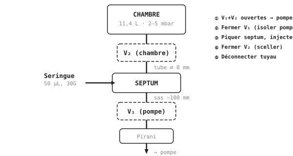
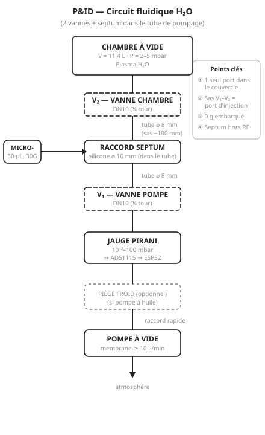
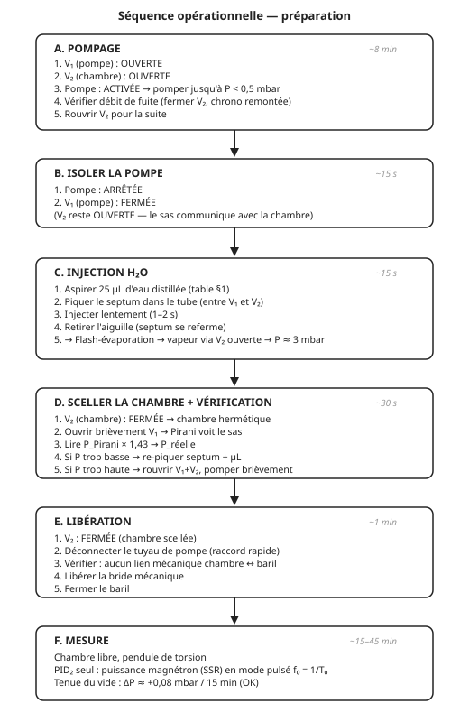

# 💧 Contrôle de la Vapeur d'Eau — Injection, Dosage, Pompage

[← Retour au README](../README.md) · [← Pistes d'optimisation](11_pistes_optimisation.md)

---

## Résumé exécutif

Le plasma H₂O à 2–5 mbar requiert un contrôle précis de l'**injection**
d'eau et du **pompage** de la chambre. Ce document spécifie l'ensemble
du circuit fluidique.

**Fait remarquable** : il faut seulement **~25 µL** d'eau liquide
(une demi-goutte !) pour remplir la chambre de 11,4 L à 3 mbar. Cette
quantité infime, injectée dans une chambre déjà sous vide, se vaporise
**instantanément** (flash-évaporation).

**Méthode retenue : septum + microseringue** — la méthode standard en
chimie analytique (GC-MS, spectromètres de masse) pour injecter des
quantités précises de liquide dans le vide. Aucune électronique, aucune
électrovanne, aucun réservoir embarqué. Un disque de silicone,
une seringue graduée, et c'est tout.

---

## Table des matières

1. [Thermodynamique de la vapeur d'eau](#1-thermodynamique-de-la-vapeur-deau)
2. [Méthode d'injection — septum + microseringue](#2-méthode-dinjection--septum--microseringue)
3. [Pompage et mise sous vide](#3-pompage-et-mise-sous-vide)
4. [Capteur de pression — jauge Pirani](#4-capteur-de-pression--jauge-pirani)
5. [Protection de la pompe](#5-protection-de-la-pompe)
6. [Lignes de gaz et raccords](#6-lignes-de-gaz-et-raccords)
7. [Diagramme P&ID complet](#7-diagramme-pid-complet)
8. [Séquence opérationnelle](#8-séquence-opérationnelle)
9. [Pureté de l'eau et contaminants](#9-pureté-de-leau-et-contaminants)
10. [Pourquoi pas un système continu ?](#10-pourquoi-pas-un-système-continu-)

---

## 1. Thermodynamique de la vapeur d'eau

### Quantité de vapeur nécessaire

À la pression cible de 3 mbar dans un volume de 11,4 L à 300 K (loi
des gaz parfaits $PV = nRT$) :

$$n = \frac{PV}{RT} = \frac{300 \times 0{,}0114}{8{,}314 \times 300}
    = 1{,}37 \times 10^{-3}\;\text{mol}$$

$$m = n \times M_{\text{H}_2\text{O}} = 1{,}37 \times 10^{-3} \times 18{,}015
    \approx \mathbf{25\;\text{mg}}$$

En volume d'eau liquide ($\rho = 998\;\text{kg/m}^3$) :

$$V_{\text{liquide}} = \frac{m}{\rho} \approx \mathbf{25\;\mu\text{L}}$$

> 💡 **C'est une quantité infime** — une demi-goutte. Le défi n'est pas
> d'avoir assez d'eau, mais de la **doser** avec précision.

### Table de correspondance volume–pression

| $P$ cible (mbar) | $n$ (µmol) | $m$ (mg) | $V_{\text{liquide}}$ (µL) |
|:-----------------:|:----------:|:--------:|:------------------------:|
| 2,0 | 914 | 16,5 | **16,5** |
| 2,5 | 1 143 | 20,6 | **20,6** |
| **3,0** | **1 371** | **24,7** | **24,8** |
| 3,5 | 1 600 | 28,8 | **28,9** |
| 4,0 | 1 828 | 32,9 | **33,0** |
| 5,0 | 2 285 | 41,2 | **41,3** |

C'est un **abaque opérationnel** : pour viser 3 mbar, injecter 25 µL.
Pour viser 5 mbar, injecter 41 µL. La relation est parfaitement
linéaire ($\Delta P / \Delta V \approx 0{,}12$ mbar/µL).

### Flash-évaporation dans le vide

L'eau injectée dans une chambre à < 1 mbar est **loin** sous sa
pression de vapeur saturante :

$$P_{\text{sat}}(20\;°\text{C}) = 23{,}3\;\text{mbar} \gg P_{\text{chambre}} < 1\;\text{mbar}$$

L'eau bout donc **instantanément** au contact du vide — c'est la
**flash-évaporation**. Le temps d'évaporation de 25 µL est < 1 s.
Aucun chauffage, aucun barboteur, aucun nébuliseur n'est nécessaire.

La totalité de l'eau injectée se transforme en vapeur et remplit le
volume de la chambre de façon homogène. La pression finale est
**directement** donnée par la table ci-dessus.

---

## 2. Méthode d'injection — septum + microseringue

### Principe

Le septum est monté **dans le tube de pompage**, entre deux vannes
d'isolement. L'injection se fait entièrement **à l'extérieur** de la
chambre et de la cage de Faraday — aucun perçage supplémentaire dans
le couvercle acrylique.

Séquence :

1. Ouvrir V₁ (pompe) **et** V₂ (chambre) → pomper tout le circuit.
2. Fermer V₁ → isoler la pompe.
3. Piquer le septum (dans le tube entre V₁ et V₂, toujours en
   communication avec la chambre via V₂ ouverte). Injecter 25 µL
   → flash-évaporation → la vapeur se répand dans la chambre.
4. Fermer V₂ → sceller la chambre.
5. Déconnecter le tuyau côté pompe, libérer la chambre.

C'est la technique standard d'injection par septum en
chromatographie en phase gazeuse (GC) — éprouvée, reproductible,
simple — adaptée ici avec un sas à deux vannes.



<!-- Fallback ASCII

  POMPE ── V₁ ──┤ SEPTUM ├── V₂ ── CHAMBRE
  (ext.)  (pompe) (tube)  (chambre) (vide)

  Séquence :
  1. V₁=O  V₂=O  → pompage complet
  2. V₁=F         → pompe isolée
  3.       ↑ piquer septum, injecter 25 µL
  4.        V₂=F  → chambre scellée
  5. déconnecter tuyau, libérer chambre
-->

### Le septum

Un **septum** est un disque de silicone (ou PTFE/silicone composite)
maintenu dans un raccord hermétique. Quand une aiguille le traverse,
l'élasticité du matériau assure l'étanchéité autour de l'aiguille.
Quand on retire l'aiguille, le trou se referme automatiquement.

| Paramètre | Spécification |
|:---|:---|
| **Matériau** | Silicone haute densité (ou PTFE/silicone composite) |
| **Diamètre** | 10–15 mm (standard GC : 9,5 mm / 11 mm) |
| **Épaisseur** | 2–3 mm |
| **Tenue vide** | $< 10^{-4}$ mbar·L/s (après 100+ percements) |
| **Tenue thermique** | −60 °C à +200 °C |
| **Durée de vie** | ~100 percements (aiguille 30G) |
| **Prix** | **< 2 $** (pack de 10 septa GC) |

> 💡 **Le septum est à l'extérieur de la cage de Faraday** — dans le
> tube de pompage, entre les deux vannes. Aucun composant n'est ajouté
> à l'intérieur de la chambre ni sur le couvercle acrylique.
> Le septum ne voit le plasma que pendant la brève phase d'injection
> (V₂ ouverte, quelques secondes), puis V₂ est fermée.

### Montage du septum dans le tube

Le septum est monté dans un **raccord en T** ou un **raccord droit
avec port septum** (standard GC) inséré dans le tube de pompage
entre les deux vannes :

| Composant | Spécification |
|:---|:---|
| **Raccord septum** | Union Swagelok ¼" avec port septum, ou T en laiton/inox avec bouchon percé |
| **Position** | Sur le tube de pompage, entre V₁ (côté pompe) et V₂ (côté chambre) |
| **Accessibilité** | Entièrement **à l'extérieur** — pas de grillage, pas de magnétron, accès direct |
| **Fixation** | Barbelé + collier ou compression — vide grossier OK |
> 💡 **Avantage majeur** : le septum est accessible directement par
> l'opérateur, sans passer à travers le grillage Faraday ni contourner
> le magnétron. Aucun perçage du couvercle acrylique n'est nécessaire.

### La microseringue

| Paramètre | Spécification |
|:---|:---|
| **Type** | Microseringue à piston (type Hamilton, SGE, ou jetable) |
| **Volume** | 50 µL ou 100 µL |
| **Résolution** | 0,5 µL (graduation) |
| **Précision** | ±1 % du volume injecté |
| **Aiguille** | 30G (⌀ 0,3 mm) — intégrée ou amovible |
| **Longueur aiguille** | 25–50 mm (traverse le septum + atteint l'intérieur) |
| **Prix** | **~15–30 $** (Hamilton) ou **~3 $** (jetable, pack de 10) |

Pour 25 µL injectés, la précision de ±1 % donne une incertitude de
±0,25 µL → **$\Delta P = \pm 0{,}03$ mbar** → excellent.

> **Alternative économique** : une seringue à insuline 0,3 mL (30G)
> graduée en µL. Coût : < 1 $ pièce, précision ~±2 µL — suffisant
> pour la Phase 1 (donne $\Delta P \approx \pm 0{,}25$ mbar).

### Avantages du septum vs. système à électrovanne

| Critère | Septum + seringue | Réservoir + EV + PID |
|:---|:---|:---|
| **Composants** | 2 (septum + seringue) + 2 vannes | 6+ (flacon, tube, capillaire, EV, MOSFET, firmware) |
| **Coût** | ~20 $ | ~26 $ |
| **Masse embarquée** | **0 g** (septum + vannes sur le tube, déconnecté) | ~25 g (flacon + EV + tubes) |
| **Électronique** | **Aucune** | PWM + MOSFET + firmware PID₁ |
| **Pièces sous RF** | **Aucune** (septum est externe) | Électrovanne (solénoïde métallique → **antenne !**) |
| **Reproductibilité** | ±1 % (volume calibré) | Dépendant du PID |
| **Risque RF** | **Aucun** | EV métallique = couplage RF parasite |
| **Complexité firmware** | **Zéro** | PID₁ + anti-windup + driver MOSFET |
| **Point de défaillance** | Quasi aucun | Vanne, tube, fuite, PID divergent |

---

## 3. Pompage et mise sous vide

### Architecture

La pompe est **externe et fixe** — elle n'est pas embarquée sur le
pendule (trop lourde, vibrante). Elle se connecte via un tuyau
flexible et la vanne d'isolement DN10 :

| Phase | Pompe | V₁ (pompe) | Septum | V₂ (chambre) | Chambre |
|:---|:---|:---|:---|:---|:---|
| **1. Pompage** | Active | **Ouverte** | — | **Ouverte** | Bridée |
| **2. Isoler pompe** | Arrêtée | **Fermée** | — | Ouverte | Bridée |
| **3. Injection** | Off | Fermée | **Piquer** | Ouverte | Bridée |
| **4. Sceller chambre** | Off | Fermée | Retirer | **Fermée** | Bridée |
| **5. Déconnexion** | Off | — | — | Fermée | **Libre** |
| **6. Mesure** | Off | — | — | Fermée | **Libre** |

### Spécifications de la pompe

| Paramètre | Exigence | Valeur recommandée |
|:---|:---|:---|
| **Type** | Membrane (sèche) ou palettes (avec piège) | **Membrane** (voir [§5](#5-protection-de-la-pompe)) |
| **Vitesse de pompage** | ≥ 10 L/min | 20 L/min recommandé |
| **Vide ultime** | < 1 mbar | Typique membrane : 1–5 mbar |
| **Compatibilité** | Vapeur H₂O (résiduelle) | Membrane intrinsèquement compatible |

### Temps de pompage

Temps pour pomper la chambre (11,4 L) de l'atmosphère (1 013 mbar)
à 1 mbar, en exponentielle $P(t) = P_0 \, e^{-t/\tau}$ :

$$t = \frac{V}{S} \ln\left(\frac{P_0}{P_f}\right)$$

| Vitesse pompe | $t$ (1 013 → 1 mbar) | Commentaire |
|:---|:---|:---|
| 5 L/min | 16 min | Minimum acceptable |
| **10 L/min** | **8 min** | Bon compromis |
| 20 L/min | 4 min | Confortable |
| 50 L/min | 1,6 min | Rapide, pompe industrielle |

> 💡 Pas besoin d'une pompe turbomoléculaire — le vide requis (< 1 mbar
> avant injection) est un **vide primaire grossier**, largement
> accessible par une pompe à membrane mécanique de labo.

### Tenue du vide pendant la mesure

Après fermeture de la vanne d'isolement et déconnexion du tuyau, la
chambre est un volume clos. Le débit de fuite détermine la stabilité :

| Débit de fuite | Remontée (mbar/min) | Après 15 min | Verdict |
|:---|:---|:---|:---|
| $10^{-2}$ mbar·L/s | 0,053 | +0,79 mbar | ⚠️ Marginal |
| $\mathbf{10^{-3}}$ **mbar·L/s** | **0,005** | **+0,08 mbar** | ✅ **Excellent** |
| $10^{-4}$ mbar·L/s | 0,0005 | +0,008 mbar | ✅ Négligeable |

Le joint silicone du couvercle acrylique et la vanne V₂ doivent
assurer un débit de fuite combiné **< $10^{-3}$ mbar·L/s**. Test :
pomper à < 1 mbar, fermer V₂, chronométrer la remontée →
$\dot{Q} = V \cdot \Delta P / \Delta t$.

> Le septum est **en amont de V₂** (côté pompe) — ses micro-fuites
> résiduelles (~$10^{-4}$ mbar·L/s après percement) sont isolées de
> la chambre par V₂ fermée. La tenue au vide de la chambre ne dépend
> que de V₂ et du joint du couvercle.

---

## 4. Capteur de pression — jauge Pirani

### Principe

La [jauge Pirani](https://fr.wikipedia.org/wiki/Jauge_de_Pirani) mesure
la pression par la conductivité thermique du gaz résiduel. Un filament
chauffé perd de la chaleur proportionnellement à la pression → sa
résistance change → signal électrique.

### Spécifications

| Paramètre | Valeur |
|:---|:---|
| Plage | $10^{-3}$ – 100 mbar |
| Sortie | 0–10 V analogique |
| Interface ESP32 | ADS1115 (ADC I²C 16 bits, adresse 0x48) + diviseur résistif |
| Cadence | 100 Hz (canal CH1) |
| Position | **Ligne de pompage** (extérieure à la chambre, protégée de la RF) |

### Calibration pour H₂O

> ⚠️ **Attention** — La jauge Pirani est **calibrée pour l'azote** (N₂)
> ou l'air par défaut. La conductivité thermique de H₂O diffère de
> celle de N₂ :

| Gaz | $\lambda$ (mW/m·K) à 300 K | Facteur correctif / air |
|:---|:---|:---|
| Air (N₂) | 26,4 | 1,00 |
| **H₂O** | **18,6** | **0,70** |
| Ar | 17,7 | 0,67 |

La jauge **sous-estime** la pression réelle d'un facteur ~1,4 quand
le gaz est de la vapeur d'eau pure. Deux approches :

1. **Correction logicielle** : appliquer un facteur ×1,43 dans le
   firmware (`P_reel = P_lu × 1.43`). Simple, mais suppose 100 % H₂O.
2. **Calibration in situ** : injecter un volume connu avec la
   microseringue (pression théorique = table §1) et comparer à la
   lecture Pirani → tracer $P_{\text{réelle}} = f(V_{\text{Pirani}})$.

> 💡 L'injection par microseringue offre une **calibration gratuite** :
> le volume injecté donne la pression théorique exacte ($PV = nRT$),
> qu'on compare directement à la lecture Pirani. C'est un étalon
> primaire sans aucun instrument supplémentaire.

### Implémentation firmware

Le driver ADS1115 est **à implémenter** (actuellement un placeholder
dans le firmware). La lecture se fait via le bus I²C :

```
ADS1115 (0x48) ←I²C→ ESP32
  CH0 : coupleur directionnel (P_r)
  CH1 : jauge Pirani (P)
```

Voir [08_acquisition.md](08_acquisition.md) pour le format de données.

### Rôle pendant l'injection

La jauge Pirani est lue **pendant l'injection** (phase 4, chambre
bridée, pompe déjà déconnectée) pour :

1. **Confirmer le vide** avant injection (P < 0,5 mbar ?)
2. **Vérifier la pression** après injection (P ≈ cible ?)
3. Si trop basse → re-piquer le septum et ajouter quelques µL

> ⚠️ La jauge est sur la **ligne de pompage**, côté extérieur de V₂.
> Quand V₂ est fermée, la jauge ne voit pas
> l'intérieur de la chambre. Pour lire la pression après injection :
> ouvrir brièvement la vanne DN10 (sans pompe connectée), lire la
> Pirani, et refermer. Ou monter la jauge sur un port séparé
> communiquant avec la chambre.

---

## 5. Protection de la pompe

### Le problème

La vapeur d'eau condensée dans une **pompe à palettes** (huile)
contamine l'huile → perte de performance, corrosion, maintenance
fréquente. Mais avec la méthode septum, la pompe ne voit que de
l'**air sec** (l'eau est injectée *après* le pompage et la
déconnexion).

### Solutions

| Solution | Principe | Coût | Recommandation |
|:---|:---|:---|:---|
| **A. Pompe à membrane** | Pas d'huile → pas de contamination | 0 $ (si déjà en stock) | ✅ **Première recommandation** |
| B. Piège froid | Erlenmeyer dans bain de glace, condense H₂O résiduelle | ~5 $ | ✅ Si pompe à palettes |
| C. Ballast gaz | Admission d'air sur la pompe | 0 $ (intégré) | 🟡 Réduit le vide ultime |

> 💡 **Avantage du septum** : la pompe ne pompe que de l'air (avant
> l'injection d'eau). La contamination H₂O de la pompe est quasiment
> éliminée. La seule H₂O résiduelle est l'humidité ambiante de l'air
> pompé — problème standard, pas spécifique au projet.

---

## 6. Lignes de gaz et raccords

### Circuit avec sas d'injection

Le circuit de pompage intègre un **sas** (tronçon de tube entre
deux vannes) qui sert aussi de port d'injection :

| Tronçon | Composants | ⌀ int. | Notes |
|:---|:---|:---|:---|
| **Chambre → V₂** | Tube court (sortie couvercle DN10) | 8–10 mm | V₂ = vanne ¼ tour côté chambre |
| **V₂ → septum → V₁** | Tube ~100–200 mm avec raccord septum | 8–10 mm | **Sas d'injection** — volume ~5–10 mL |
| **V₁ → Pirani → pompe** | Tube + jauge + raccord rapide | 8–10 mm | V₁ = vanne côté pompe, déconnectable |

### Raccords

| Raccord | Usage | Recommandation |
|:---|:---|:---|
| **Barbelé + collier** | Tuyau silicone/PVC sur DN10 et vannes | ✅ Simple, vide grossier OK |
| **Raccord rapide** (type pneumatique) | Déconnexion tuyau pompe (côté V₁) | ✅ Pratique |
| **Raccord septum** (T ou union + port GC) | Port percé dans le tube entre V₁ et V₂ | ✅ Voir §2 |

> 💡 **En vide grossier** (2–5 mbar), des raccords barbelés avec
> colliers de serrage sont **parfaitement suffisants**. Les raccords
> KF/NW et Swagelok sont conçus pour le vide poussé ($< 10^{-3}$ mbar)
> — coûteux et inutiles ici.

### Feedthrough (passage sous vide)

Le couvercle acrylique n'a qu'**un seul passage** :

| Port | Fonction | Type |
|:---|:---|:---|
| **DN10** (centre du couvercle) | Pompage + injection (via le sas) | Vanne V₂ au bout du tube |

Le septum est **dans le tube**, en amont de V₂, **à l'extérieur** de
la chambre et de la cage de Faraday. Il ne constitue pas un passage
sous vide supplémentaire — V₂ fermée l'isole de la chambre.

---

## 7. Diagramme P&ID complet



<!-- Fallback ASCII
 ╔══════════════════════════════════════════════════════════════╗
 ║             P&ID — Circuit fluidique H₂O                    ║
 ║         (2 vannes + septum dans le tube de pompage)          ║
 ╠══════════════════════════════════════════════════════════════╣
 ║                                                              ║
 ║                           ┌──────────────────┐              ║
 ║                           │  CHAMBRE À VIDE   │              ║
 ║                           │  V = 11,4 L       │              ║
 ║                           │  P = 2–5 mbar     │              ║
 ║                           │  Plasma H₂O       │              ║
 ║                           └────────┬─────────┘              ║
 ║                                    │                         ║
 ║                      ┌─────────────┴──────────────┐         ║
 ║                      │  V₂ — VANNE CHAMBRE        │         ║
 ║                      │  DN10 (¼ tour)              │         ║
 ║                      └─────────────┬──────────────┘         ║
 ║                                    │ tube ⌀ 8 mm            ║
 ║                                    │ (sas ~100 mm)          ║
 ║               ┌───────────┐   ┌────┴─────────────┐         ║
 ║               │MICRO-     │   │   RACCORD SEPTUM  │         ║
 ║               │SERINGUE   │──→│   silicone ⌀ 10   │         ║
 ║               │50 µL, 30G │   │   (dans le tube)  │         ║
 ║               └───────────┘   └────┬─────────────┘         ║
 ║                                    │ tube ⌀ 8 mm            ║
 ║                      ┌─────────────┴──────────────┐         ║
 ║                      │  V₁ — VANNE POMPE          │         ║
 ║                      │  DN10 (¼ tour)              │         ║
 ║                      └─────────────┬──────────────┘         ║
 ║                                    │                         ║
 ║                           ┌────────┴─────────┐              ║
 ║                           │ JAUGE PIRANI      │              ║
 ║                           │ 10⁻³–100 mbar     │              ║
 ║                           │ → ADS1115 → ESP32 │              ║
 ║                           └────────┬─────────┘              ║
 ║                                    │                         ║
 ║                           ┌────────┴─────────┐ (optionnel)  ║
 ║                           │ PIÈGE FROID       │              ║
 ║                           │ (si pompe huile)  │              ║
 ║                           └────────┬─────────┘              ║
 ║                                    │ raccord rapide          ║
 ║                           ┌────────┴─────────┐              ║
 ║                           │ POMPE À VIDE      │              ║
 ║                           │ membrane ≥10 L/min│              ║
 ║                           └────────┬─────────┘              ║
 ║                                    ↓                         ║
 ║                              atmosphère                      ║
 ║                                                              ║
 ╚══════════════════════════════════════════════════════════════╝
-->

**Points clés de cette architecture** :

1. **Un seul port** dans le couvercle (DN10 au centre) — pas de
   perçage supplémentaire dans l'acrylique.
2. **Sas d'injection** — le tronçon V₁–V₂ sert à la fois de ligne
   de pompage et de port d'injection (septum accessible de l'extérieur).
3. **Rien d'embarqué** embarqué sur le pendule — la seringue est retirée, les
   vannes et le septum restent sur le tube (déconnecté après V₂).
4. **Pas d'électronique** d'injection — pas de PWM, pas de MOSFET,
   pas de PID₁.
5. **Le septum est hors de la cage de Faraday** — aucune interaction
   RF, accès direct par l'opérateur.

---

## 8. Séquence opérationnelle

### Phase de préparation (chambre bridée)



<!-- Fallback ASCII
  A. POMPAGE (~8 min)
  ┌───────────────────────────────────────────────────┐
  │  1. V₁ (pompe) : OUVERTE                          │
  │  2. V₂ (chambre) : OUVERTE                        │
  │  3. Pompe : ACTIVÉE                               │
  │  4. → Pomper jusqu'à P < 0,5 mbar                 │
  │  5. Vérifier le débit de fuite                     │
  │     (fermer V₂, chronométrer remontée)             │
  │     Objectif : < 10⁻³ mbar·L/s                    │
  │  6. Rouvrir V₂ pour la suite                       │
  └───────────────────────────────────────────────────┘
                        │
                        ▼
  B. ISOLER LA POMPE (~15 s)
  ┌───────────────────────────────────────────────────┐
  │  1. Pompe : ARRÊTÉE                               │
  │  2. V₁ (pompe) : FERMÉE                           │
  │     (V₂ reste OUVERTE — le sas communique         │
  │      avec la chambre)                              │
  └───────────────────────────────────────────────────┘
                        │
                        ▼
  C. INJECTION H₂O (~15 s)
  ┌───────────────────────────────────────────────────┐
  │  1. Aspirer 25 µL d'eau distillée dans la         │
  │     microseringue (table §1 pour la cible)         │
  │  2. Piquer le septum dans le tube (entre V₁       │
  │     et V₂ — accessible de l'extérieur)             │
  │  3. Injecter lentement (1–2 s)                     │
  │  4. Retirer l'aiguille (le septum se referme)      │
  │  5. → Flash-évaporation → vapeur se répand         │
  │     dans la chambre via V₂ ouverte                 │
  │  6. → P ≈ 3 mbar dans les 11,4 L                  │
  └───────────────────────────────────────────────────┘
                        │
                        ▼
  D. SCELLER LA CHAMBRE + VÉRIFICATION (~30 s)
  ┌───────────────────────────────────────────────────┐
  │  1. V₂ (chambre) : FERMÉE                         │
  │     → la chambre est maintenant hermétique         │
  │  2. Ouvrir brièvement V₁ pour laisser la           │
  │     Pirani voir le sas (pression résiduelle)       │
  │  3. Lire P_Pirani × 1,43 → P_réelle               │
  │  4. Si P trop basse : rouvrir V₂, re-piquer        │
  │     le septum, ajouter quelques µL, refermer V₂    │
  │  5. Si P trop haute : rouvrir V₁+V₂, pomper        │
  │     brièvement, recommencer                        │
  └───────────────────────────────────────────────────┘
                        │
                        ▼
  E. LIBÉRATION
  ┌───────────────────────────────────────────────────┐
  │  1. V₂ : FERMÉE (chambre scellée)                 │
  │  2. Déconnecter le tuyau de pompe (raccord rapide) │
  │  3. Aucun lien mécanique chambre ↔ baril          │
  │     (vérifier : pas de tuyau, pas de câble)        │
  │  4. Libérer la bride mécanique                     │
  │  5. Fermer le baril                                │
  └───────────────────────────────────────────────────┘
                        │
                        ▼
  F. MESURE (~15-45 min)
  ┌───────────────────────────────────────────────────┐
  │  Chambre libre, pendule de torsion                 │
  │  PID₂ seul : puissance magnétron (SSR)             │
  │  Magnétron en mode pulsé à f₀ = 1/T₀              │
  │  Tenue du vide : ΔP ≈ +0,08 mbar / 15 min (OK)   │
  └───────────────────────────────────────────────────┘
-->

### Durée totale de préparation

| Phase | Durée |
|:---|:---|
| Pompage (V₁+V₂ ouvertes) | ~8 min |
| Isoler pompe (fermer V₁) | ~15 s |
| Injection (piquer septum) | ~15 s |
| Sceller chambre (fermer V₂) + vérification | ~30 s |
| Libération (déconnexion tuyau) | ~1 min |
| **Total** | **~10 min** |

### Ajustement fin de la pression

Si la pression n'est pas exacte après injection :

| Situation | Action |
|:---|:---|
| **P trop basse** | Re-piquer le septum avec la seringue, injecter quelques µL de plus. Relation : +0,12 mbar par µL. |
| **P trop haute** | Rouvrir V₁+V₂, reconnecter la pompe, pomper brièvement l'excédent. Refermer V₁ puis V₂. Vérifier. |
| **P exacte** | Procéder à la libération et la mesure. |

C'est un avantage de la méthode : on peut **itérer** facilement.
L'ajout est additif et linéaire.

### Stabilité pendant la mesure

Pendant la mesure, la pression évolue **très lentement** par fuite
résiduelle. En 15 min : $\Delta P \approx 0{,}08$ mbar, soit une
variation de $n_e / n_{e,c} < 3\%$. Le PID₂ (puissance magnétron)
compense cette dérive par le duty cycle RF.

> ⚠️ **Plus de PID₁ sur l'électrovanne** — cette boucle est supprimée.
> Le PID₂ (puissance magnétron) est le **seul** actionneur actif
> pendant la mesure. La boucle PID₁ ($P_r$ → résonance RF) pourra être
> redéfinie ultérieurement si un actionneur mécanique non-perturbant
> est identifié. Voir [06_controle.md](06_controle.md) — à mettre à
> jour en conséquence.

---

## 9. Pureté de l'eau et contaminants

### Exigence : eau distillée ou déionisée

L'eau du robinet contient des ions dissous (Ca²⁺, Na⁺, Cl⁻, etc.)
et des gaz dissous (O₂, N₂, CO₂). Dans un plasma à 2–5 mbar :

| Contaminant | Effet dans le plasma | Problème |
|:---|:---|:---|
| **Sels dissous** (Ca, Na, Cl) | Dépôts solides sur les parois et les Nixie | Contamination des surfaces |
| **O₂ dissous** | Espèces O⁺, O₃ dans le plasma | Attaque chimique du cuivre (piste 1) |
| **CO₂ dissous** | Bandes vibrationnelles parasites | Bruit spectral pour AS7343 |
| **N₂ dissous** | Raies N₂ (337, 357 nm) dans le spectre | Confusion avec raies H₂O |

### Recommandation

| Type d'eau | Pureté | Prix | Verdict |
|:---|:---|:---|:---|
| Eau déionisée (DI) | $> 1\;\text{M}\Omega\cdot\text{cm}$ | ~3 $/L (pharmacie) | ✅ Suffisant |
| Eau distillée | Très haute | ~5 $/L | ✅ Idéal |
| Eau Milli-Q (ultrapure) | $> 18\;\text{M}\Omega\cdot\text{cm}$ | N/A (labo) | 🟡 Surqualifié |
| **Eau du robinet** | Variable | 0 $ | ❌ **Non** |

> 💡 **Eau distillée de pharmacie** (~3 $CAD / 4 L) est parfaitement
> adaptée. Avec 25 µL par session, un litre représente **40 000
> sessions** — littéralement pour la vie du projet.

### Gaz dissous

L'eau distillée contient des gaz dissous (~8 mg/L d'O₂ à 20 °C). Dans
25 µL injectés, cela représente ~0,2 µg d'O₂ — **totalement
négligeable** devant les 25 mg de H₂O. Le pompage de la chambre a
également retiré l'air résiduel, et l'atmosphère est > 99,9 % H₂O
après injection. Pas besoin de dégazer l'eau.

---

## 10. Pourquoi pas un système continu ?

Une version antérieure de cette conception proposait un système
complexe : réservoir embarqué (barboteur) + restriction capillaire +
électrovanne TOR (PWM) + boucle PID₁ + driver MOSFET. Cette approche
visait un scénario où l'injection et le contrôle de pression se
faisaient **en continu pendant le plasma**. Mais ce scénario est
contradictoire avec l'architecture du pendule de torsion :

1. **Pendant la mesure, la chambre est libre** — aucun actionneur
   mécanique ne peut opérer sans créer un couple parasite. Une
   électrovanne solénoïde exerce ~0,5 N à chaque commutation →
   bruit mécanique direct sur le pendule.

2. **L'électrovanne est un objet métallique** sous RF à 200–700 W —
   elle agit comme une antenne parasite. Les courants induits
   échauffent le solénoïde et perturbent le champ EM dans la cavité.

3. **Le PID₁ est aveugle pendant la mesure** — la pompe est
   déconnectée, donc l'électrovanne ne peut qu'ajouter de l'eau
   sans jamais en retirer. Le contrôle n'est que dans un sens.

4. **La tenue du vide est excellente** — $\Delta P < 0{,}08$ mbar en
   15 min. La pression est suffisamment stable sans régulation active.

5. **La quantité est si faible** que le dosage volumétrique par
   seringue est plus précis qu'un PID sur une électrovanne pulsée
   (problème de zone morte, hystérésis, transitoires).

Le septum + microseringue résout élégamment tous ces problèmes :
injection précise, décorrélée du pompage, sans composant métallique
sous RF, sans électronique embarquée, et sans firmware à écrire.

> 💡 Si une Phase 2 du projet requiert des ajustements de pression
> **pendant** le plasma (improbable vu la stabilité), une option
> serait un micro-doseur piézoélectrique (non métallique, µL/coup)
> intégré au couvercle. Mais c'est un horizon lointain.

---

## Récapitulatif — Liste de matériel fluidique

| # | Composant | Spécification | Coût | Statut |
|:--|:---|:---|:---|:---|
| 1 | Septum silicone | ⌀ 10–12 mm, épaisseur 3 mm (standard GC) | < 2 $ (×10) | 🔶 |
| 2 | Raccord septum | T ou union ¼" avec port GC, ou montage maison | ~2 $ | 🔶 |
| 3 | Microseringue 50 µL | Aiguille 30G, graduation µL (Hamilton ou jetable) | ~15 $ | 🔶 |
| 4 | Tube pompage | PVC/silicone ⌀ int. 8 mm, ~1,5 m | ~5 $ | 🔶 |
| 5 | Raccord rapide | Pour déconnexion tuyau pompe (côté V₁) | ~5 $ | 🔶 |
| 6 | Eau distillée | Pharmacie, 1 L | ~3 $ | 🔶 |
| 7 | 2ᵉ vanne DN10 (V₁) | Boisseau sphérique, quart de tour (côté pompe) | ~5 $ | 🔶 |
| | **Total** | | **~20 $** | |
| — | Vanne DN10 (V₂) | Boisseau sphérique, quart de tour (côté chambre) | — | ✅ En stock |
| — | Pompe à vide | ≥ 10 L/min, membrane recommandée | — | ✅ En stock |
| — | Jauge Pirani | $10^{-3}$–100 mbar, 0–10 V | — | ✅ En stock |

**Coût additionnel : ~20 $** — soit 6 $ de moins que l'approche
à électrovanne, avec moins de composants, pas d'électronique,
et zéro risque RF.

---

## Références

1. **O'Hanlon, J. F.** (2003). *A User's Guide to Vacuum Technology*.
   3ᵉ édition, Wiley. (Chap. 3 : pompes primaires ; chap. 6 : mesure
   de pression.)

2. **Jousten, K. (éd.)** (2016). *Handbook of Vacuum Technology*.
   2ᵉ édition, Wiley-VCH. (Chap. 15 : conductance, régime
   moléculaire.)

3. **NIST Chemistry WebBook** — Coefficients Antoine pour H₂O.
   https://webbook.nist.gov/

4. **Grob, R. L. & Barry, E. F.** (2004). *Modern Practice of Gas
   Chromatography*. 4ᵉ édition, Wiley. (Chap. 4 : technique
   d'injection par septum, microseringues.)

---

[← Pistes d'optimisation](11_pistes_optimisation.md) ·
[Retour au README →](../README.md)
