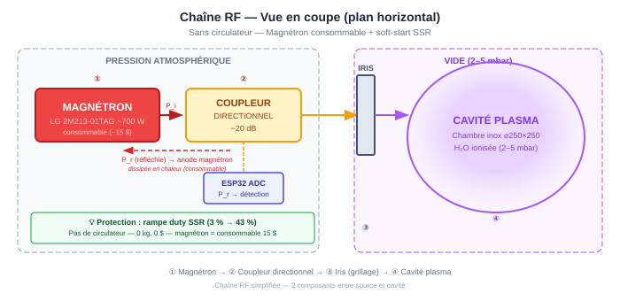
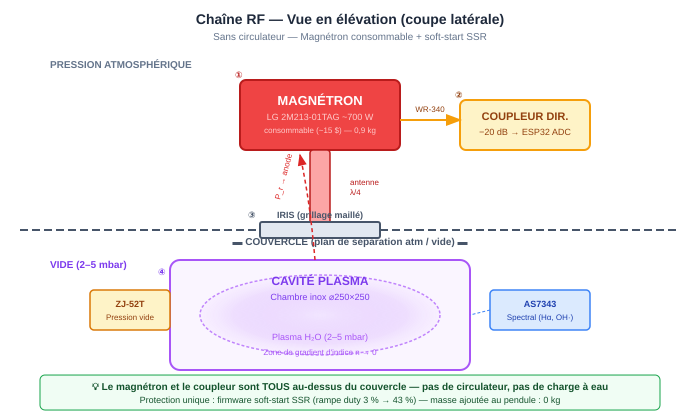

# 📡 Adaptation RF et Amorçage du Plasma

[← Retour au README](../README.md) · [← Justification du médium](13_justification_medium.md)

---

## Résumé exécutif

Un magnétron injectant 700 W dans une cavité contenant **seulement
25 µL de vapeur d'eau non ionisée** voit son énergie réfléchie à
~90 %. Cette puissance réfléchie stresse le magnétron, provoque du
*mode jumping* et — paradoxalement — empêche le firmware de sécurité
de laisser le plasma s'amorcer.

Ce document traite le **problème du bootstrap RF** : comment passer
de « cavité vide + vapeur froide » à « plasma stable » sans détruire
la source. La solution repose sur un pilier unique :

1. **Séquence d'amorçage progressive (soft-start SSR)** — rampe de
   puissance firmware avec seuils adaptatifs, exploitant la
   robustesse native du magnétron de four domestique.

> 💡 **Pourquoi pas de circulateur ?** — Un circulateur ferrite WR-340
> ajouterait **3–6 kg** sur le bras du pendule (circulateur + charge à
> eau + plomberie), ce qui est incompatible avec un système de torsion
> conçu pour détecter des micro-newtons. Le magnétron LG 2M213-01TAG
> (~15 $) est traité comme un **consommable** dont la durée de vie
> réduite par le VSWR est un compromis acceptable face à la
> préservation de la sensibilité du pendule. Voir
> [§4 — Justification de l'approche « consommable »](#4-justification-de-lapproche--consommable-).

**Coût total : 0 $** (uniquement du firmware). **Masse ajoutée : 0 kg.**

---

## Table des matières

1. [Le problème — SWR et amorçage](#1-le-problème--swr-et-amorçage)
2. [Chronologie du bootstrap RF](#2-chronologie-du-bootstrap-rf)
3. [Le cercle vicieux du firmware](#3-le-cercle-vicieux-du-firmware)
4. [Justification de l'approche « consommable »](#4-justification-de-lapproche--consommable-)
5. [Solution — Séquence d'amorçage firmware (soft-start SSR)](#5-solution--séquence-damorçage-firmware-soft-start-ssr)
6. [Stub tuner (optionnel Phase 2)](#6-stub-tuner-optionnel-phase-2)
7. [Impact sur le bilan de masse du pendule](#7-impact-sur-le-bilan-de-masse-du-pendule)
8. [Intégration dans la chaîne RF](#8-intégration-dans-la-chaîne-rf)
9. [Récapitulatif et coûts](#9-récapitulatif-et-coûts)

---

## 1. Le problème — SWR et amorçage

### Adaptation d'impédance et VSWR

Un magnétron est conçu pour débiter sa puissance dans une **charge
adaptée** — typiquement un guide d'onde WR-340 terminé par un
absorbeur (nourriture, eau, ou plasma). Lorsque la charge n'absorbe
pas l'énergie, l'onde réfléchie interfère avec l'onde incidente et
crée une **onde stationnaire** dans le guide d'onde / la cavité.

Le **taux d'onde stationnaire** (VSWR — *Voltage Standing Wave
Ratio*) quantifie le désaccord :

$$\text{VSWR} = \frac{1 + |\Gamma|}{1 - |\Gamma|}
\qquad \text{où} \quad
\Gamma = \frac{Z_L - Z_0}{Z_L + Z_0}$$

| Situation | $\lvert\Gamma\rvert$ | VSWR | $P_r / P_i$ | Commentaire |
|:---|:---|:---|:---|:---|
| **Charge parfaite** (plasma résonant) | 0 | 1,0 | 0 % | État cible |
| Légère désadaptation | 0,2 | 1,5 | 4 % | Fonctionnement normal |
| **Vapeur froide** (non ionisée) | 0,8–0,9 | 9–19 | **64–81 %** | ⚠️ Amorçage |
| **Cavité vide** (vide pur) | ~0,95 | ~39 | **~90 %** | ❌ Dangereux |

> 💡 **En termes simples** — Imaginez un amplificateur audio connecté
> à un haut-parleur : si le haut-parleur est débranché (circuit ouvert),
> l'énergie revient dans l'amplificateur et le grille. Un magnétron
> sans charge absorbante, c'est la même chose — en 700 watts.

### Conséquences sur le magnétron

Un magnétron fonctionnant en forte désadaptation ($\text{VSWR} > 3$)
subit :

| Effet | Mécanisme | Conséquence |
|:---|:---|:---|
| **Échauffement de l'anode** | $P_r$ dissipée dans le magnétron | Durée de vie réduite (×0,5 à ×0,1) |
| **Mode jumping** | L'énergie réfléchie perturbe les cavités | Fréquence instable (±50 MHz) → couplage cavité erratique |
| **Arc interne** | Surtension aux ouvertures des cavités | Destruction possible du magnétron |
| **Charge du condensateur HT** | Courant réduit → tension anode monte | Stress diélectrique du condensateur doubleur |

> ⚠️ **Note** — Les magnétrons de micro-ondes domestiques sont conçus
> pour tolérer **brièvement** (quelques secondes) un VSWR élevé —
> c'est ce qui se passe quand on fait tourner un micro-ondes à vide
> avant de s'en rendre compte. Mais un fonctionnement prolongé (>10 s)
> en forte désadaptation réduit drastiquement la durée de vie et risque
> un arc destructeur.

---

## 2. Chronologie du bootstrap RF

Le problème fondamental est un **dilemme temporel** : le plasma
absorbe l'énergie RF (bonne charge), mais il n'existe pas encore
quand on allume le magnétron (mauvaise charge). Il faut traverser
une phase transitoire de forte réflexion.

### Séquence temporelle détaillée

| Phase | Temps | Contenu cavité | $Z_L$ vue par le magnétron | $\lvert\Gamma\rvert$ | $P_r$ (pour 700 W) |
|:---|:---|:---|:---|:---|:---|
| **A** — Vide résiduel | $t < 0$ | < 0,5 mbar, pas de gaz | Court-circuit / circuit ouvert (modes propres vides) | ~0,95 | **~630 W** |
| **B** — Après injection H₂O | $t = 0$ | 3 mbar H₂O, vapeur froide | Cavité + gaz neutre (faible $\varepsilon_r$) | ~0,85 | **~505 W** |
| **C** — Allumage magnétron | $t_0$ | Vapeur + champ RF croissant | Gaz non ionisé → $n_e \approx 0$ | ~0,85 | **~505 W** ⚠️ |
| **D** — Claquage RF | $t_0 + \Delta t_{\text{claquage}}$ | Ionisation en avalanche | $n_e$ monte exponentiellement | ↘ rapide | ↘ rapide |
| **E** — Plasma naissant | $t_0 + 1\text{–}50$ ms | Plasma sous-critique ($n_e < n_{e,c}$) | Absorption partielle | ~0,3–0,5 | ~60–175 W |
| **F** — Plasma résonant | $t_0 + 50\text{–}200$ ms | $n_e \approx n_{e,c}$ | **Couplage optimal** | < 0,15 | **< 15 W** ✅ |

### Le temps de claquage $\Delta t_{\text{claquage}}$

Le claquage RF se produit lorsque le champ électrique dans la cavité
dépasse le seuil d'ionisation du gaz. Pour la vapeur d'eau à 3 mbar :

$$E_{\text{seuil}} \approx 3\text{–}10 \;\text{kV/m}$$

(dépend du libre parcours moyen, du taux d'attachement de H₂O, et du
coefficient d'ionisation $\alpha/p$).

Pour un magnétron de 700 W dans une cavité de $Q \approx 280$ (inox) :

$$E_{\text{peak}} \approx 19 \;\text{kV/m} \gg E_{\text{seuil}}$$

Le claquage se produit donc en **quelques microsecondes à quelques
millisecondes** — très rapide. Mais même quelques millisecondes de
~500 W réfléchis stressent le magnétron, et la phase de montée vers
$n_{e,c}$ (phases D→F) dure ~50–200 ms.

### La fenêtre critique

La **fenêtre d'exposition** du magnétron à un VSWR élevé est donc :

$$\Delta t_{\text{critique}} = \Delta t_{\text{claquage}} +
\Delta t_{n_e \to n_{e,c}} \approx 50\text{–}200 \;\text{ms}$$

C'est bref, mais se produit **à chaque allumage**. Si le magnétron
est pulsé à $f_0 = 1/T_0$ (période ~10–560 s selon la configuration),
chaque pulse ON traverse cette phase. Avec un duty cycle de 50 %,
le magnétron subit des centaines de cycles allumage/extinction par
session.

> ⚠️ **Avec le mode d'alimentation SSR (bang-bang)** — Le SSR à
> passage par zéro commute le transformateur HT à ~10 Hz (période
> 100 ms). Chaque cycle ON commence par la phase de claquage. Le
> magnétron subit **~600 transitions allumage/extinction par minute**
> avec le MOT + SSR. Avec un **inverter** (cf. [doc 09](09_hypothese_inverter.md)),
> le magnétron est en régime continu — un seul amorçage par session.

---

## 3. Le cercle vicieux du firmware

### Le problème

Le watchdog de sécurité ([§6.7](06_controle.md#67-watchdog-de-sécurité))
coupe le magnétron (SSR OFF) si $P_r > P_{r,\text{max}}$ (800 mW
après coupleur −20 dB ≈ 80 W réels). Or, pendant l'amorçage :

$$P_{r,\text{amorçage}} \approx 500\;\text{W} \gg 80\;\text{W} = P_{r,\text{max}}$$

Le firmware détecte un « découplage total » et **coupe le magnétron
avant que le plasma n'ait le temps de se former**.

```
Allumage SSR ON → P_r = 500 W → Watchdog : "DÉCOUPLAGE !"
       → SSR OFF → pas de plasma → on recommence → boucle infinie
```

### La solution : seuils adaptatifs par état

La machine d'état du firmware ([§6.6](06_controle.md#66-machine-détat-du-firmware))
doit distinguer deux régimes :

| État firmware | Seuil $P_r$ du watchdog | Justification |
|:---|:---|:---|
| **AMORÇAGE** (nouvel état) | $P_{r,\text{max}} = $ **élevé** (VSWR attendu) | Le soft-start minimise l'exposition |
| **PLASMA** / **MESURE** | $P_{r,\text{max}} = 800$ mW (comme actuellement) | Détection de perte de plasma |

En phase d'amorçage, le firmware **surveille la chute** de $P_r$
au lieu de couper sur un seuil haut. La chute confirme le claquage.
Si $P_r$ ne chute pas après un timeout (5 s), c'est une anomalie
(pas de gaz, fuite, pression incorrecte) → coupure + diagnostic.

---

## 4. Justification de l'approche « consommable »

### Pourquoi pas de circulateur ?

Un **circulateur ferrite** WR-340 est la solution canonique dans
l'industrie micro-onde. Mais cette expérience n'est pas un four
industriel — c'est un **pendule de torsion** ultra-sensible.

| Composant | Masse | Impact sur le pendule |
|:---|:---|:---|
| Circulateur WR-340 | 2–5 kg | ☠️ Catastrophique |
| Charge à eau (500 mL minimum) | 0,5+ kg | ☠️ + fluide qui bouge |
| Transitions / plomberie | ~0,5 kg | Mauvais |
| **Total ajouté** | **3–6 kg** | Détruit la sensibilité |

Ajouter 3–6 kg **asymétriques** sur le bras du pendule augmente
énormément le moment d'inertie $I$, allonge la période
$T = 2\pi\sqrt{I/\kappa}$ et noie le signal dans le bruit mécanique.
Le circulateur est un composant plus lourd que le magnétron lui-même.

### Le magnétron domestique tolère le VSWR

Le **LG 2M213** est un magnétron **de four micro-ondes domestique**.
Chaque jour, des millions de ces magnétrons fonctionnent **sans
circulateur** :

- Une tasse de café → charge minuscule, $|\Gamma|$ élevé
- Un four tourne à vide par erreur → $|\Gamma| \approx 1$
- Le magnétron survit des années comme ça

Les magnétrons de four sont conçus avec une **anode épaisse et des
ailettes de refroidissement** justement parce qu'ils dissipent une
partie de la puissance réfléchie en chaleur interne. Ce ne sont pas
des klystrons de précision à 10 000 €.

### Le bilan économique

| Approche | Masse ajoutée | Coût | Risque magnétron |
|:---|:---|:---|:---|
| Circulateur WR-340 + charge | +3–6 kg | 150–300 USD | Quasi nul |
| **Soft-start SSR (retenu)** | **+0 kg** | **0 USD** | Faible (durée de vie réduite ~20 %) |
| Magnétron de remplacement | — | ~15 USD | Budget « consommable » |

Un magnétron LG 2M213 coûte **15 €** sur Amazon/AliExpress. Si le
VSWR en réduit la durée de vie de 10 000 h à 2 000 h, à raison de
1 h d'expérience par session, on a **2 000 sessions** avant de le
changer. C'est un **consommable**, pas un composant à protéger.

> 💡 **L'investissement va dans la qualité du pendule et des capteurs,
> pas dans la protection d'un tube remplaçable à 15 $.**

---

## 5. Solution — Séquence d'amorçage firmware (soft-start SSR)

La protection du magnétron repose entièrement sur le **firmware** —
une rampe progressive du duty cycle SSR qui minimise l'énergie
réfléchie par pulse pendant la phase d'amorçage.

### Principe : le duty cycle réduit protège le magnétron

Pendant chaque cycle ON du SSR, le magnétron émet **700 W crête**.
Mais en réduisant le duty cycle, on limite la durée d'exposition
par cycle et la puissance **moyenne** dissipée dans l'anode :

| Duty SSR | Puissance crête | Puissance moyenne | $P_r$ réfléchie moy. | État cavité |
|:---|:---|:---|:---|:---|
| 3 % | 700 W | 21 W | ~18 W | Vide, $\lvert\Gamma\rvert \approx 0{,}85$ |
| 5 % | 700 W | 35 W | ~30 W | Début ionisation |
| 10 % | 700 W | 70 W | ~60 W | Plasma instable |
| 20 % | 700 W | 140 W | ↘ rapide | Plasma établi, $\lvert\Gamma\rvert$ baisse |
| 43 % | 700 W | 300 W | < 15 W | Régime nominal |

**Pendant les premières secondes** (3–5 % duty) :
- Le magnétron pulse 700 W pendant ~15 ms toutes les 500 ms
- La puissance réfléchie (~505 W × 15 ms = 7,6 J par pulse) est
  dissipée dans l'anode du magnétron
- Les ailettes de ventilation évacuent cette chaleur
- C'est exactement ce que fait un four domestique en mode
  « décongélation »

**Dès que le plasma s'amorce** → $\varepsilon''$ du plasma augmente →
$|\Gamma|$ chute → la cavité absorbe de mieux en mieux → on monte le
duty.

### Nouvel état : AMORÇAGE

Un **nouvel état AMORÇAGE** est ajouté à la machine d'état
([§6.6](06_controle.md#66-machine-détat-du-firmware)) :

```
  ┌──────────┐  démarrage  ┌──────────┐  vide atteint  ┌───────────┐
  │   INIT   │────────────▶│  POMPAGE  │───────────────▶│ AMORÇAGE  │
  │          │             │  PID₃ ON  │                │ rampe SSR │
  └──────────┘             └──────────┘                └───────────┘
       │                        │                            │
       │                        │ anomalie            claquage confirmé
       │                        ▼                      (P_r chute)
       │                  ┌──────────┐                      │
       │                  │  ERREUR  │                      ▼
       │                  │ SSR OFF  │                ┌──────────┐
       │                  └──────────┘                │  PLASMA  │
       │                        ▲                     │ PID₂ ON  │
       │                        │ anomalie            └──────────┘
       │                        │                          │
       │                        │                     vanne fermée
       │                        │                     pompe déconnectée
       │                        │                          ▼
       │                        │                    ┌──────────┐
       │                        ├────────────────────│  MESURE  │
       │                        │                    │ PID₂ ON  │
       │                        │                    │ PID₃ OFF │
       │                        │                    └──────────┘
       │                        │                          │
       │                        │                          ▼
       │                        │                    ┌──────────┐
       └────────────────────────┘                    │   FIN    │
                 watchdog timeout                    │ SSR OFF  │
                                                     │ log flush│
                                                     └──────────┘
```

### Algorithme d'amorçage (pseudo-code)

```
ÉTAT: AMORÇAGE
  // Phase 0 : Pré-chauffe filament
  SSR = OFF
  Alimenter le filament (3,15 V AC) via le secondaire dédié
  Attendre 2 s (thermalisation de la cathode)

  // Phase 1 : Rampe douce (soft-start)
  duty_SSR = 3 %           // ~21 W moyens, ~18 W réfléchis
  timeout = 5 s
  BOUCLE:
    Lire P_r
    SI P_r a chuté de > 50 % par rapport à P_r initial:
      → Claquage confirmé → passer en Phase 2
    SI timeout expiré:
      → ERREUR("CLAQUAGE_ECHOUE")
      → Diagnostic: pression incorrecte ? fuite ? pas de gaz ?
    Attendre 10 ms

  // Phase 2 : Montée progressive
  POUR duty_SSR DE 5 % À duty_cible PAR PAS DE 5 %:
    Appliquer duty_SSR
    Attendre 200 ms
    Lire P_r, T_magnétron
    SI P_r > seuil_phase2:
      // Le plasma a décroché → réduire
      duty_SSR -= 10 %
    SI T_magnétron > 85 °C:
      // Magnétron chauffe trop → ralentir la montée
      Attendre 2 s
    PUBLIER MQTT {"state": "AMORCAGE", "duty": duty_SSR, "Pr": P_r}

  // Phase 3 : Transition vers PLASMA
  Activer PID₂ (consigne normale)
  Rétablir seuil watchdog normal (P_r < 800 mW)
  État → PLASMA
```

### Détection du claquage

Le claquage RF dans la vapeur d'eau à 3 mbar se manifeste par :

1. **Chute brutale de $P_r$** — en ~1–10 ms, $P_r$ passe de ~85 %
   à ~30–50 % de $P_i$ (le plasma naissant commence à absorber).
2. **Émission lumineuse** — le capteur spectral AS7343 (canal Hβ
   486 nm) détecte un saut de luminosité.
3. **Tirage de courant** — le courant magnétron augmente (charge
   plus absorbante, $V_{\text{anode}}$ baisse légèrement).

Le critère le plus fiable et le plus rapide est la **chute de $P_r$**
(mesurée à 1 kHz via le coupleur directionnel). Le firmware attend
simplement que $P_r(t) < 0{,}50 \times P_r(t_0)$ — la puissance
réfléchie a diminué de moitié, le plasma s'est allumé.

### Paramètres de la séquence

| Paramètre | Valeur | Justification |
|:---|:---|:---|
| Durée pré-chauffe filament | 2 s | Thermalisation de la cathode (émission thermoïonique stable) |
| Duty initial (Phase 1) | 3 % | ~21 W moy. → $E_{\text{peak}}$ suffisant pour le claquage à 3 mbar, stress minimal |
| Timeout Phase 1 | 5 s | Au-delà, la vapeur est insuffisante ou la pression incorrecte |
| Critère de claquage | $P_r < 0{,}50 \times P_r(t_0)$ | Chute significative confirmant l'ionisation |
| Pas de montée (Phase 2) | 5 % / 200 ms | Rampe douce (~2 s pour atteindre 43 %) |
| Seuil watchdog en AMORÇAGE | **Élevé** (VSWR attendu) | Le soft-start limite l'énergie réfléchie à ~7 J/pulse |
| Seuil watchdog en PLASMA/MESURE | $P_r > 800$ mW (normal) | Détection de perte de plasma |
| Seuil $T_{\text{magnétron}}$ | 85 °C | Ralentir la montée si l'anode chauffe |

### Protection firmware complémentaire

Le firmware embarqué sur l'ESP32 assure la sécurité **sans
circulateur** grâce à trois gardes :

```
SI  température_magnétron > 85 °C  →  réduire duty, attendre
SI  pas_de_lumière_plasma après 10 s à 10 %  →  SSR OFF + ERREUR
SI  ratio Hα/Hβ instable  →  maintenir duty actuel (ne pas monter)
```

> 💡 **Analogie** — C'est exactement la stratégie « décongélation »
> des fours micro-ondes domestiques. Le four pulse le magnétron à
> faible duty, sans aucun circulateur, et le magnétron survit des
> années. Notre soft-start fait la même chose, mais de manière
> plus intelligente (détection du claquage + rampe adaptative).

---

## 6. Stub tuner (optionnel Phase 2)

### Principe

Un **triple-stub tuner** est un réseau d'adaptation d'impédance
réglable constitué de 3 courts-circuits coulissants (stubs) disposés
à des distances fixes le long du guide d'onde. En ajustant la
profondeur d'insertion des stubs, on peut adapter n'importe quelle
impédance de charge à l'impédance du guide.

### Utilité pour le projet

| Avantage | Limitation |
|:---|:---|
| Minimise le VSWR même sans plasma | L'optimum pour « vapeur froide » ≠ optimum pour « plasma » |
| Réduit le stress sur le magnétron | Ajustement mécanique — difficilement automatisable |
| Peut servir pour le diagnostic d'impédance | Ajoute ~1 kg et ~200 mm de longueur au guide d'onde |

### Verdict Phase 1

Le stub tuner est **inutile en Phase 1**. Le soft-start SSR protège
le magnétron pendant l'amorçage et le magnétron est traité comme un
consommable. Le stub tuner n'apporte un bénéfice que pour
**maximiser le transfert de puissance** vers le plasma une fois
établi — un gain marginal qui ne justifie pas la masse et la
complexité ajoutées en Phase 1.

En **Phase 2**, si l'on cherche à optimiser chaque watt transféré
(pistes 4–6 de [11_pistes_optimisation.md](11_pistes_optimisation.md)),
un stub tuner motorisé piloté par l'ESP32 pourrait adapter
l'impédance en temps réel. Mais c'est un développement conséquent.

---

## 7. Impact sur le bilan de masse du pendule

L'approche sans circulateur **n'ajoute aucune masse** au pendule.
Le bilan de masse reste identique à la configuration de base.

### Bilan de masse (Phase 1 — sans circulateur)

| Composant | Masse (kg) | Côté | Commentaire |
|:---|:---|:---|:---|
| Chambre inox 3 gal | ~5,0 | A | — |
| 1× Transfo HT + magnétron 2M213-01TAG | ~2,3 | A | — |
| Coupleur directionnel | ~0,2 | A | — |
| **Total côté A** | **~7,5** | | |
| Batterie + onduleur + ESP32 | ~1,7 | B | — |
| Contrepoids ajustable | **~5,8** | **B** | Équilibrage |
| **Total côté B** | **~7,5** | | Équilibré |
| **Total suspendu** | **~15,0** | | |

### Comparaison avec l'approche circulateur (rejetée)

| Approche | Total suspendu | $I$ | $T_0$ | Sensibilité |
|:---|:---|:---|:---|:---|
| **Sans circulateur** (retenu) | 15,0 kg | 0,60 kg·m² | ~8 min | ✅ Préservée |
| Avec circulateur + charge | 17,6 kg | 0,70 kg·m² | ~8,8 min | ⚠️ Dégradée (+3–6 kg asymétriques) |

### Moment d'inertie et période

$$I \approx 2 \times 7{,}5 \times 0{,}20^2 = 0{,}60 \;\text{kg·m}^2$$

$$T_0 = 2\pi\sqrt{\frac{I}{\kappa}} = 2\pi\sqrt{\frac{0{,}60}{10^{-4}}}
\approx 487 \;\text{s} \approx 8{,}1 \;\text{min}$$

La sensibilité statique $\theta = FL/\kappa$ est **inchangée**
(elle ne dépend pas de la masse, seulement de $\kappa$ et du bras
de levier $L$).

---

## 8. Intégration dans la chaîne RF

### Chaîne RF simplifiée (sans circulateur)

L'absence de circulateur simplifie considérablement la chaîne RF.
Le magnétron alimente directement l'iris via le coupleur
directionnel :

<!-- Fallback ASCII

  ┌──────────┐   guide d'onde   ┌────────────────┐
  │MAGNÉTRON │   ou coaxial     │   COUPLEUR     │
  │2M213-01TAG│──────────────▶  │  DIRECTIONNEL  │
  │  ~700 W  │                  │    −20 dB      │
  └──────────┘                  └───────┬────────┘
                                        │
                                        │ P_r → diode Schottky
                                        │        → ADC ESP32
                                        │
                               ┌────────▼────────┐
                               │      IRIS       │
                               │ (grillage/trou) │
                               └────────┬────────┘
                                        │
                               ┌────────▼────────┐
                               │   CAVITÉ PLASMA │
                               │   (chambre inox)│
                               │   ⌀250 × 250   │
                               └─────────────────┘
-->

### Vue en coupe — Plan horizontal

> Cette vue montre la chaîne RF simplifiée « à plat » avec les deux
> zones clairement séparées : **atmosphère** (magnétron, coupleur
> directionnel) et **vide** (cavité plasma). Le grillage/iris
> est la frontière.



### Vue en élévation — Coupe latérale

> Cette vue montre le **positionnement physique** des composants.
> Le magnétron est monté au-dessus du grillage, à pression
> atmosphérique. Pas de circulateur ni de charge à eau.



---

### Ordre des composants (du magnétron à la cavité)

| # | Composant | Fonction | Notes |
|:---|:---|:---|:---|
| 1 | **Magnétron** LG 2M213-01TAG | Source RF 700 W | Au-dessus du grillage |
| 2 | **Coupleur directionnel** −20 dB | Mesure $P_r$ (→ ESP32 ADC) | Après le magnétron |
| 3 | **Iris** (fenêtre dans le grillage) | Couplage cavité | Position à ~30° de N₁ |
| 4 | **Cavité** (chambre inox) | Contient le plasma | Sous le grillage |

> 💡 **Simplicité** — Sans circulateur, la chaîne RF est réduite
> à seulement 2 composants entre le magnétron et la cavité (le
> coupleur et l'iris). Moins de composants = moins de masse,
> moins de pertes d'insertion, moins de points de défaillance.

> ⚠️ **Position du coupleur** — Le coupleur mesure la $P_r$ **totale**
> qui revient du plasma vers le magnétron. Ce signal sert à la
> fois pour la détection du claquage (état AMORÇAGE) et pour le
> PID (état PLASMA/MESURE).

---

## 9. Récapitulatif et coûts

| # | Composant | Spécification | Coût | Statut |
|:--|:---|:---|:---|:---|
| 1 | Magnétron LG 2M213-01TAG | ~700 W, 2,45 GHz. **Consommable** (~2 000 h avec VSWR) | ~15 $ | ✅ Récupéré d'un four |
| 2 | Magnétrons de rechange (×2) | Identiques, stock de sécurité | ~30 $ | 🔶 À acheter |
| 3 | Firmware soft-start | Séquence d'amorçage progressive (ce document) | 0 $ | 🔶 À implémenter |
| | **Total** | | **~30 $** (stock rechanges) | |

### Pourquoi cette approche est supérieure (pour ce projet)

| Critère | Avec circulateur | **Sans circulateur** |
|:---|:---|:---|
| Masse ajoutée | +3–6 kg | **0 kg** |
| Coût | 150–300 $ | **0–30 $** |
| Complexité RF | Transitions WR-340, charge à eau, plomberie | **Aucune** |
| Protection magnétron | Excellente | Acceptable (consommable à 15 $) |
| Impact pendule | Désastreux (masse asymétrique) | **Nul** |
| Maintenance | Vérifier charge à eau, connectique | **Stock de magnétrons de rechange** |

> 💡 **Résumé pragmatique** — Pas de circulateur. Le magnétron est
> un composant jetable à 15 €. La protection se fait en firmware via
> la rampe de duty SSR. L'investissement va dans la qualité du
> pendule et des capteurs, pas dans la protection d'un tube
> remplaçable.

---

## Références

1. **Pozar, D. M.** (2012). *Microwave Engineering*. 4ᵉ édition, Wiley.
   ISBN 978-0-470-63155-3.
   (Chap. 9 : circulateurs, isolateurs, composants passifs ferrite.
   Chap. 11 : adaptation d'impédance, Smith chart, stub tuners.)

2. **Helszajn, J.** (2008). *The Stripline Circulator — Theory and
   Practice*. Wiley. ISBN 978-0-470-25878-6.
   (Référence complète sur le fonctionnement des circulateurs ferrite.)

3. **Matthaei, G., Young, L. & Jones, E. M. T.** (1964). *Microwave
   Filters, Impedance-Matching Networks, and Coupling Structures*.
   McGraw-Hill.
   (Réseaux d'adaptation d'impédance, stub tuners.)

4. **Lieberman, M. A. & Lichtenberg, A. J.** (2005). *Principles of
   Plasma Discharges and Materials Processing*. 2ᵉ édition, Wiley.
   ISBN 978-0-471-72001-0.
   (Chap. 12 : couplage magnétron-plasma, adaptation de charge,
   réflexion RF pendant l'amorçage.)

5. **Edgar, R. H. & Osepchuk, J. M.** (2001). « Consumer, Commercial,
   and Industrial Microwave Ovens and Heating Systems ». In
   *Handbook of Microwave Technology for Food Applications*,
   Datta & Anantheswaran (eds.), Marcel Dekker.
   (Rôle du circulateur/isolateur dans les systèmes micro-ondes
   industriels. Protection du magnétron en charge variable.)

---

[← Justification du médium](13_justification_medium.md) ·
[Retour au README →](../README.md)
